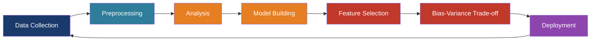
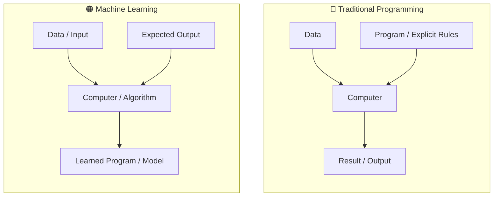
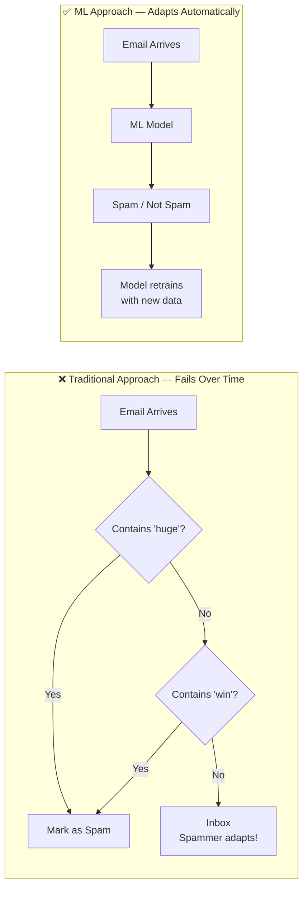
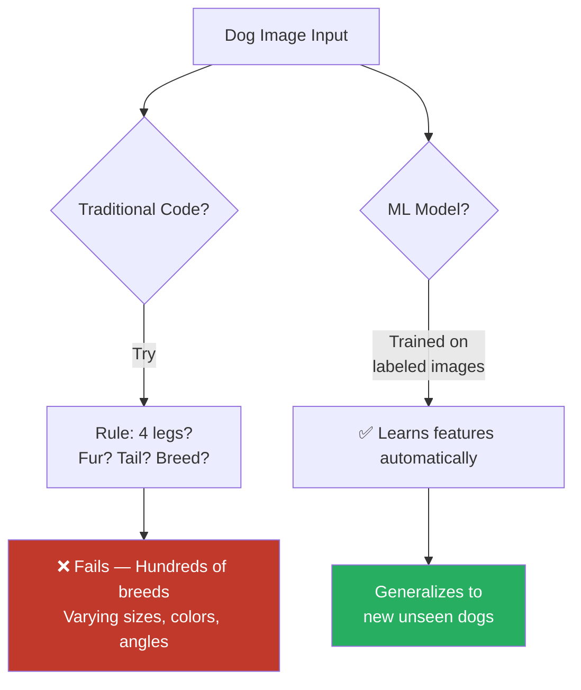
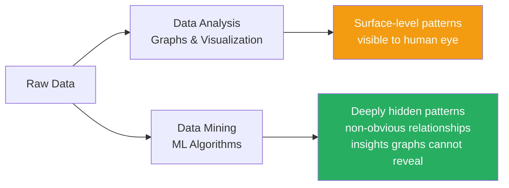
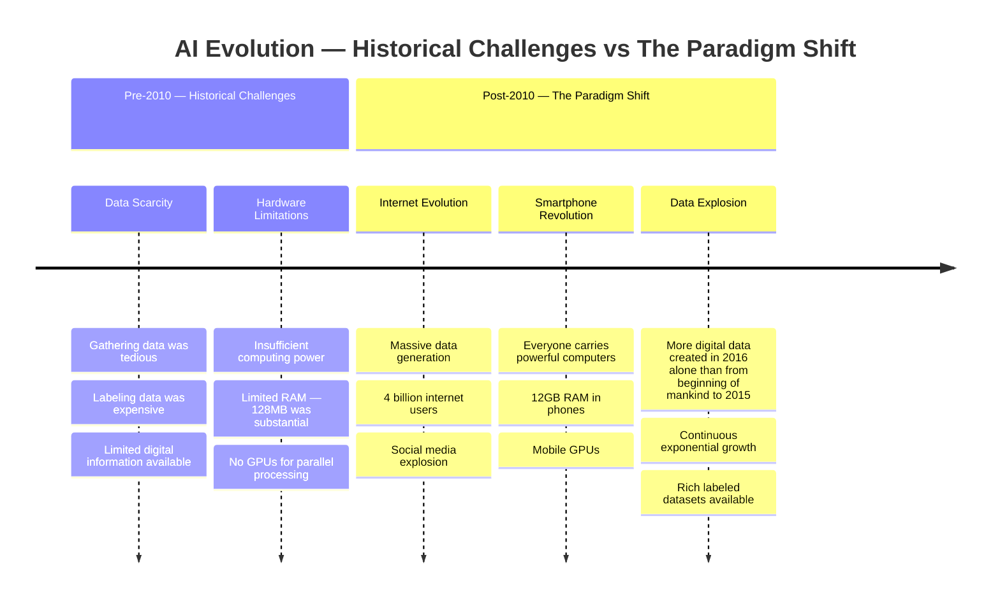
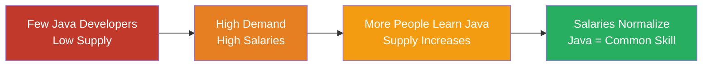
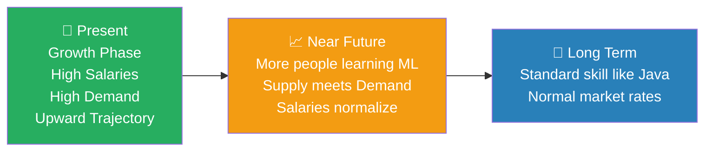

# Introduction to Machine Learning

---

## 📋 Content Focus

- **Primary Focus:** Machine Learning Life Cycle and Product Development Flow
- **Key Topics to Include:**
  - Complete ML project flow
  - Machine Learning Life Cycle (Product Life Cycle)
  - Data preprocessing and imputation
  - Analysis techniques
  - Model selection
  - Feature selection
  - Bias-Variance Trade-off
  - Deployment strategies
  - Techniques that differentiate ordinary from extraordinary ML engineers

---

### Target Audience

- **Beginners:** Complete resource from scratch
- **Intermediate Learners:** Review and fill knowledge gaps
- **Students and Professionals:** Valuable reference resource
- **Goal:** Advance learners to proficient level in Machine Learning

---

## 🖥️ What is Machine Learning?

### Formal Definition

> "Machine learning is a field of computer science that uses statistical techniques to give computer systems the ability to 'learn' with data, without being explicitly programmed."

---

### Simplified Explanation

- **Core Concept:** Learning from data
- **Key Difference:** No explicit programming for each scenario
- **Process:**
  1. Provide data to algorithm
  2. Algorithm identifies patterns between input and output
  3. Use learned patterns to predict outputs for new inputs

---

### Traditional Programming vs Machine Learning

#### Traditional Programming:

- **Flow:** Input → Program (with explicit logic) → Output
- **Characteristics:**
  - Logic written by programmers
  - Code for each specific condition
  - Fixed functionality
- **Example:** Program to add two numbers
  - Can only add exactly two numbers
  - Fails with different number of inputs

#### Machine Learning:

- **Flow:** Data (Input + Output) → Algorithm → Learned Program/Model
- **Characteristics:**
  - Logic generated automatically by algorithm
  - Learns patterns from data
  - Flexible and adaptable
- **Example:** Addition through ML
  - Provide data showing numbers and their sums
  - Model learns the addition pattern
  - Can handle any number of inputs after training

---

## 🎯 When to Use Machine Learning

### Scenario 1: Too Many Cases to Code

#### Email Spam Classification Example:

- **Traditional Approach Problems:**
  - Need to create if-else conditions for every spam indicator
  - Spammers adapt when they learn the rules
  - Constant manual updates required
  - Example: If "huge" triggers spam → spammers switch to "big" or "massive"

- **ML Advantage:**
  - Automatically adapts to new patterns
  - Logic updates with new data
  - No manual rule modification needed

---

### Scenario 2: Impossible to Enumerate All Cases

#### Image Classification Example (Dog Detection):

- **Challenge:**
  - Hundreds of dog breeds
  - Varying sizes, colors, shapes
  - Different angles and positions
  - Impossible to code rules for all variations

- **ML Solution:**
  - Mimics human learning process
  - Learns from labeled examples
  - Generalizes to new, unseen cases

---

### Scenario 3: Data Mining

- **Data Analysis:** Extract patterns through visualization and graphs
- **Data Mining:**
  - Discover deeply hidden patterns
  - Apply ML algorithms to uncover non-obvious relationships
  - Extract insights that graphs alone cannot reveal
- **Example:** Finding subtle spam indicators not visible through simple analysis

---

## 📜 History of Machine Learning

### The "Nawazuddin Siddiqui" Analogy

- Like the actor who existed in small roles before becoming famous
- ML has been around for 40-50 years but only recently gained prominence

---

### AI Evolution Timeline

---

### Historical Challenges (Pre-2010)

1. **Data Scarcity:**
   - Gathering data was tedious
   - Labeling data was expensive
   - Limited digital information available

2. **Hardware Limitations:**
   - Insufficient computing power
   - Limited RAM (128MB was considered substantial)
   - No GPUs for parallel processing

---

### The Paradigm Shift (Post-2010)

**Enabling Factors:**

1. **Internet Evolution**
   - Massive data generation
   - 4 billion internet users
   - Social media explosion

2. **Smartphone Revolution**
   - Everyone carries powerful computers
   - 12GB RAM in phones
   - Mobile GPUs

3. **Data Explosion:**
   - More digital data created in 2016 alone than from beginning of mankind to 2015
   - Continuous exponential growth
   - Rich, labeled datasets available

---

### Current State:

- All three requirements met: Data, Hardware, Algorithms
- Exponential growth trajectory
- Machine Learning enjoying its "golden period"

---

## 💼 Job Market Insights

### Current Situation

- **High Demand, Low Supply:**
  - Limited ML talent in market
  - Not widely taught in colleges yet
  - Companies competing for few skilled professionals
  - Result: High salaries

---

### The Economics of Tech Jobs

#### Java Example:

- Initially: Few Java developers → High demand → High salaries
- Over time: More people learned Java → Supply increased → Salaries normalized
- Current: Java is common skill → Normal market rates

---

### ML Job Market Prediction

- **Present (Growth Phase):**
  - High salaries due to scarcity
  - Increasing demand
  - Still on upward trajectory

- **Future (Normalization):**
  - More people learning ML
  - Supply will meet demand
  - Salaries will normalize
  - Will become standard skill like Java

---

### Opportunity Window:

- Currently in early growth phase
- Still time to benefit from high demand
- Advantage for early adopters
- Learning now = maximum benefit

---

## ➡️ Next Topics

**Difference between AI, ML, and DL**

- Clear distinction between these often-confused terms
- Foundation for understanding the ML ecosystem

---

## 💡 Key Takeaways

1. **Machine Learning is about learning patterns from data**, not explicit programming
2. **Use ML when:** Too many cases, impossible to code all scenarios, or need data mining
3. **ML's recent success** due to: Big data, powerful hardware, and internet/smartphone revolution
4. **Job market is favorable now** but will normalize as more people learn ML
5. **Focus on ML Life Cycle**, not just algorithms, to become exceptional ML engineer
6. **The series will provide end-to-end knowledge** for intermediate-level ML proficiency

---