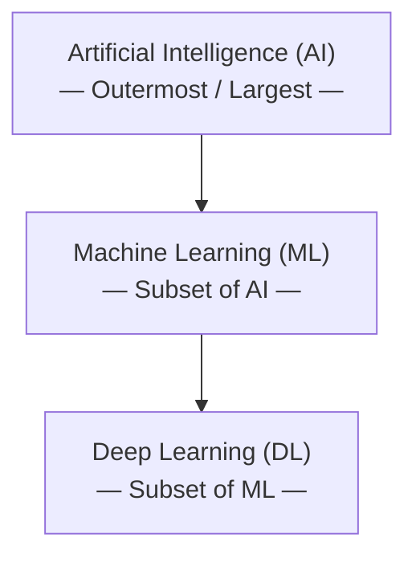
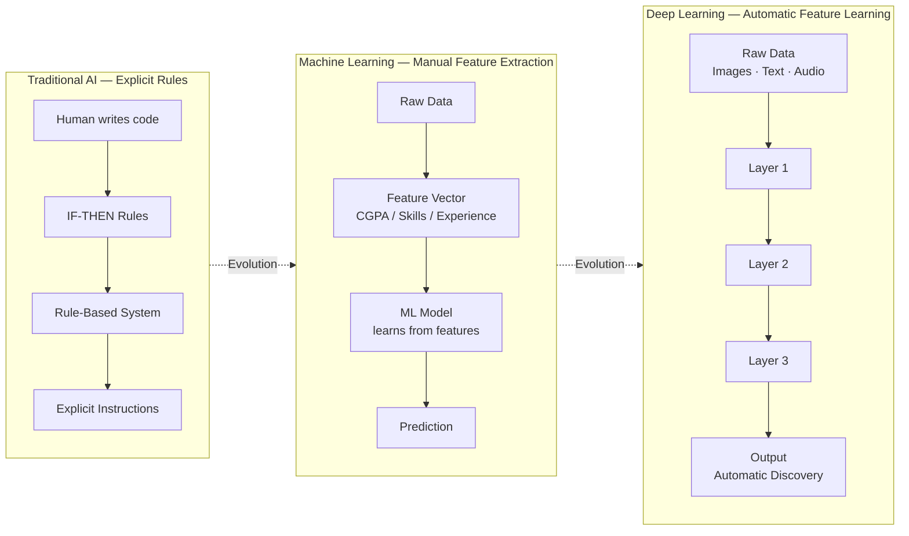
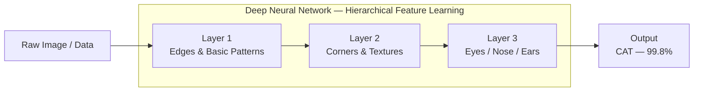
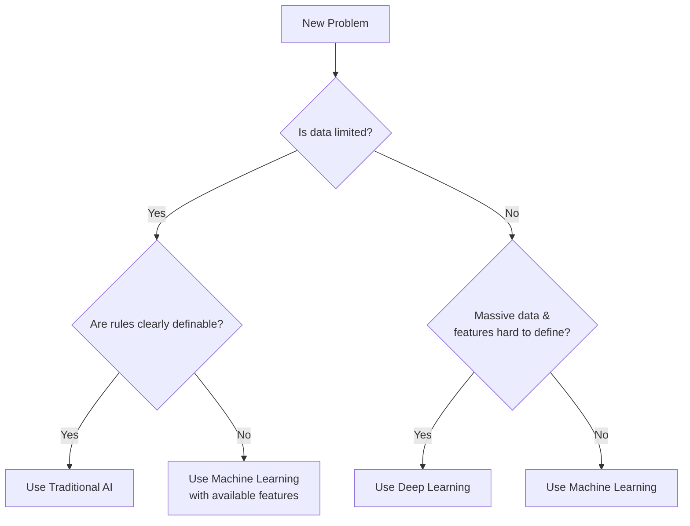
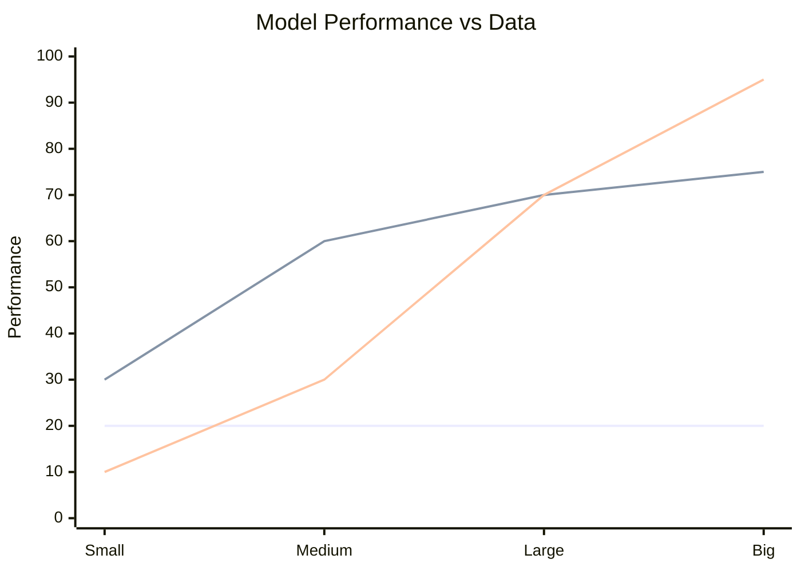
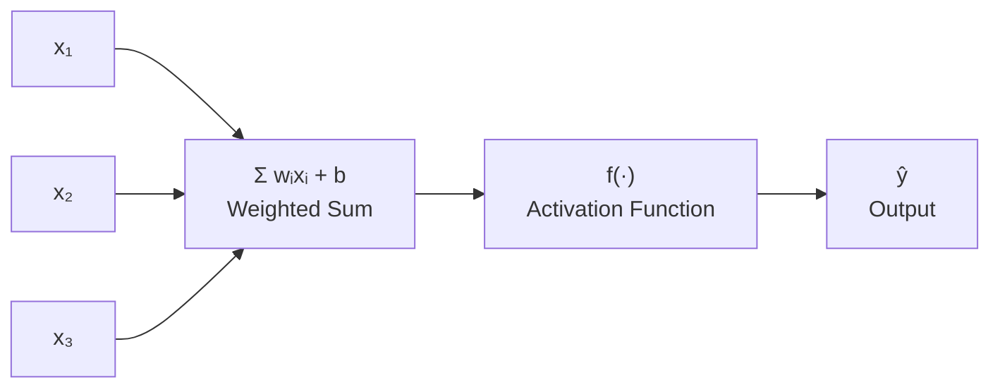

# AI vs Machine Learning vs Deep Learning

---

## Hierarchical Relationship

### Visual Structure (As shown in diagram):

- **Artificial Intelligence (AI) –** Outermost/largest circle
- **Machine Learning (ML) –** Subset of AI (middle circle)
- **Deep Learning (DL) –** Subset of ML (innermost circle)

This nested structure shows that:

- All Deep Learning is Machine Learning
- All Machine Learning is Artificial Intelligence
- But not all AI is ML, and not all ML is DL

---

## From Manual Rules to Automatic Discovery

---

## Artificial Intelligence (AI)

### Definition:

- The broadest concept aimed at creating machines with intelligence
- Goal: Enable machines to perform tasks that typically require human intelligence
- Has been an aspiration for decades (since 1950s)

### Key Characteristics:

- **Intelligence is Complex**: Comprises multiple components:
  - Problem-solving ability
  - Creativity and imagination
  - Emotional intelligence
  - Logic and reasoning
  - Pattern recognition

### Historical Approaches:

1. **Symbolic AI/Expert Systems Era (1950s–1980s)**:
   - Knowledge-based systems
   - Explicit rule programming
   - Expert systems (e.g., chess-playing computers)
   - Required manual encoding of expert knowledge into rules

### Limitations of Early AI:

- Only worked for narrow, well-defined problems
- Failed with complex, ambiguous tasks
- Couldn't handle image recognition or voice recognition effectively
- Required extensive manual rule creation

---

## Machine Learning (ML)

### Definition:

- Branch of computer science using statistical techniques to find patterns in data
- Systems learn from data without explicit programming

### Key Difference from Traditional AI:

- **No Explicit Programming**: Instead of writing rules, you provide data
- System automatically discovers patterns and rules
- Learning from examples (similar to how humans learn)

### How ML Works:

1. Provide large amounts of labeled data
2. Algorithm identifies patterns
3. System generates rules automatically
4. Can make predictions on new, unseen data

### Example – Dog Classification:

- **Traditional AI**: Write rules defining what makes a dog (specific features)
- **ML Approach**: Show thousands of dog/non-dog images, system learns features

### When ML Became Successful:

- Rise in the 2000s–2010s
- Enabled by:
  - Availability of big data
  - Improved hardware capabilities
  - Better algorithms

### ML Limitations:

- **Feature Engineering Required**:
  - Users must manually identify and provide relevant features
  - Example: For placement prediction, you need to define features like:
    - CGPA > 75%
    - Number of certifications
    - Internship experience
  - Requires domain expertise

---

## Deep Learning (DL)

### Definition:

- Subset of ML inspired by biological neural networks
- Uses artificial neural networks with multiple layers

### Key Innovation:

- **Automatic Feature Extraction**:
  - No manual feature engineering needed
  - System automatically discovers relevant features
  - Learns hierarchical representations

### How DL Differs from ML:

1. **Feature Learning**:
   - ML: Manual feature selection required
   - DL: Automatic feature discovery

2. **Layer-by-Layer Learning**:
   - First layer: Detects edges/basic patterns
   - Middle layers: Combine features into complex patterns
   - Final layers: High-level understanding

3. **Performance with Data**:
   - ML: Performance plateaus after certain data volume
   - DL: Continues improving with more data

### Why DL Became Dominant (Post-2008):

- Breakthrough in handling complex problems ML couldn't solve well
- Superior performance in:
  - Image classification
  - Object detection
  - Natural language processing
  - Speech recognition

### Requirements for DL:

- Large amounts of data
- Significant computational power
- Deep neural network architectures

---

## Practical Applications & Use Cases

### When to Use What:

**Use Traditional AI when:**

- Problem has clear, definable rules
- Limited data available
- Interpretability is crucial

**Use Machine Learning when:**

- Moderate amount of data available
- Features can be manually identified
- Problem is well-understood
- Industries: Banking, Insurance (often limited data)

**Use Deep Learning when:**

- Massive datasets available
- Features are difficult to define manually
- Complex patterns need to be learned
- Applications: Image recognition, voice assistants, language translation

---

## Detailed Comparison Table

| **Aspect** | **Traditional AI** | **Machine Learning** | **Deep Learning** |
|---|---|---|---|
| **Data Requirements** | Minimal – relies on expert knowledge | Moderate (hundreds to thousands) | Large (thousands to millions) |
| **Feature Engineering** | Manual rule creation | Manual feature selection | Automatic feature extraction |
| **Interpretability** | High – explicit rules | Medium – can trace decisions | Low – black box models |
| **Computational Power** | Low | Medium | Very High (GPUs/TPUs required) |
| **Development Time** | Long (rule creation) | Medium | Long (training time) |
| **Performance with Data** | Constant | Improves then plateaus | Continues improving |
| **Domain Expertise** | Very High | High | Medium |
| **Best Use Cases** | Chess, expert systems, rule-based chatbots | Fraud detection, recommendation systems, predictive analytics | Image recognition, NLP, autonomous vehicles |
| **Flexibility** | Low – rigid rules | Medium | High – adapts to new patterns |
| **Cost** | Low to Medium | Medium | High |
| **Maintenance** | High – manual updates | Medium | Low – self-adapting |
| **Examples** | IBM Watson (Jeopardy), Early chess programs | Netflix recommendations, Spam filters, Credit scoring | GPT models, Image classification, Self-driving cars |

---

## AI Performance vs. Data Volume: A Comparative Analysis

**Interpretation:**

- **Traditional AI** — Flat line at 20; performance stays constant regardless of data volume (limited by hard-coded rules)
- **Machine Learning** — Rises quickly from 30 → 75, but plateaus as data grows (limited by manual feature engineering)
- **Deep Learning** — Starts low at 10, slow until large data, then skyrockets to 95 with big data (benefits most from scale)

---

## Key Takeaways

1. **Evolutionary Progression**: $\text{AI} \rightarrow \text{ML} \rightarrow \text{DL}$ represents increasing sophistication

2. **Not Always Better**: DL isn't always the best solution – depends on:
   - Data availability
   - Computational resources
   - Problem complexity
   - Need for interpretability

3. **Current State**:
   - We're far from General AI (human-like intelligence)
   - Current AI excels at specific tasks
   - Focus is on practical applications rather than general intelligence

4. **Industry Reality**:
   - Not all companies have big data
   - ML still very relevant for many business problems
   - Choice depends on specific use case and constraints

---

## Mathematical & Technical Foundation

### Neural Networks in DL:

- Basic unit: Perceptron (artificial neuron)
- Inspired by biological neurons but not identical
- Mathematical models that process information
- Multiple layers enable complex pattern recognition

A single perceptron computes:

$$\hat{y} = f\left(\sum_{i=1}^{n} w_i x_i + b\right)$$

Where:
- $x_i$ = input features
- $w_i$ = learned weights
- $b$ = bias term
- $f(\cdot)$ = activation function
- $\hat{y}$ = predicted output

### Data Requirements:

- **ML**: Can work with smaller datasets (hundreds to thousands)
- **DL**: Requires large datasets (thousands to millions)

### Computational Complexity:

- Increases exponentially with depth
- Requires specialized hardware (GPUs, TPUs)
- Training can take days or weeks for complex models

---

## Dog Recognition Example — Comparing All Three Approaches

