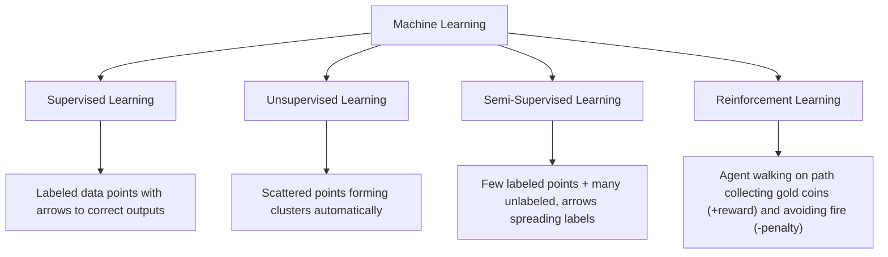
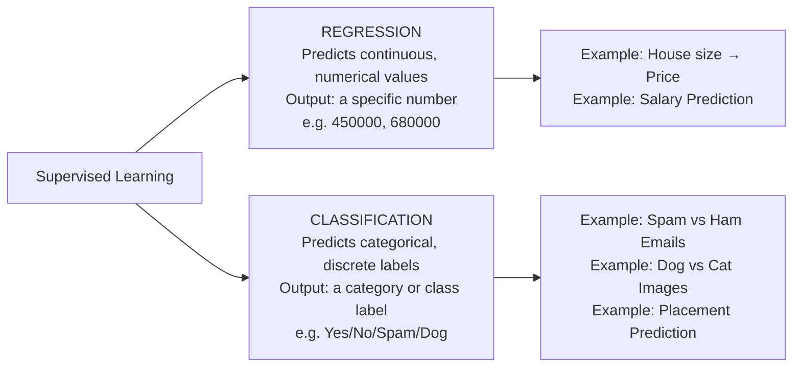
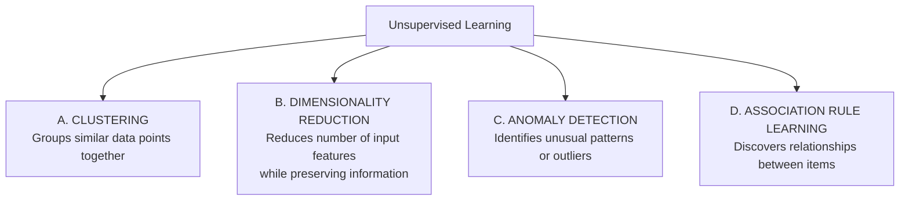
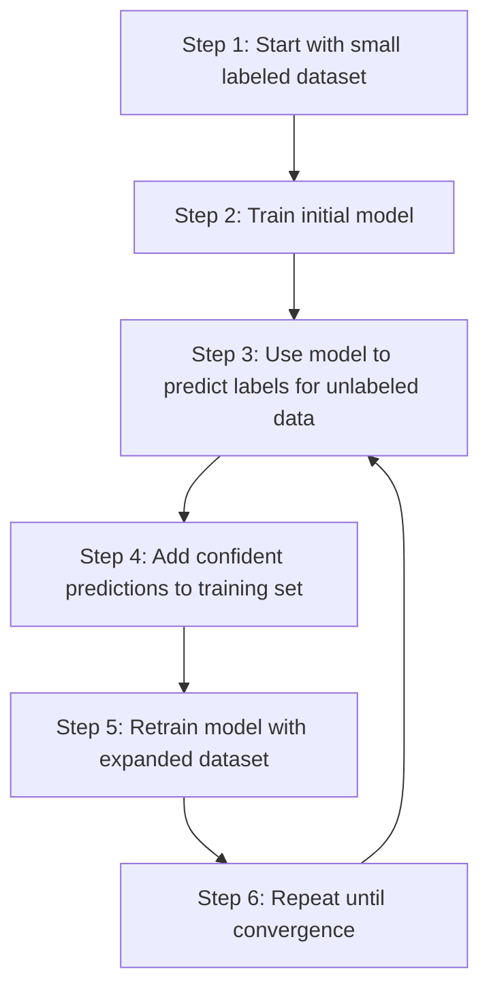
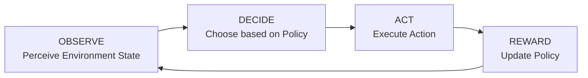
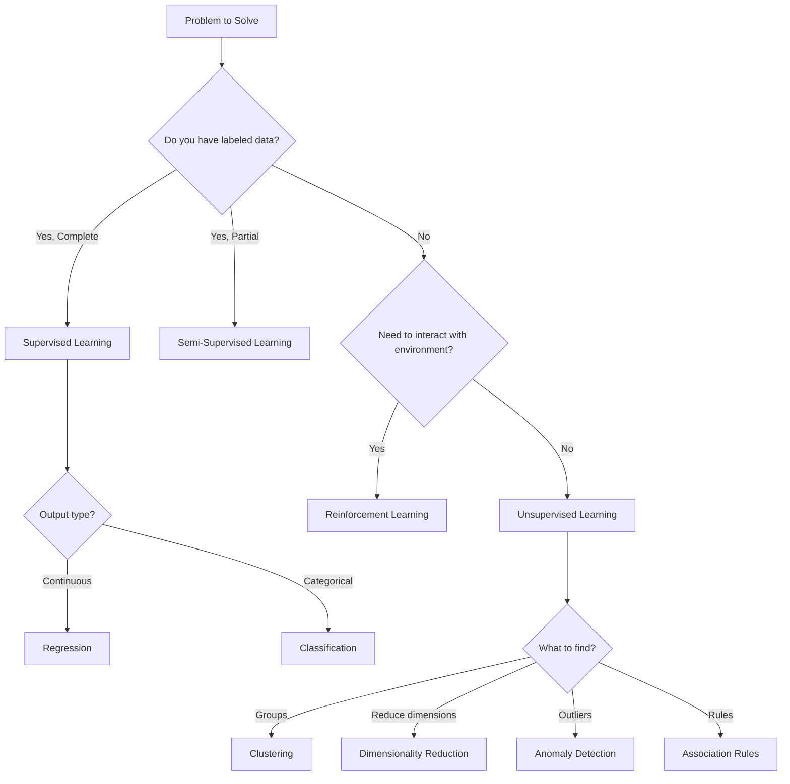

# Types of Machine Learning – Complete Notes

---

## Overview



---

## 1. SUPERVISED LEARNING

### Definition

- Algorithm learns from **labeled training data** (both input and output are provided)
- Goal: Learn the relationship between input and output to predict output for new inputs

### Key Characteristics

| Aspect | Description |
|---|---|
| **Data Required** | Input features (X) + Output labels (Y) |
| **Learning Process** | Finds mathematical relationship between X and Y |
| **Use Case** | When historical data with known outcomes is available |
| **Goal** | Predict output for new, unseen inputs |

### Types of Supervised Learning

#### A. REGRESSION

- **Output**: Numerical/Continuous values
- **Examples**:

```
Input: [IQ Score, CGPA] → Output: Salary Package (₹4.5 LPA, ₹8.9 LPA)
Input: [House Size, Location] → Output: House Price ($450,000)
Input: [Temperature, Humidity] → Output: Rainfall (125mm)
```

#### B. CLASSIFICATION

- **Output**: Categorical/Discrete values
- **Examples**:

```
Input: [IQ Score, CGPA] → Output: Placement (Yes/No)
Input: [Email Content] → Output: Spam/Not Spam
Input: [Image] → Output: Dog/Cat/Bird
Input: [Medical Tests] → Output: Disease Type
```

### Practical Example

**Student Placement Prediction Dataset:**

| Student | IQ Score | CGPA | Placement |
|---|---|---|---|
| 1 | 87 | 7.1 | Yes |
| 2 | 111 | 8.9 | Yes |
| 3 | 75 | 6.3 | No |
| 4 | 95 | 7.8 | Yes |
| … | … | … | … |

- **Input Columns**: IQ Score, CGPA
- **Output Column**: Placement (Yes/No)
- **Type**: Classification Problem

### Supervised Learning: Regression vs Classification



---

## 2. UNSUPERVISED LEARNING

### Definition

- Algorithm works with **unlabeled data** (only input, no output labels)
- Goal: Discover hidden patterns, structures, or relationships in data

### Key Characteristics

| Aspect | Description |
|---|---|
| **Data Required** | Only Input features (X), No labels |
| **Learning Process** | Finds patterns and structures within data |
| **Use Case** | Exploratory data analysis, pattern discovery |
| **Goal** | Group, reduce, or detect anomalies in data |

### Types of Unsupervised Learning



#### A. CLUSTERING

- Groups similar data points together
- **Example**: Student Segmentation

```
Group 1: High IQ + High CGPA (Top Performers)
Group 2: High IQ + Low CGPA (Underachievers)
Group 3: Low IQ + High CGPA (Hard Workers)
```

#### B. DIMENSIONALITY REDUCTION

- Reduces number of input features while preserving information
- **Techniques**: PCA (Principal Component Analysis)
- **Example**:

```
Original: [Rooms, Bathrooms, Square Feet, Location] → 4 features
Reduced: [House Size Score, Location Score] → 2 features
```

- **MNIST Example**: 784 dimensions → 2D/3D visualization

#### C. ANOMALY DETECTION

- Identifies unusual patterns or outliers
- **Applications**:
  - Credit card fraud detection
  - Manufacturing defect detection
  - Network intrusion detection

```
Normal transactions: $20, $45, $100, $75
Anomaly: $5000 (flagged as potential fraud)
```

#### D. ASSOCIATION RULE LEARNING

- Discovers relationships between items
- **Famous Example**: Walmart Case Study

```
Rule Discovered: {Baby Diapers} → {Beer}
Confidence: 80% of diaper buyers also bought beer
Action: Place these items near each other
Result: Increased sales
```

---

## 3. SEMI-SUPERVISED LEARNING

### Definition

- Combination of **labeled** and **unlabeled** data
- Uses small amount of labeled data with large amount of unlabeled data

### When to Use

- Labeling data is expensive or time-consuming
- Abundant unlabeled data available
- Limited labeled examples exist

---

## 4. REINFORCEMENT LEARNING

### Definition

- Algorithm learns through interaction with environment
- Uses rewards and penalties to learn optimal behavior

### Key Components

- **Agent**: The learner/decision maker
- **Environment**: What the agent interacts with
- **Actions**: Choices available to agent
- **Rewards**: Feedback for actions taken

---

## Comparison Table

| Type | Data Required | Output Type | Example Use Cases |
|---|---|---|---|
| **Supervised** | Labeled (X,Y) | Known categories/values | Spam detection, Price prediction |
| **Unsupervised** | Unlabeled (X only) | Patterns/Groups | Customer segmentation, Anomaly detection |
| **Semi-supervised** | Mix of labeled & unlabeled | Known categories | Image recognition with limited labels |
| **Reinforcement** | Environment feedback | Actions/Decisions | Game playing, Robotics |

---

## 3. SEMI-SUPERVISED LEARNING (Detailed)

### Definition

Semi-supervised learning bridges the gap between supervised and unsupervised learning by using **both labeled and unlabeled data** for training.

### Why Semi-Supervised Learning?

| Challenge | Solution with Semi-Supervised |
|---|---|
| **Expensive Labeling** | Labels are costly to obtain (requires human experts) |
| **Time-Consuming** | Manual annotation takes significant time |
| **Resource Intensive** | Need domain experts for accurate labeling |

### How It Works



### Real-World Example: Google Photos

**Face Recognition System:**

1. **Initial State**:
   - Thousands of photos uploaded
   - System clusters similar faces automatically (unsupervised)

2. **User Interaction**:
   - User labels ONE photo: "This is Dad"
   - System automatically labels ALL photos of Dad

3. **Result**:
   - Minimal human effort (1 label)
   - Maximum output (hundreds of photos labeled)

```
Before Labeling:              After Labeling One:
┌────────────┐                ┌────────────┐
│  Cluster 1 │                │  Dad (200) │
│ (200 photos)│   ──→         │ ✓ Labeled  │
└────────────┘                └────────────┘

┌────────────┐                ┌────────────┐
│  Cluster 2 │                │  Mom (150) │
│ (150 photos)│   ──→         │ ✓ Labeled  │
└────────────┘                └────────────┘
```

### Advantages vs Disadvantages

| Advantages | Disadvantages |
|---|---|
| ✓ Reduces labeling cost | ✗ Model assumptions may propagate errors |
| ✓ Utilizes abundant unlabeled data | ✗ Requires careful validation |
| ✓ Often improves performance | ✗ More complex than supervised learning |
| ✓ Practical for real-world scenarios | ✗ May need iterative refinement |

---

## 4. REINFORCEMENT LEARNING (Detailed)

### Definition

Learning through **interaction with environment** using **rewards and punishments** to maximize cumulative reward.

### Core Components

| Component | Description | Example (Self-Driving Car) |
|---|---|---|
| **Agent** | The learner/decision maker | The car's AI system |
| **Environment** | The world agent interacts with | Road, traffic, weather |
| **State** | Current situation | Car position, speed, nearby objects |
| **Action** | Possible choices | Accelerate, brake, turn |
| **Reward** | Feedback for action | +10 for safe driving, -100 for collision |
| **Policy** | Strategy/rule book | When to brake, how fast to go |

### Learning Process



### Simple Example: Fire and Water

**Scenario**: Agent must choose between fire (danger) and water (safety)

```
Initial State:
    [Agent]
       |
    ───────
    ↓     ↓
🔥 Fire  💧 Water

Step 1: Agent goes to Fire
Result: -10 points (punishment)
Learning: Update policy - "Avoid fire"

Step 2: Agent goes to Water
Result: +10 points (reward)
Learning: Update policy - "Seek water"

Final Policy: Water = Good, Fire = Bad
```

### Famous Application: AlphaGo by DeepMind

**Achievement**: Defeated world champion in Go (2016–2017)

| Aspect | Details |
|---|---|
| **Game Complexity** | More complex than Chess |
| **Why Significant** | Previously thought impossible for AI |
| **Method Used** | Deep Reinforcement Learning |
| **Result** | Won 4 out of 5 games against champion |
| **Impact** | Revolutionized AI game playing |

### Reinforcement Learning Applications

1. **Gaming**
   - Chess, Go, Video Games
   - Strategy optimization

2. **Robotics**
   - Walking, grasping, navigation
   - Task automation

3. **Autonomous Vehicles**
   - Self-driving cars
   - Traffic navigation

4. **Resource Management**
   - Power grid optimization
   - Network routing

5. **Finance**
   - Trading strategies
   - Portfolio management

---

## Comparison: All Four Types

| Aspect | Supervised | Unsupervised | Semi-Supervised | Reinforcement |
|---|---|---|---|---|
| **Data Required** | Fully labeled (X,Y) | Unlabeled (X only) | Mix of both | No initial data |
| **Learning Method** | Direct mapping | Pattern discovery | Propagate labels | Trial and error |
| **Feedback** | Immediate | None | Partial | Delayed rewards |
| **Goal** | Predict Y from X | Find structure | Reduce labeling | Maximize reward |
| **Difficulty** | Medium | Medium-Hard | Medium | Hard |
| **Common Use** | 70% of applications | 20% of applications | 5% of applications | 5% of applications |

---

## When to Use Which Type?

### Decision Framework



---

## Summary Points

1. **Label Availability** determines the learning type
2. **Semi-Supervised** is increasingly important in industry (cost-effective)
3. **Reinforcement Learning** is powerful but complex (cutting-edge AI)
4. **Real-world applications** often combine multiple approaches
5. **Choose based on**:
   - Data availability
   - Problem requirements
   - Resource constraints
   - Performance needs

### 4 Types of Machine Learning: A Comparison

| TYPE | DATA NEEDED | FEEDBACK | GOAL | DIFFICULTY | REAL EXAMPLES |
|---|---|---|---|---|---|
| **Supervised Learning** | Labeled data (Input-Output pairs) | Immediate (Correct answers provided) | Predict output / Map input to output | Medium | Spam filtering, Price prediction |
| **Unsupervised Learning** | No labels (Unstructured data) | None (No guidance provided) | Find patterns / Discover hidden structures | Medium-Hard | Customer segmentation, Market basket analysis |
| **Semi-Supervised Learning** | Mix (Small amount of labeled + large amount of unlabeled) | Partial (Limited supervision) | Reduce labeling effort / Improve learning with less labeled data | Medium | Google Photos (Face grouping), Speech analysis |
| **Reinforcement Learning** | Environment interaction (States, Actions) | Delayed rewards (Reward/Penalty signals) | Maximize cumulative reward / Learn optimal policy | Hard | AlphaGo, Robotics, Game playing |