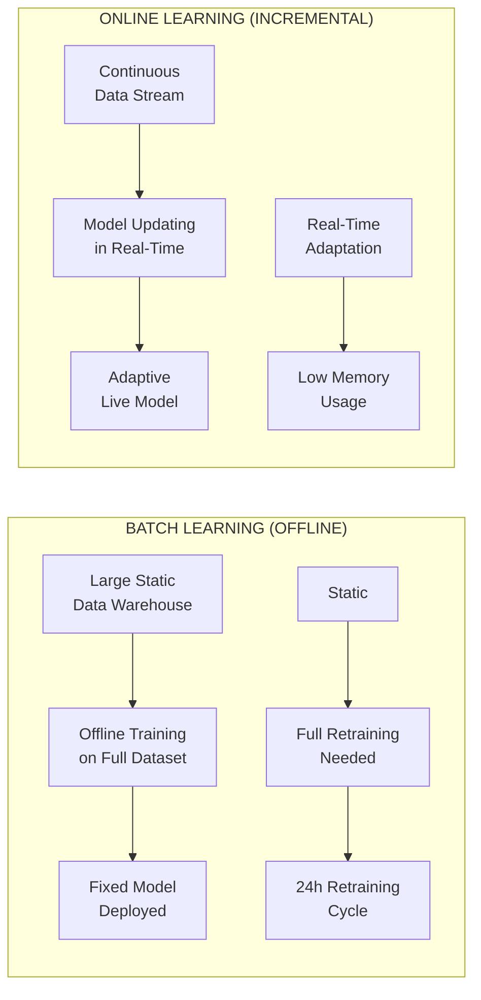
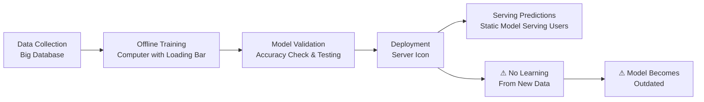
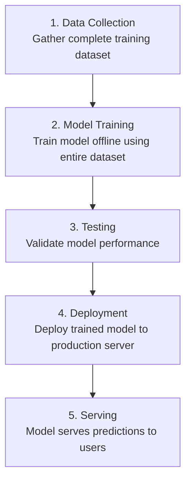
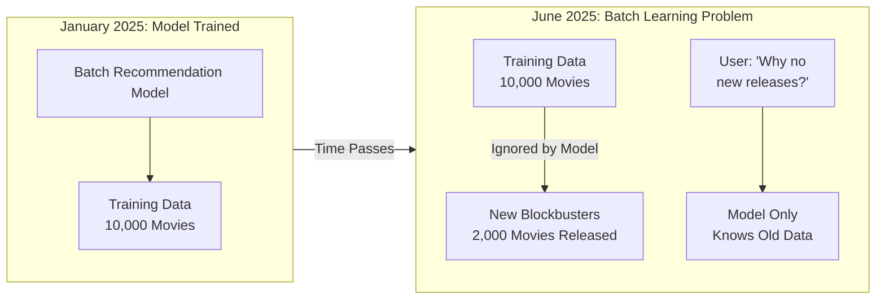
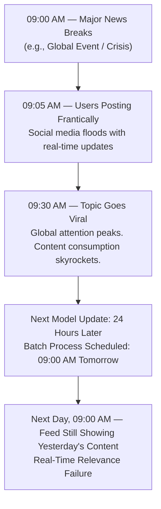
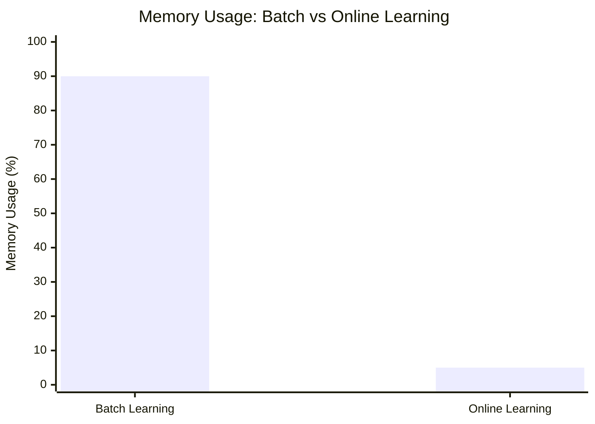
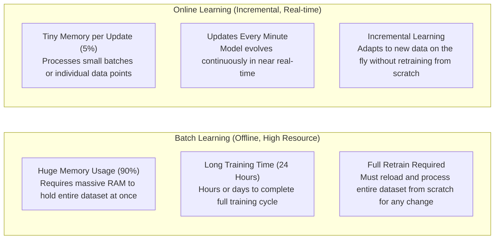
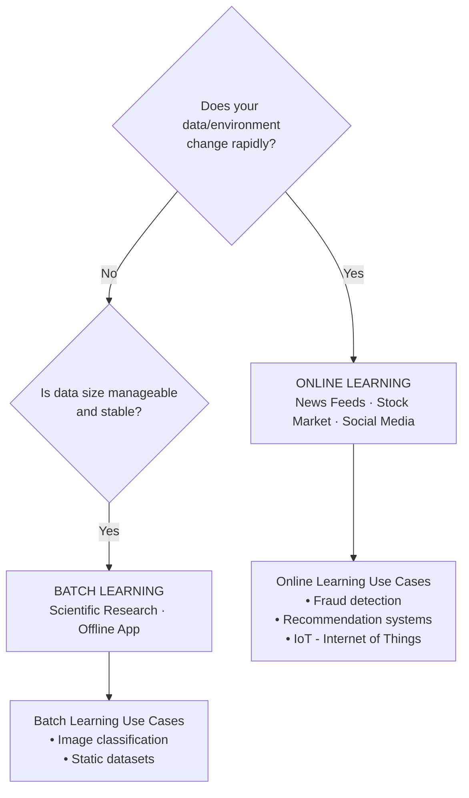

# Batch Machine Learning | Offline vs Online Learning

---

## Introduction

This document covers one of the fundamental classification systems in machine learning based on **how models are trained in production environments**. Unlike the traditional classification based on supervision (supervised, unsupervised, semi-supervised, reinforcement learning), this classification focuses on the **training methodology during deployment**.

The two main types are:

- **Batch Learning** (Offline Learning)
- **Online Learning** (Incremental Learning)

---

## Batch vs Online Learning — Overview



---

## Production vs Development Environment

### Development Environment

- Where data scientists and ML engineers develop and train models
- Models are trained on local machines
- Testing and validation occurs here

### Production Environment

- The server environment where trained models are deployed
- Where the model serves real users and processes live data
- Models run continuously to provide predictions/recommendations

---

### Batch Learning Pipeline (with Key Warning)



**Key Point**: The behavior and performance of ML models can differ significantly between development and production environments.

---

## Batch Learning (Offline Learning)

### Definition

Batch learning is the conventional method of training machine learning models where:

- The **entire dataset** is used at once for training
- Training happens **offline** (not in real-time)
- Once trained, the model is deployed to production as a **static model**

### Characteristics

- Uses complete dataset for training
- No incremental training capability
- Model parameters are fixed after training
- Requires full retraining for updates

---

## How Batch Learning Works

### Step-by-Step Process



### Example: Movie Recommendation System

- Collect all user-movie interaction data
- Train recommendation model offline
- Deploy model to production
- System provides movie recommendations to users
- **Problem**: Model becomes outdated as new movies are added

#### Illustration: The Staleness Problem



---

## Problems with Batch Learning

### 1. Static Model Problem

- **Issue**: Once deployed, models cannot learn from new data
- **Impact**: Recommendations become stale over time
- **Example**: A movie recommendation system trained today won't know about movies released next week

### 2. Business Evolution

- **Issue**: Business scenarios constantly evolve
- **Impact**: Models become less relevant over time
- **Example**:
  - Email spam detection becomes outdated with new spam techniques
  - Market trends change faster than model updates

---

## Disadvantages of Batch Learning

### 1. Large Data Handling Issues

- **Problem**: Training with massive datasets can exceed system capabilities
- **Example**: Social media data growing exponentially
- **Impact**: System crashes or memory limitations

### 2. Hardware Limitations

- **Problem**: Limited computational resources for processing large datasets
- **Constraint**: Cannot train entire model at once due to hardware limits
- **Solution Required**: Need for distributed computing or cloud resources

### 3. Connectivity Issues

- **Problem**: Models deployed in remote locations without internet access
- **Examples**:
  - Mobile apps in remote areas (mountains, rural areas)
  - Satellite applications
  - Offline mobile applications
- **Impact**: Cannot perform frequent updates

### 4. Availability Constraints

- **Problem**: Real-time updates are not possible
- **Example Scenario**:
  - Social media platform with 24-hour update cycle
  - Breaking news (like demonetization) occurs
  - Users interested in trending topic immediately
  - System cannot adapt until next update cycle (24 hours later)
  - By the time system updates, news may be outdated

---

## When Batch Learning Fails

### Real-Time Adaptation Needs

When systems require immediate adaptation to:

- Breaking news and trending topics
- Sudden market changes
- Emergency situations
- Real-time user behavior changes

### Example: Social Media Feed

```
Timeline:
09:00 AM - Major news breaks (e.g., policy announcement)
09:05 AM - Users start engaging with related content
09:30 AM - Content goes viral
24:00 PM - System finally updates (too late)
```

#### Failure Timeline Visualization



**Batch learning models are obsolete the moment significant new data emerges. Users are left behind.**

---

## Online Learning Alternative

To address the limitations of batch learning, **Online Learning** (Incremental Learning) is used, which:

- Learns incrementally from new data
- Updates model parameters in real-time
- Adapts quickly to changing patterns
- Requires less computational resources per update

### Resource Comparison: Batch vs Online Learning



### Key Benefits

- Real-time adaptation
- Efficient resource utilization
- Better handling of evolving data patterns
- Suitable for streaming data scenarios

### Side-by-Side Comparison



---

## Summary

Batch learning is suitable for:

- ✅ Stable environments with infrequent changes
- ✅ Limited computational resources
- ✅ Well-defined, static problems
- ✅ Offline applications

Batch learning is **not suitable** for:

- ❌ Real-time adaptation requirements
- ❌ Rapidly changing environments
- ❌ Streaming data scenarios
- ❌ Large-scale data that exceeds system capacity

### Decision Guide: Batch vs Online Learning



Understanding these trade-offs is crucial for choosing the right learning approach based on your specific use case and deployment constraints.