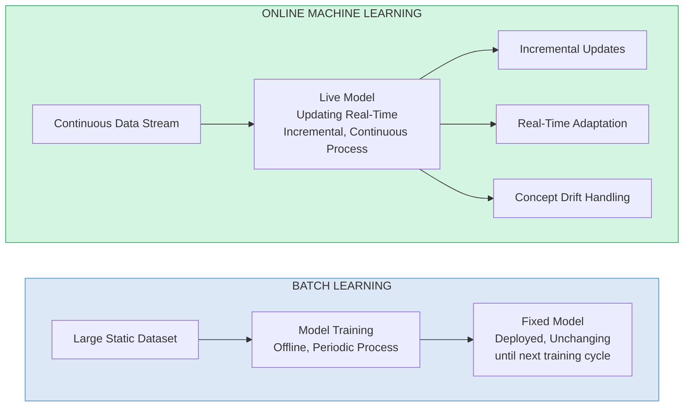
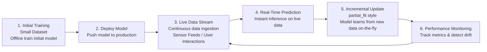
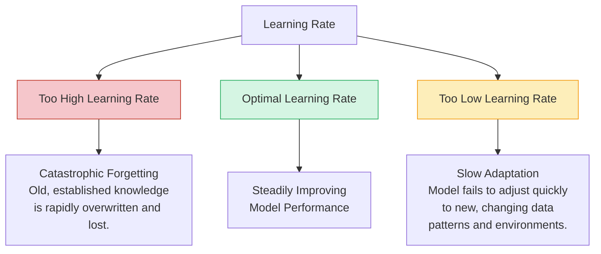
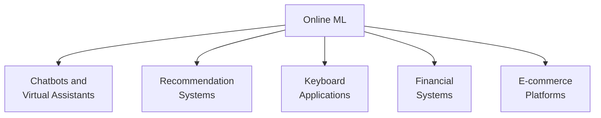
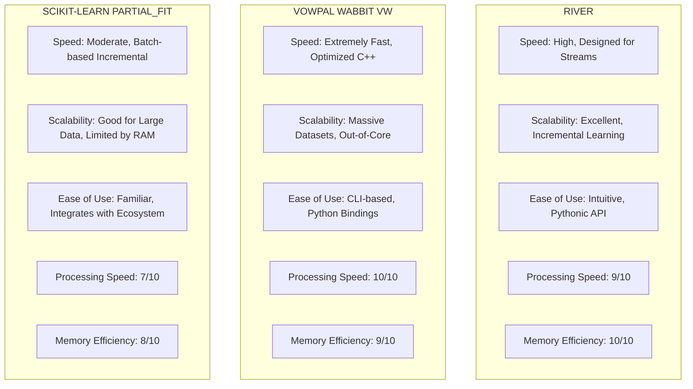
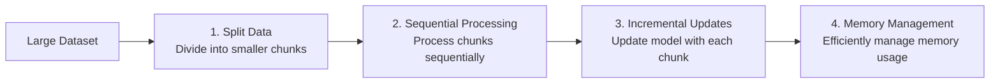
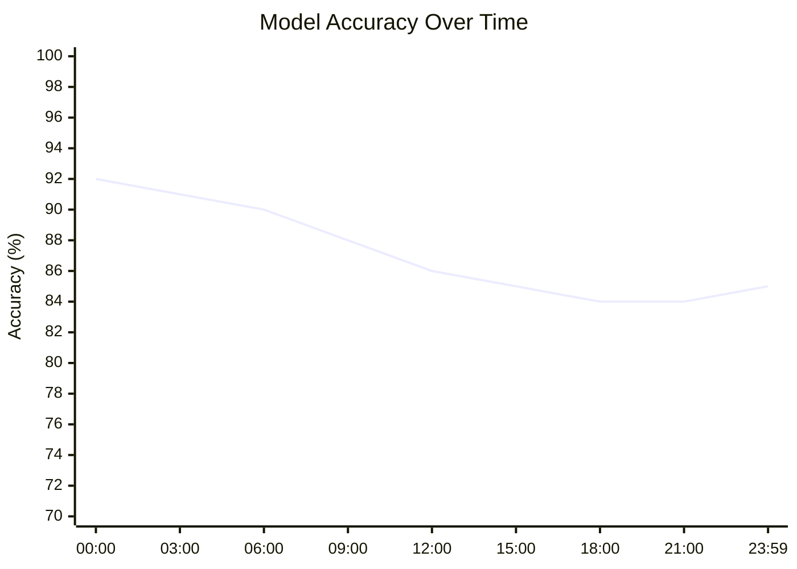
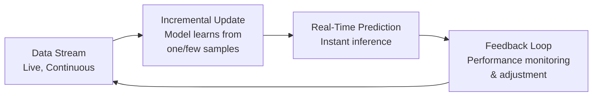
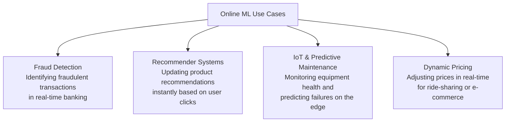

# Online Machine Learning

---

## Introduction to Online Machine Learning

Online Machine Learning is a paradigm where models learn incrementally from data streams, updating themselves continuously as new data arrives. Unlike traditional batch learning, where models are trained on complete datasets, online learning processes data sequentially in small batches or individual samples.

---

## Online Machine Learning vs Batch Learning



**Batch Learning Characteristics:** Long Training Times · High Resource Requirement · Infrequent Updates

**Online Learning Characteristics:** Low Latency Predictions · Efficient Memory Usage · Adapts to Changing Environments

---

## Key Definition

> **Online Learning = Incremental Learning** using streaming data where models train and improve continuously on live servers

---

## Key Concepts and Definitions

### Core Principles

- **Incremental Training**: Models update gradually with each new data point
- **Sequential Processing**: Data is processed one sample or small batch at a time
- **Continuous Improvement**: Model performance improves as more data is processed
- **Real-time Adaptation**: Models adapt to changing patterns in real-time

### Process Flow



---

## How Online Learning Works

### Architecture Overview

1. **Initial Training**: Start with small initial dataset
2. **Model Deployment**: Deploy trained model to production server
3. **Continuous Data Stream**: New data arrives continuously
4. **Real-time Processing**: Model processes new data and makes predictions
5. **Incremental Updates**: Model parameters update based on new data
6. **Performance Monitoring**: System monitors model performance continuously

### Learning Rate Considerations

- **Critical Parameter**: Learning rate determines how quickly the model adapts
- **Balance Required**: Too fast = forgets old knowledge; Too slow = doesn't adapt to changes
- **Dynamic Adjustment**: May need to adjust learning rate based on data patterns

#### The Learning Rate Dilemma



---

## Real-World Applications



### 1. Chatbots and Virtual Assistants

- **Examples**: Google Assistant, Alexa, Siri
- **Benefit**: Improve responses based on user interactions
- **Implementation**: Continuous learning from conversation data

### 2. Recommendation Systems

- **Examples**: YouTube, Netflix, Amazon
- **Benefit**: Adapt to changing user preferences
- **Implementation**: Update recommendations based on user clicks/interactions

### 3. Keyboard Applications

- **Examples**: SwiftKey
- **Benefit**: Improve typing predictions based on user behavior
- **Implementation**: Learn from typing patterns and commonly used words

### 4. Financial Systems

- **Use Case**: Fraud detection, stock prediction
- **Benefit**: Adapt to new fraud patterns and market conditions

### 5. E-commerce Platforms

- **Use Case**: Dynamic pricing, customer behavior analysis
- **Benefit**: Respond to market changes and customer trends

---

## Implementation Examples

### Using Scikit-learn SGDRegressor

```python
import numpy as np
from sklearn import linear_model
import time

# Generate sample data
n_samples, n_features = 1, 500
y = np.random.randn(n_samples)
X = np.random.randn(n_samples, n_features)

# Initialize online learning model
clf = linear_model.SGDRegressor()

# Measure training time for single sample
start_time = time.time()
clf.partial_fit(X, y)
elapsed_time = time.time() - start_time

print(f"Training time for single sample: {elapsed_time} seconds")
# Output: 0.004430294036865234 seconds

# Continue training with new data
y_new = np.random.randn(n_samples)
X_new = np.random.randn(n_samples, n_features)
clf.partial_fit(X_new, y_new)
```

### Key Methods in Scikit-learn

- `partial_fit()` : Incrementally fit the model
- `fit()` : Traditional batch training
- `predict()` : Make predictions

---

## Libraries and Tools

### 1. River ML

- **Website**: https://riverml.xyz/dev/
- **Description**: Python library specifically designed for online machine learning
- **Features**:
  - Streaming data processing
  - Incremental learning algorithms
  - Real-time model evaluation
  - Easy integration with production systems

### 2. Vowpal Wabbit

- **Website**: https://vowpalwabbit.org/
- **Description**: Fast online learning system
- **Features**:
  - High-performance online learning
  - Scalable to large datasets
  - Multiple learning algorithms
  - Command-line and API interfaces

### 3. Scikit-learn

- **Relevant Algorithms**:
  - SGDRegressor
  - SGDClassifier
  - Passive Aggressive algorithms
- **Method**: Use `partial_fit()` for incremental learning

### Top 3 Online ML Libraries Comparison

```mermaid
xychart-beta
    title "Online ML Libraries Comparison"
    x-axis ["Processing Speed", "Memory Efficiency"]
    y-axis "Score (out of 10)" 0 --> 10
    bar "River" [9, 10]
    bar "Vowpal Wabbit" [10, 9]
    bar "Scikit-learn" [7, 8]
```





---

## Advantages and Disadvantages

### Advantages ✅

1. **Cost Effective**: Lower computational costs for large datasets
2. **Real-time Adaptation**: Models adapt to changing patterns immediately
3. **Memory Efficient**: No need to store entire dataset in memory
4. **Faster Inference**: Quick prediction times
5. **Scalable**: Can handle continuous data streams

### Disadvantages ❌

1. **Implementation Complexity**: More complex to implement and maintain
2. **Monitoring Requirements**: Needs continuous monitoring for model drift
3. **Data Quality Risks**: Vulnerable to bad data affecting model performance
4. **Learning Rate Tuning**: Requires careful tuning of learning parameters
5. **Limited Tooling**: Fewer mature tools compared to batch learning

---

## Online vs Batch Learning Comparison

| Feature | Offline/Batch Learning | Online Learning |
|---|---|---|
| **Complexity** | Less complex, model is constant | Dynamic complexity, model keeps evolving |
| **Computational Power** | Fewer computations, single-time batch training | Continuous data ingestion results in consequent model refinement computations |
| **Production Use** | Easier to implement | Difficult to implement and manage |
| **Applications** | Image Classification, stable ML tasks where data patterns remain constant | Used in finance, economics, health where new data patterns are constantly emerging |
| **Tools** | Industry proven tools (Scikit, TensorFlow, PyTorch, Keras, Spark MLlib) | Active research/New project tools (MOA, SAMOA, scikit-multiflow, streamDM) |

---

## Best Practices and Considerations

### 1. When to Use Online Learning

- **Dynamic Environments**: When data patterns change frequently
- **Large Datasets**: When dataset is too large for batch processing
- **Real-time Requirements**: When immediate model updates are needed
- **Resource Constraints**: When computational resources are limited

### 2. Implementation Considerations

- **Data Quality Monitoring**: Implement anomaly detection for incoming data
- **Model Versioning**: Keep backup of previous model versions
- **Rollback Strategy**: Have ability to revert to previous model if needed
- **Performance Monitoring**: Continuously track model performance metrics

### 3. Risk Mitigation

- **Data Validation**: Validate incoming data before training
- **Gradual Updates**: Use appropriate learning rates to prevent catastrophic forgetting
- **A/B Testing**: Test model updates before full deployment
- **Circuit Breakers**: Implement safeguards to stop learning if anomalies detected

### 4. Out-of-Core Learning

When dataset is too large for memory:



---

## Monitoring and Maintenance

### Essential Monitoring Metrics

1. **Model Performance**: Accuracy, precision, recall over time
2. **Data Drift**: Changes in input data distribution
3. **Prediction Drift**: Changes in model predictions
4. **Learning Rate**: Monitor and adjust learning parameters
5. **System Performance**: Latency, throughput, resource usage

### Model Accuracy Over Time (Illustrative)



### Alert Systems

- Set up alerts for significant performance degradation
- Monitor for unusual patterns in incoming data
- Track model update frequency and success rates

---

## Online Machine Learning in 2025

### Definition

Online Machine Learning is a method where models are continuously updated as new data arrives in a sequential stream, enabling real-time adaptation and learning without retraining from scratch. Unlike batch learning, it processes data incrementally.

### Process Flow



### Key Advantages & Disadvantages

| Advantages | Disadvantages |
|---|---|
| **Real-time Adaptation** – Adapts instantly to changing environments and concept drift | **Catastrophic Forgetting** – Risk of forgetting old knowledge when learning new data |
| **Scalability** – Handles massive datasets without requiring large memory | **Complexity** – More complex to implement, debug, and monitor |
| **Low Latency** – Provides predictions in milliseconds for time-critical applications | **Sensitivity to Noise** – Highly susceptible to noisy or adversarial data |
| **Resource Efficiency** – Lower computational cost, ideal for edge devices | **Lack of Global Optimization** – May not reach the global optimum compared to batch learning |

### Top 3 Tools (2025)

1. **River** – Python library for online ML. Combines 'creme' and 'scikit-multiflow'. Great for streaming data & drift detection.
2. **Vowpal Wabbit** – Fast, out-of-core learning system. Developed by Microsoft/Yahoo. Excellent for large-scale, sparse data.
3. **scikit-learn** – Includes `partial_fit` method for incremental learning. Good for beginners and integrating with existing pipelines.

### Real-World Use Cases



### Best Practices Checklist

- ☑ **Handle Concept Drift** – Implement drift detection mechanisms (e.g., ADWIN, DDM) to trigger updates.
- ☑ **Monitor Performance Continuously** – Track metrics like accuracy, precision, and recall in real-time using dashboards.
- ☑ **Feature Engineering for Streams** – Use incremental feature extraction and selection techniques suitable for flowing data.
- ☑ **Manage Memory & Resources** – Set constraints on model size and data window to prevent memory overflow.
- ☑ **Use Ensembles & forgetting** – Combine multiple models or use forgetting mechanisms to balance stability and plasticity.
- ☑ **Validate Offline First** – Test online models with historical data streams before live deployment.

---

## Resources

### Official Documentation

- **River ML**: https://riverml.xyz/dev/
- **Vowpal Wabbit**: https://vowpalwabbit.org/
- **Scikit-learn**: Online Learning Documentation

### Research Papers and Articles

- "Online Learning: A Comprehensive Survey" – Academic research on online learning algorithms
- "Streaming Machine Learning" – Practical applications and case studies
- "Concept Drift in Machine Learning" – Handling changing data patterns