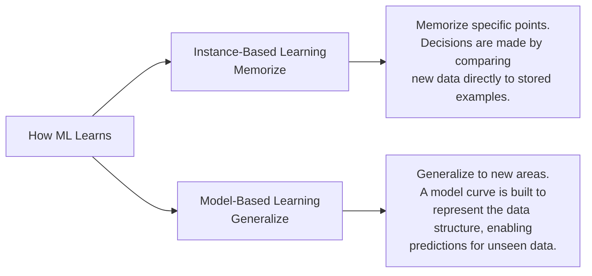
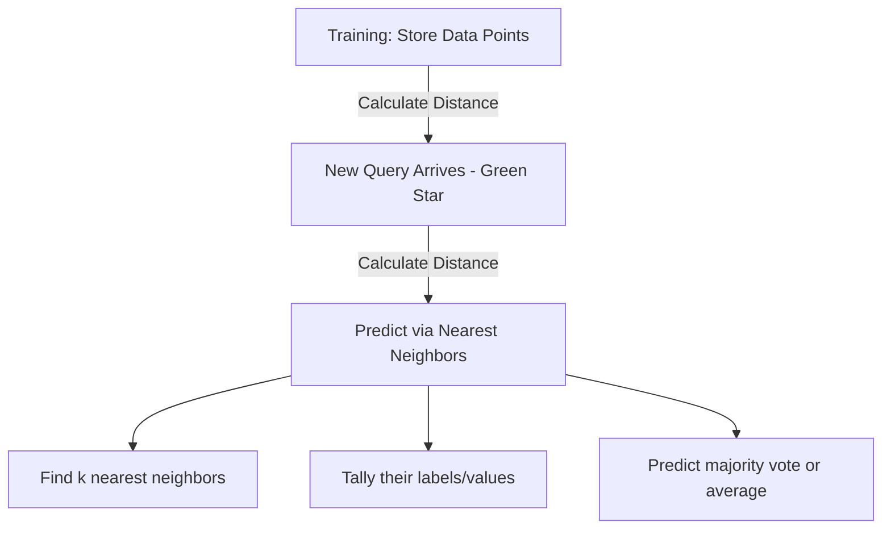
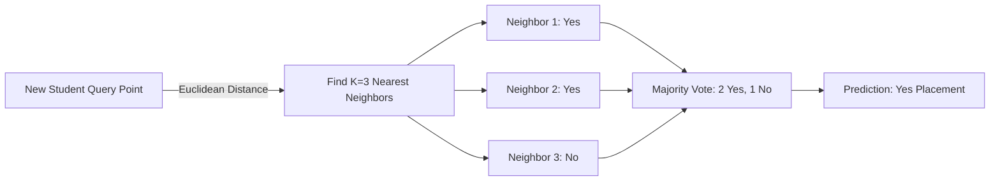
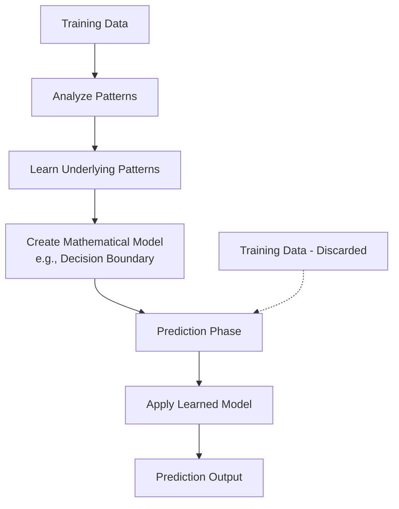
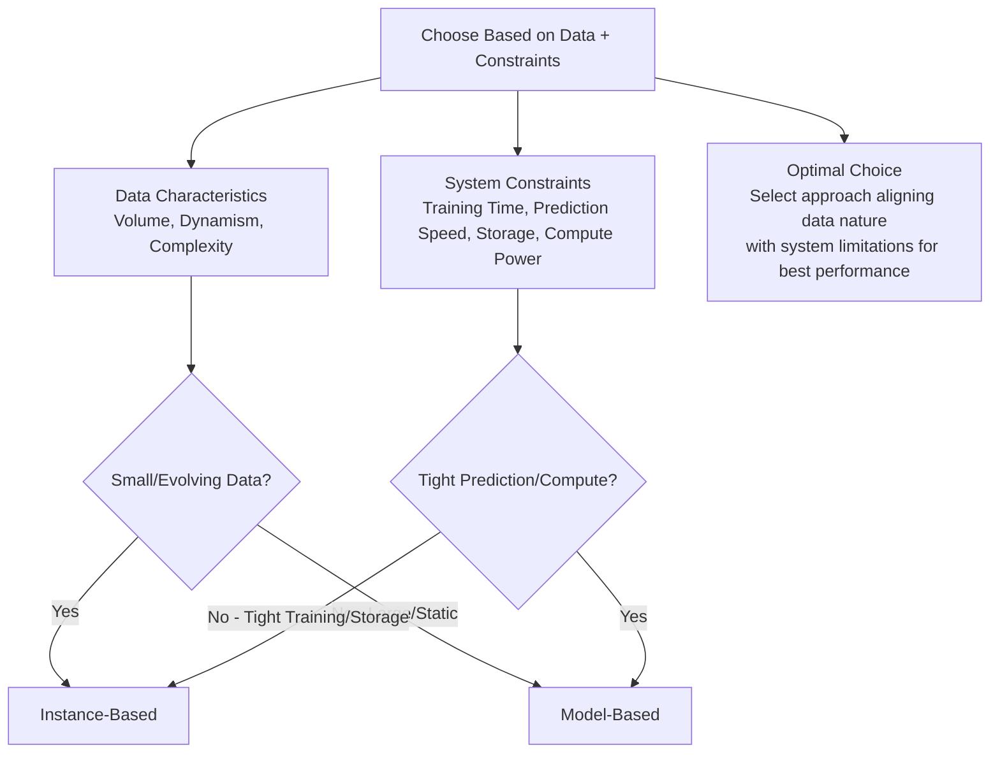

# Instance-Based vs Model-Based Learning | Types of Machine Learning

## Overview

Machine learning algorithms can be categorized based on **how they learn** from data. There are two fundamental approaches:

1. **Instance-Based Learning** (Memorizing)
2. **Model-Based Learning** (Generalizing)

---

## 🎯 Real-World Analogy

**Instance-Based Learning**: Like a student who memorizes all examples and solves new problems by remembering similar past problems.

**Model-Based Learning**: Like a student who understands the underlying concepts and applies formulas/rules to solve new problems.

---

---

## 🖥️ Instance-Based Learning (Lazy Learning)

### Core Concept

- **Memorizes** training data points without building an explicit model
- Makes predictions by comparing new instances with stored training examples
- Also called "**Lazy Learning**" because no model is built during training

### How It Works

1. **Training Phase**: Simply stores all training data points
2. **Prediction Phase**:
   - When a new query point arrives
   - Calculates similarity/distance to all stored points
   - Uses nearest neighbors to make predictions

### Example: K-Nearest Neighbors (KNN)

From the images, we see a classification problem with:

- **Features**: IQ and CGPA
- **Target**: Placement (Yes/No)
- **Process**:
  - New point (green) finds its K nearest neighbors
  - Takes majority vote from neighbors
  - If 2 out of 3 neighbors got placement → Predict "Yes"

### Characteristics

**Advantages:**
- ✅ **No training time** – Just stores data
- ✅ **Flexible** – Can adapt to complex patterns
- ✅ **Non-parametric** – No assumptions about data distribution

**Disadvantages:**
- ❌ **High storage requirements** – Must keep all training data
- ❌ **Slow predictions** – Compares with all stored instances
- ❌ **Sensitive to noise** – Outliers directly affect predictions

### Common Algorithms

- K-Nearest Neighbors (KNN)
- Radial Basis Function Networks
- Case-Based Reasoning systems

---

## 🗃️ Model-Based Learning

### Core Concept

- **Learns patterns** and creates a mathematical function/model
- Generalizes from training data to create decision boundaries
- Makes predictions using the learned model, not raw data

### How It Works

1. **Training Phase**:
   - Analyzes training data
   - Learns underlying patterns
   - Creates mathematical model (e.g., decision boundary)
2. **Prediction Phase**:
   - Uses only the learned model
   - Training data not needed anymore

### Example: Linear/Logistic Models

From the images, we see:

- Creates a **decision boundary** (curved line)
- Separates "Placement: Yes" from "Placement: No" regions
- Any new point is classified based on which side of boundary it falls

### Characteristics

**Advantages:**
- ✅ **Fast predictions** – Uses compact model
- ✅ **Low storage** – Only stores model parameters
- ✅ **Generalizes well** – Learns underlying patterns
- ✅ **Interpretable** – Can understand decision rules

**Disadvantages:**
- ❌ **Training time required** – Must learn parameters
- ❌ **May oversimplify** – Assumes specific model form
- ❌ **Less flexible** – Limited by model assumptions

### Common Algorithms

- Linear Regression
- Logistic Regression
- Decision Trees
- Neural Networks
- Support Vector Machines

---

## 🔄 Key Differences

| Aspect | Instance-Based | Model-Based |
|---|---|---|
| **Learning Approach** | Memorizes examples | Learns patterns |
| **Training Phase** | Just stores data | Builds mathematical model |
| **Storage Required** | High (all training data) | Low (only parameters) |
| **Prediction Speed** | Slow (compares all data) | Fast (applies formula) |
| **When to Train** | No explicit training | Trains before predictions |
| **Generalization** | During prediction only | During training |
| **Training Data After Learning** | Must keep forever | Can discard |
| **Adaptability** | Naturally handles complex patterns | Limited by model assumptions |
| **Interpretability** | Hard to interpret | Often interpretable |

---

## 💡 When to Use Which?

### Use Instance-Based When:

- Data has complex, non-linear patterns
- Local patterns are more important than global
- Storage space is not a constraint
- Few predictions needed
- Training data continuously updates

### Use Model-Based When:

- Need fast predictions
- Storage space is limited
- Want interpretable results
- Global patterns exist in data
- Training data is static
- Need to deploy on edge devices

---

### Instance-Based Learning – Strengths & Best For

- **Strengths**: No explicit training phase, flexible to dynamic data, handles complex relationships.
- **Best For**: Small datasets, evolving data streams, applications where training time is a constraint.

### Model-Based Learning – Strengths & Best For

- **Strengths**: Compact representation, fast inference, generalizes well to unseen data.
- **Best For**: Large datasets, static data, applications requiring rapid real-time predictions.

### Balanced Use Cases (Combined Strengths)

- **Combined Strengths**: Leverages stored examples for specific cases while using a model for speed and generalization.
- **Trade-offs**: Balance between model complexity and storage, accuracy vs. speed.

---

## Summary

Both approaches have their place in machine learning. Instance-based methods excel at capturing complex local patterns but require more resources at prediction time. Model-based methods are efficient and interpretable but may miss complex patterns if the model is too simple. The choice depends on your specific use case, constraints, and data characteristics.