# Major Challenges in Machine Learning

## Overview

This document provides a comprehensive analysis of the 10 most significant challenges faced when working on Machine Learning projects. Understanding these challenges is crucial for anyone pursuing a career in ML or working on real-world ML applications.

---

## 1. Data Collection

### Problem Description

Data collection is the foundation of any machine learning project. Without data, there is no machine learning. While learning ML or working on college projects, data is readily available from sources like Kaggle, UCI ML Repository, or provided by instructors. However, in real-world industry scenarios, data collection becomes significantly more challenging.

### Data Collection Methods

| Method | Description | Challenges |
|---|---|---|
| **API** | Using Application Programming Interfaces to fetch data from services | - Rate limiting<br>- Authentication requirements<br>- Data format inconsistencies<br>- API changes/deprecation |
| **Web Scraping** | Extracting data from websites using automated tools | - Legal/ethical concerns<br>- Website structure changes<br>- Anti-scraping measures (CAPTCHAs, IP blocking)<br>- Data quality issues<br>- Inconsistent HTML structures |

### Key Points

- **Academic vs Industry**: In academic settings, clean CSV/JSON files are readily available. In industry, you must actively collect and curate data.
- **Legal Considerations**: Web scraping may violate Terms of Service or copyright laws
- **Data Ownership**: Questions about who owns the collected data
- **Privacy Concerns**: Especially when dealing with personal or sensitive information

### Best Practices

1. Always check the legality of data collection methods
2. Respect robots.txt files when web scraping
3. Use official APIs when available
4. Document data sources and collection methodology
5. Implement error handling and data validation during collection

### Academic vs. Industry Data Collection (Flowchart)

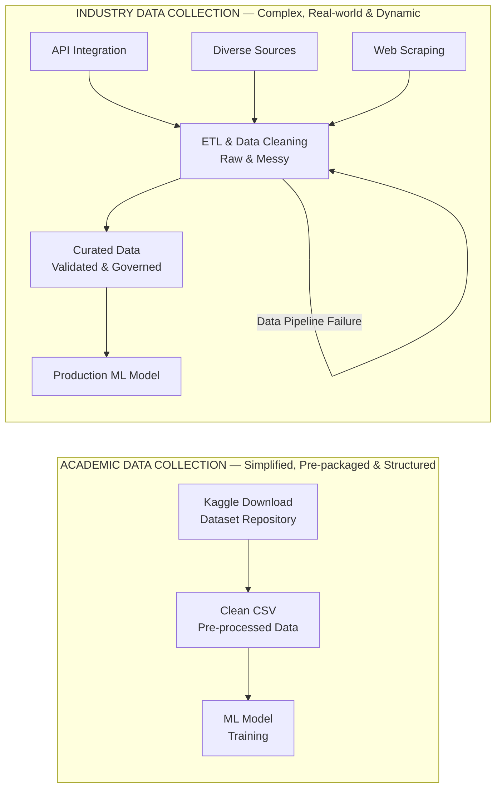

---

## 2. Insufficient Data / Labelled Data

### Problem Description

Even when data is available, having insufficient quantity or lack of proper labels creates significant challenges. This is particularly critical in supervised learning tasks where labeled data is essential for training.

### The Data Quantity Problem

**Model Performance Comparison:**

| Model | Data Size | Performance |
|---|---|---|
| M1 (Simple) | 100 samples | Poor |
| M2 (Complex) | $10^6$ samples | Excellent |

### The "Unreasonable Effectiveness of Data"

A famous research paper demonstrated that:

- With massive amounts of data, the choice of algorithm matters less
- A simple algorithm with abundant data often outperforms a sophisticated algorithm with limited data
- Data quantity can compensate for algorithmic simplicity

### Mathematical Insight

$$\text{Performance} \propto \text{Algorithm Quality} \times \text{Data Quantity} \times \text{Data Quality}$$

When Data Quantity $\to \infty$:
- Algorithm differences become less significant
- Even simpler models perform well

### Model Performance vs. Data Size

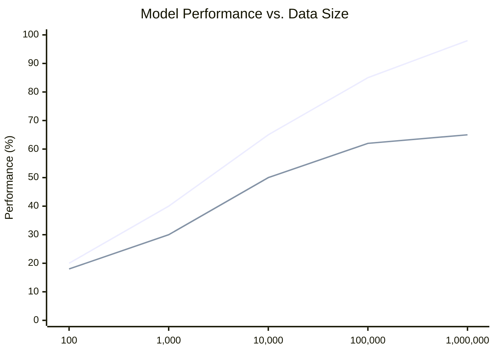

### Labeling Challenges

| Aspect | Challenge | Solution |
|---|---|---|
| **Manual Labeling** | Time-consuming and expensive | Semi-supervised learning, Active learning |
| **Domain Expertise** | Requires subject matter experts | Crowdsourcing with quality checks |
| **Label Consistency** | Inter-annotator agreement issues | Multiple annotators + majority voting |
| **Cost** | Expensive at scale | Transfer learning, Pre-trained models |

### NLP-Specific Challenges

Natural Language Processing tasks face unique labeling challenges:

- Subjective interpretations of text
- Context-dependent meanings
- Need for linguistic expertise
- Multilingual labeling requirements

### Practical Solutions

1. **Data Augmentation**: Create synthetic data from existing samples
2. **Transfer Learning**: Use pre-trained models and fine-tune
3. **Semi-Supervised Learning**: Use small labeled + large unlabeled datasets
4. **Active Learning**: Intelligently select samples for labeling
5. **Crowdsourcing**: Use platforms like Amazon Mechanical Turk (with quality control)

### Solutions for Insufficient Data (Pyramid)

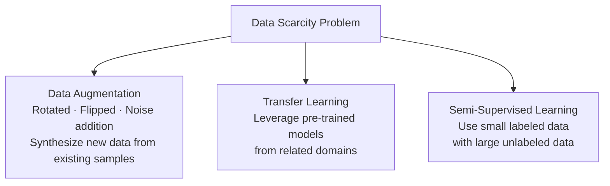

---

## 3. Non-Representative Data

### Problem Description

Non-representative data occurs when your training dataset doesn't accurately reflect the real-world population or scenarios where the model will be deployed. This leads to poor generalization and biased predictions.

### Visualization of the Problem

```
Real World Distribution:
      |     x   xxx
      |   xxxxxxxxxx
      | xxxxxxxxxxxxxx
      |xxxxxxxxxxxxxxxxx
      |_________________

Your Sample (Biased):
      |               x
      |             xxx
      |           xxx
      |        x
      |_________________
         (Only capturing right portion)
```

### Types of Sampling Issues

#### 1. Sampling Noise

Random fluctuations in small samples that don't represent the true population.

**Example**: Tossing a coin 10 times might give 7 heads and 3 tails (70%-30%), but the true distribution is 50%-50%.

#### 2. Sampling Bias

Systematic error in sample selection that favors certain outcomes.

**Example**: Conducting a T20 Cricket World Cup winner survey only in India will give biased results favoring the Indian team, even though other countries also have strong teams.

### Real-World Examples

| Scenario | Bias Type | Impact |
|---|---|---|
| Medical diagnosis trained only on adults | Age bias | Poor performance on children |
| Face recognition trained on one ethnicity | Racial bias | Lower accuracy for other ethnicities |
| Language model trained on formal text | Register bias | Poor performance on casual language |
| Fraud detection trained on old data | Temporal bias | Misses new fraud patterns |

### Mathematical Representation

True Model: $f(x) =$ actual relationship

Sample Model: $\hat{f}(x) =$ model learned from sample

Non-representative sample leads to:

$$E[\hat{f}(x)] \neq f(x)$$

Where $E[]$ is the expected value.

### Solutions and Best Practices

1. **Stratified Sampling**: Ensure proportional representation of all subgroups
2. **Random Sampling**: Reduce systematic bias
3. **Data Collection Diversity**: Collect from multiple sources and demographics
4. **Regular Model Updates**: Adapt to changing distributions
5. **Bias Detection**: Use fairness metrics to identify biases
6. **Cross-Validation**: Test on diverse holdout sets

### Example: The Survey Problem

```
Question: Which team will win the T20 World Cup?

✗ BAD APPROACH:
  Survey only in India → 90% say India will win
  (Sampling Bias - not representative)

✓ GOOD APPROACH:
  Survey in all participating countries → Balanced view
  Get representative predictions
```

---

## 4. Poor Quality Data

### Problem Description

Poor quality data is characterized by errors, inconsistencies, missing values, duplicates, and noise that can severely impact model performance. The principle "Garbage In, Garbage Out" applies directly here.

### Common Data Quality Issues

| Issue Type | Description | Example | Impact |
|---|---|---|---|
| **Missing Values** | Data points without values | Age field is empty | Model can't learn patterns; reduces training data |
| **Outliers** | Extreme values that don't fit the pattern | Age = 150 years | Skews model training; poor generalization |
| **Duplicates** | Repeated records | Same customer entry twice | Overrepresentation; biased learning |
| **Inconsistencies** | Contradictory information | Male/Female vs M/F/1/0 | Parsing errors; feature confusion |
| **Formatting Issues** | Inconsistent data formats | Date: 01/12/2020 vs 2020-12-01 | Data type errors; parsing failures |
| **Noise** | Random errors in measurements | Sensor malfunction readings | Degrades signal; poor predictions |
| **Incorrect Labels** | Wrong target values | Cat image labeled as dog | Model learns wrong patterns |

### Data Quality Dimensions

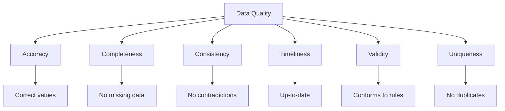

### Impact on ML Models

$$\text{Model Performance} = f(\text{Algorithm},\ \text{Data Quality},\ \text{Data Quantity})$$

With Poor Data Quality:
- Increased training time
- Poor generalization
- Unstable predictions
- Low confidence scores
- Model doesn't converge

### Data Cleaning Workflow

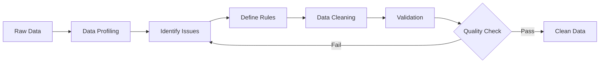

### Solutions and Best Practices

1. **Data Profiling**: Understand data statistics before cleaning

2. **Missing Value Handling**:
   - Deletion (if < 5% missing)
   - Mean/Median/Mode imputation
   - Forward/Backward fill for time series
   - Model-based imputation (KNN, MICE)

3. **Outlier Detection**:
   - Statistical methods (Z-score, IQR)
   - Visualization (box plots, scatter plots)
   - Domain knowledge validation

4. **Deduplication**:
   - Exact matching
   - Fuzzy matching for near-duplicates
   - Record linkage techniques

5. **Validation Rules**:
   - Range checks (age: 0-120)
   - Format checks (email, phone)
   - Cross-field validation
   - Business rule validation

6. **Data Quality Monitoring**:
   - Automated quality checks
   - Regular data audits
   - Data quality dashboards
   - Alert systems for quality degradation

---

## 5. Irrelevant Features

### Problem Description

Irrelevant features (also called "garbage features") are variables that have no meaningful relationship with the target variable. Including these features can confuse the model, increase training time, and reduce performance.

### The "Garbage In, Garbage Out" Principle

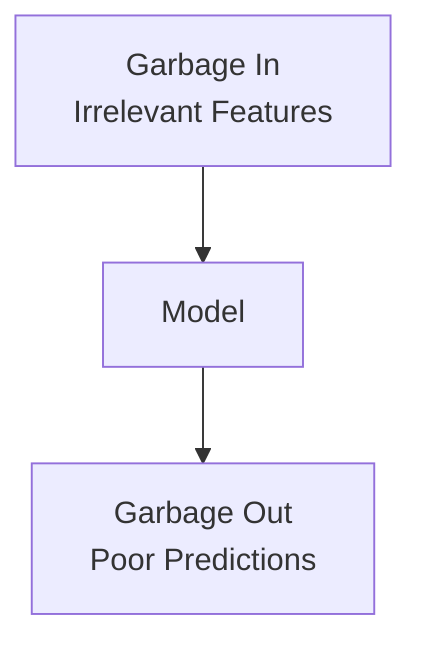

### Feature Types

| Feature Type | Relevance | Action |
|---|---|---|
| **Relevant Features** | Strong correlation with target | Keep |
| **Redundant Features** | Correlated with other features | Remove (reduce multicollinearity) |
| **Irrelevant Features** | No correlation with target | Remove |
| **Weakly Relevant Features** | Minimal correlation | Consider removing (depends on model) |

### Examples of Irrelevant Features

**Predicting House Prices:**
- ✓ **Relevant**: Square footage, location, bedrooms, age
- ✗ **Irrelevant**: Previous owner's favorite color, day of the week listed, agent's middle name

**Credit Card Fraud Detection:**
- ✓ **Relevant**: Transaction amount, location, time, merchant category
- ✗ **Irrelevant**: Cardholder's favorite movie, last login day, card design color

### Feature Selection Process

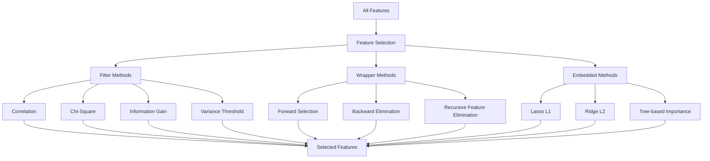

### Feature Selection Methods

#### 1. Filter Methods

Statistical techniques applied before training:

| Method | Use Case | Pros | Cons |
|---|---|---|---|
| Correlation | Numerical features | Fast, simple | Only linear relationships |
| Chi-Square | Categorical features | Good for classification | Assumes independence |
| Mutual Information | Any type | Captures non-linear | Computationally expensive |
| Variance Threshold | Remove low variance | Very fast | May remove useful features |

#### 2. Wrapper Methods

Use model performance to select features:

- **Forward Selection**: Start with no features, add one at a time
- **Backward Elimination**: Start with all features, remove one at a time
- **Recursive Feature Elimination (RFE)**: Iteratively remove least important features

#### 3. Embedded Methods

Feature selection during model training:

- **Lasso (L1 Regularization)**: Drives coefficients to zero
- **Tree-based Feature Importance**: Random Forest, XGBoost
- **Neural Network Attention**: Learn which features matter

### Curse of Dimensionality

As number of features increases:
- Required data grows exponentially
- Model complexity increases
- Risk of overfitting increases
- Training time increases
- Interpretability decreases

#### Mathematical Insight

For $d$ dimensions:

$$\text{Volume of unit hypercube} = 1$$

$$\text{Volume of inscribed hypersphere} \approx \frac{\pi^{d/2}}{(d/2)!}$$

As $d \to \infty$, volume ratio $\to 0$. Most data points are near the surface (edges).

### Feature Engineering vs Feature Selection

| Aspect | Feature Engineering | Feature Selection |
|---|---|---|
| **Goal** | Create new features | Choose best existing features |
| **Process** | Transform, combine features | Filter, rank, select features |
| **Example** | $\text{Age}^2$ from Age | Select Age, drop Weight |
| **Impact** | Can improve model significantly | Reduces complexity |

### Best Practices

1. **Domain Knowledge**: Consult experts to identify relevant features
2. **Exploratory Data Analysis (EDA)**: Visualize relationships
3. **Correlation Analysis**: Remove highly correlated features
4. **Feature Importance**: Use tree-based models to rank features
5. **Cross-Validation**: Test feature sets on validation data
6. **Iterative Process**: Continuously refine feature set
7. **Documentation**: Keep track of which features are removed and why

---

## 6. Overfitting

### Problem Description

Overfitting occurs when a model learns the training data too well, including its noise and outliers, rather than learning the underlying pattern. The model performs excellently on training data but poorly on new, unseen data.

### Visual Representation

```
Training Data Points: x
True Underlying Pattern: ----
Overfitted Model: ~~~~

      |     x    /\    x
      |   x   /    \      x
      | x  /          \
      |/                  \x
      |____________________

The model follows every training point
including noise and outliers
```

### Characteristics of Overfitting

| Training Set | Validation/Test Set | Diagnosis |
|---|---|---|
| High accuracy (>95%) | Low accuracy (<70%) | **Overfitting** |
| Low error | High error | **Overfitting** |
| Perfect fit | Poor generalization | **Overfitting** |

### Causes of Overfitting

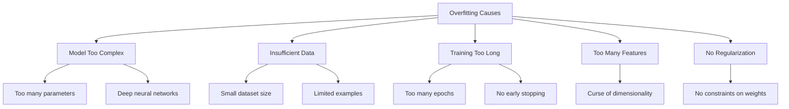

### Bias-Variance Tradeoff

$$\text{Total Error} = \text{Bias}^2 + \text{Variance} + \text{Irreducible Error}$$

**Overfitting: Low Bias, High Variance**
- Performs well on training data
- Performs poorly on test data
- Sensitive to small changes in training data

### Signs of Overfitting

1. **Large gap between training and validation accuracy**

```
Training Accuracy:  98%
Validation Accuracy: 72%
Gap: 26% → Overfitting!
```

2. **Training loss decreases, but validation loss increases**

```
Epoch  1: Train Loss: 1.2   Val Loss: 1.3
Epoch  5: Train Loss: 0.8   Val Loss: 0.9
Epoch 10: Train Loss: 0.3   Val Loss: 0.8  ← Starting to overfit
Epoch 20: Train Loss: 0.1   Val Loss: 1.2  ← Clear overfitting
```

3. **Model performs well on training examples but fails on similar unseen examples**

4. **High model complexity relative to data size**

```
Data points:    100
Model parameters: 10,000
Ratio: 1:100 → Likely to overfit!
```

### Solutions to Overfitting

#### 1. Get More Training Data
- Collect additional samples
- Data augmentation (images, text)
- Synthetic data generation

#### 2. Reduce Model Complexity
- Fewer layers in neural networks
- Fewer neurons per layer
- Simpler algorithms (linear vs polynomial)
- Reduce tree depth in decision trees

#### 3. Regularization Techniques

| Technique | Description | How it Helps |
|---|---|---|
| **L1 (Lasso)** | Adds sum of absolute weights to loss | Drives some weights to zero; feature selection |
| **L2 (Ridge)** | Adds sum of squared weights to loss | Penalizes large weights; smoother model |
| **Elastic Net** | Combines L1 and L2 | Benefits of both L1 and L2 |
| **Dropout** | Randomly drop neurons during training | Prevents co-adaptation of neurons |

**Mathematical Representation:**

Without Regularization:

$$\text{Loss} = \text{Error}(y,\ \hat{y})$$

With L2 Regularization:

$$\text{Loss} = \text{Error}(y,\ \hat{y}) + \lambda \sum w^2$$

With L1 Regularization:

$$\text{Loss} = \text{Error}(y,\ \hat{y}) + \lambda \sum |w|$$

Where:
- $\lambda$ = regularization strength
- $w$ = model weights

#### 4. Early Stopping

Stop training when validation error starts increasing:

```
Monitor validation loss during training
Stop when it hasn't improved for N epochs
Restore model to best validation checkpoint
```

#### 5. Cross-Validation

Use k-fold cross-validation to ensure model generalizes:

```
1. Split data into k folds
2. Train on k-1 folds, validate on 1 fold
3. Repeat k times
4. Average performance across all folds
```

#### 6. Data Augmentation

Create variations of existing data:

- **Images**: Rotation, flipping, cropping, color jittering
- **Text**: Synonym replacement, back-translation, paraphrasing
- **Audio**: Time stretching, pitch shifting, noise addition

#### 7. Ensemble Methods

Combine multiple models:

- **Bagging**: Random Forest (reduces variance)
- **Boosting**: XGBoost, AdaBoost (reduces both bias and variance)
- **Stacking**: Combine different model types

### Best Practices

1. Always use separate training, validation, and test sets
2. Monitor both training and validation metrics
3. Start with simple models and increase complexity gradually
4. Use regularization by default
5. Implement early stopping
6. Perform cross-validation for reliable estimates
7. Keep test set completely separate until final evaluation

### Bias-Variance Tradeoff Chart

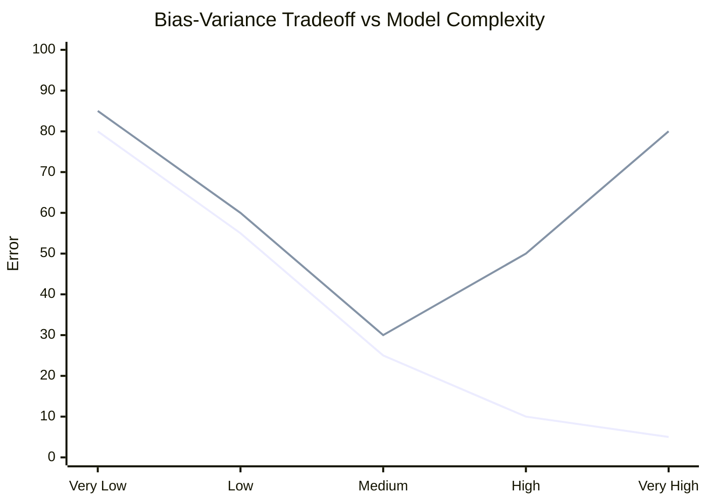

---

## 7. Underfitting

### Problem Description

Underfitting occurs when a model is too simple to capture the underlying pattern in the data. The model performs poorly on both training and test data because it hasn't learned the actual relationships.

### Visual Representation

```
Training Data Points: x
True Underlying Pattern: ~~~~
Underfitted Model: ----

      | x       x    x   x
      |    x x    x      x x
      | x   x       x  x
      |__________________
           (Simple linear line doesn't capture
            the curved pattern in data)
```

### Characteristics of Underfitting

| Metric | Training Set | Validation/Test Set | Diagnosis |
|---|---|---|---|
| Accuracy | Low (~60%) | Low (~62%) | **Underfitting** |
| Error | High | High (similar to train) | **Underfitting** |
| Performance | Poor | Poor | **Underfitting** |

### Comparison: Underfitting vs Overfitting vs Good Fit

```
               Model Complexity

    UNDERFITTING    GOOD FIT    OVERFITTING

Training:  Low          High        Very High
Test:      Low          High        Low
Gap:       Small        Small       Large

Model:     Too Simple   Optimal     Too Complex
Bias:      High         Balanced    Low
Variance:  Low          Balanced    High
```

### Bias-Variance in Underfitting

**Underfitting: High Bias, Low Variance**
- Model makes strong assumptions
- Doesn't capture data patterns
- Consistent but consistently wrong
- Similar poor performance on all data

### Causes of Underfitting

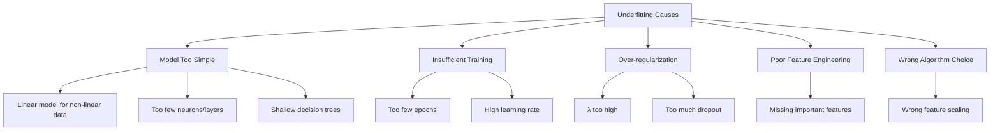

### Examples of Underfitting

**Example 1: Linear Model for Non-Linear Data**

```
Problem: Predict house prices based on size

Data Pattern: Exponential relationship
Price = a × size² + b × size + c

Model Used: Linear Regression
Price = m × size + c

Result: Underfitting - can't capture quadratic relationship
```

**Example 2: Shallow Neural Network**

```
Problem: Image classification (complex patterns)

Model: Single layer neural network
Result: Cannot learn hierarchical features
        Underfits the data

Should Use: Deep neural network with multiple layers
```

### Signs of Underfitting

1. **Both training and test accuracy are low**

```
Training Accuracy: 65%
Test Accuracy:     63%
Both poor → Underfitting!
```

2. **Model can't capture obvious patterns in training data**
3. **Simple patterns in data, but model misses them**

4. **Learning curves plateau at poor performance**

```
Training Error stays high across all epochs
Validation Error also stays high
Both lines are close together but at poor performance level
```

5. **Predictions have high error variance**

### Solutions to Underfitting

#### 1. Increase Model Complexity

| Model Type | How to Increase Complexity |
|---|---|
| **Neural Networks** | Add more layers (go deeper), Add more neurons per layer (go wider), Use different activation functions |
| **Decision Trees** | Increase max depth, Reduce min samples per leaf, Reduce min samples for split |
| **Polynomial Regression** | Increase polynomial degree, Add interaction terms |
| **SVM** | Use non-linear kernels (RBF, polynomial), Decrease regularization parameter C |

#### 2. Add More Features

```
Original Features: [square_feet, bedrooms]
Enhanced Features: [
    square_feet,
    bedrooms,
    square_feet²,              ← Polynomial feature
    square_feet × bedrooms,    ← Interaction feature
    log(square_feet),          ← Transformed feature
    age_of_house,              ← New relevant feature
    location_score             ← Engineered feature
]
```

#### 3. Reduce Regularization

```
Original: λ = 1.0  (too much regularization)
Adjusted: λ = 0.1  (less constraint on model)

For L2 Regularization:
High λ → Simple model → Underfitting
Low λ  → Complex model → Better fit
```

#### 4. Train Longer

```
Increase number of epochs
Reduce learning rate for finer adjustments
Use learning rate schedules
Allow model more time to learn patterns
```

#### 5. Feature Engineering

Create more informative features:
- Polynomial features
- Interaction terms
- Domain-specific transformations
- Binning continuous variables
- Encoding categorical variables properly

#### 6. Choose Better Algorithm

| Problem Type | Poor Choice | Better Choice |
|---|---|---|
| Non-linear relationships | Linear Regression | Polynomial Regression, Neural Network |
| Complex image patterns | Logistic Regression | CNN, Deep Learning |
| Sequential data | Linear model | RNN, LSTM, Transformer |
| Interactions between features | Simple linear model | Tree-based (Random Forest, XGBoost) |

#### 7. Remove or Reduce Regularization

```python
# Too much regularization:
model = Ridge(alpha=100)  # High alpha → Underfitting

# Better:
model = Ridge(alpha=1)    # Moderate alpha

# Or try:
model = Ridge(alpha=0.1)  # Less regularization
```

### Best Practices

1. **Start Simple, Then Increase Complexity**
   - Begin with baseline model
   - Gradually increase complexity if underfitting

2. **Use Learning Curves**
   - Plot training and validation error vs training size
   - Identify whether adding data or complexity helps

3. **Feature Analysis**
   - Ensure all relevant features are included
   - Check feature correlations with target

4. **Hyperparameter Tuning**
   - Use grid search or random search
   - Find optimal model complexity

5. **Cross-Validation**
   - Ensures model isn't accidentally fitting to specific split
   - Gives reliable performance estimate

6. **Domain Expertise**
   - Consult experts for feature ideas
   - Understand problem deeply before modeling

---

## 8. Software Integration

### Problem Description

After building a machine learning model, integrating it into production software systems is one of the most challenging aspects. ML models don't exist in isolation—they must work within larger software ecosystems across different platforms, languages, and environments.

### The Integration Challenge

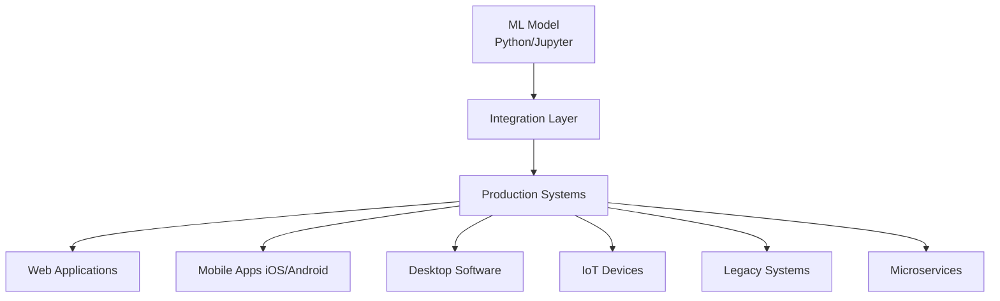

### Platform Diversity Challenge

| Platform | Operating System | Language | ML Support | Challenges |
|---|---|---|---|---|
| **Web Servers** | Linux, Windows | Python, Node.js, Java | Good | Dependency management |
| **Mobile (iOS)** | iOS | Swift, Objective-C | Limited | CoreML conversion required |
| **Mobile (Android)** | Android | Java, Kotlin | Limited | TensorFlow Lite conversion |
| **Desktop** | Windows, macOS, Linux | C++, C#, Java | Varies | Model portability |
| **Edge Devices** | Embedded Linux, RTOS | C, C++ | Limited | Resource constraints |
| **Web Browser** | JavaScript | JavaScript | Emerging | TensorFlow.js, ONNX.js |
| **Microcontrollers** | Bare metal | C, C++ | Very Limited | Extreme constraints |

### Integration Architecture Patterns

#### 1. Embedded Model

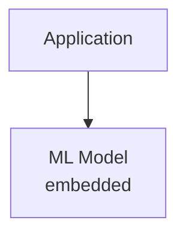

**Pros**: Fast, no network latency, offline capable  
**Cons**: Large binary size, hard to update model

#### 2. API Service

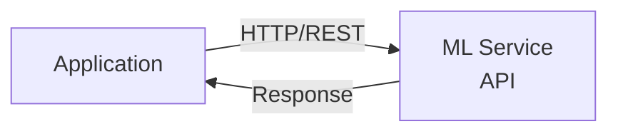

**Pros**: Easy to update, centralized, language-agnostic  
**Cons**: Network dependency, latency, scaling challenges

#### 3. Hybrid Approach

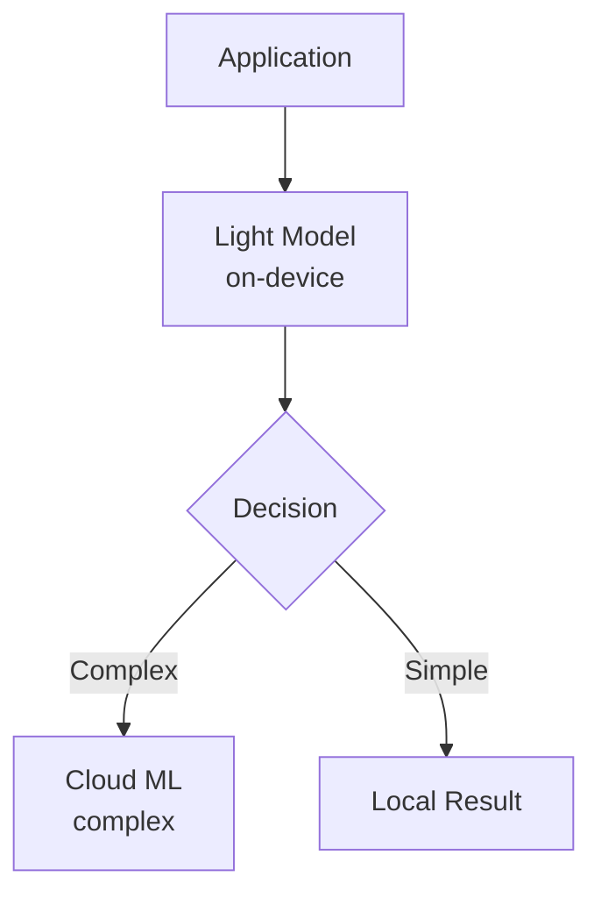

### Framework and Language Compatibility

| ML Framework | Primary Language | Production Support | Deployment Options |
|---|---|---|---|
| **TensorFlow** | Python | Excellent | TF Serving, TF Lite, TF.js |
| **PyTorch** | Python | Good | TorchServe, ONNX export |
| **Scikit-learn** | Python | Good | Pickle, ONNX, PMML |
| **XGBoost** | Python/C++ | Excellent | Native C++ API, PMML |
| **Keras** | Python | Excellent | Via TensorFlow |

### Common Integration Issues

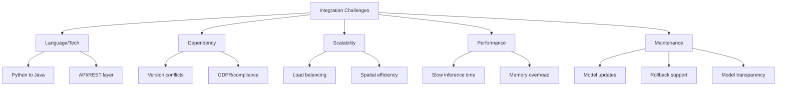

### Platform-Specific Challenges

#### Java Integration

```
Challenge: Python ML model → Java application

Problems:
- No native TensorFlow support (limited)
- Scikit-learn not available in Java
- Need for model conversion or API layer

Solutions:
1. Use DL4J (DeepLearning4J) - Java ML library
2. Export to ONNX, load with Java ONNX runtime
3. Create REST API service
4. Use Jython (limited support)
5. Use GraalVM for polyglot execution
```

#### JavaScript/Browser Integration

```
Challenge: Run ML in browser

Progress:
- TensorFlow.js: Growing support
- ONNX.js: Run ONNX models
- WebAssembly: Better performance

Limitations:
- Limited model size
- Performance constraints
- Not all operations supported
- Browser compatibility issues
```

#### Mobile Integration

**iOS (CoreML)**

```
Steps:
1. Convert model to CoreML format
   - Using coremltools (Python)
   - Limited to supported operations
2. Integrate in Swift/Objective-C
3. Deploy with app

Challenges:
- Model size limits
- Update requires app update
- Not all layer types supported
```

**Android (TensorFlow Lite)**

```
Steps:
1. Convert TF model to TFLite
2. Optimize and quantize
3. Integrate in Java/Kotlin
4. Handle device fragmentation

Challenges:
- Device capability variations
- Model compression needed
- Different Android versions
```

### Deployment Solutions and Tools

#### 1. Model Serving Frameworks

| Tool | Provider | Best For | Features |
|---|---|---|---|
| **TensorFlow Serving** | Google | TensorFlow models | High performance, versioning, batching |
| **TorchServe** | AWS/Facebook | PyTorch models | Multi-model serving, metrics |
| **MLflow** | Databricks | Any framework | Experiment tracking, model registry |
| **Seldon Core** | Seldon | Kubernetes | Cloud-native, multi-framework |
| **BentoML** | BentoML | Any framework | Easy packaging, deployment |

#### 2. Model Format Standards

| Format | Description | Support | Use Case |
|---|---|---|---|
| **ONNX** | Open Neural Network Exchange | Wide | Cross-framework compatibility |
| **PMML** | Predictive Model Markup Language | Limited to traditional ML | Legacy systems |
| **SavedModel** | TensorFlow format | TensorFlow ecosystem | TF Serving |
| **CoreML** | Apple format | iOS/macOS | Apple devices |
| **TFLite** | TensorFlow Lite | Mobile | Android/iOS/Edge |

#### 3. Containerization

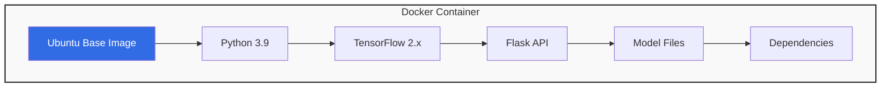

Benefits:
- ✓ Consistent environment
- ✓ Easy deployment
- ✓ Scalability
- ✓ Isolation

### Integration Workflow

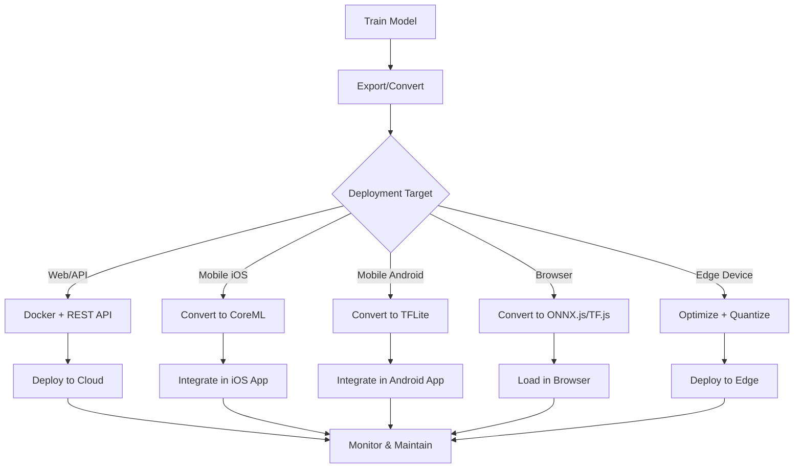

### Best Practices for Software Integration

1. **Use Standard Formats**
   - Export models to ONNX when possible
   - Use framework-agnostic formats
   - Document model interfaces clearly

2. **API-First Approach**
   - Create REST/gRPC APIs for models
   - Version your APIs
   - Use API gateways for management

3. **Containerization**
   - Use Docker for consistent environments
   - Include all dependencies
   - Version control containers

4. **Model Versioning**
   - Track model versions
   - Support A/B testing
   - Enable rollback capability

5. **Performance Optimization**
   - Use model quantization
   - Implement batching
   - Cache predictions when appropriate
   - Use GPU acceleration where available

6. **Monitoring and Logging**
   - Log predictions and inputs
   - Monitor latency and throughput
   - Track model performance over time
   - Set up alerts for issues

7. **Testing**
   - Unit test model integration
   - Integration tests with systems
   - Load testing for scalability
   - Regression testing for updates

### The Reality

Software integration is often **underestimated** in ML projects:

- **Time**: Can take 50-70% of project time
- **Expertise**: Requires both ML and software engineering skills
- **Maintenance**: Ongoing effort for updates and monitoring
- **Compatibility**: Constant challenge with evolving platforms

---

## 9. Offline Learning/Deployment

### Problem Description

Offline learning (also called batch learning) refers to models that are trained once on a static dataset and then deployed to production without continuous learning. The model doesn't update itself with new data in real-time. To update the model, you must retrain it offline and redeploy.

### Offline Learning Characteristics

| Aspect | Description | Impact |
|---|---|---|
| **Training** | Done once or periodically | Requires scheduled retraining |
| **Deployment** | Model is frozen at deployment | Doesn't adapt to new patterns |
| **Updates** | Manual retraining required | Downtime or version management |
| **Data** | Uses historical batch data | May miss recent trends |
| **Resources** | One-time high compute | Periodic spikes in compute usage |

### The Offline Learning Workflow

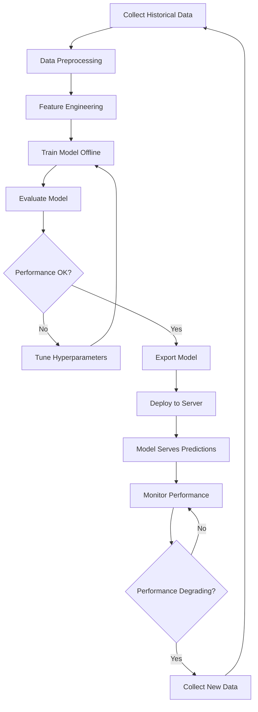

### Challenges with Offline Learning

#### 1. Model Staleness (Concept Drift)

```
Time: ──────────────────────────────────►
Data Distribution:
  T0: xxxxx              (Training data)
  T1: ─xxxxx─            (Slight shift)
  T2: ──xxxxx─           (More shift)
  T3: ────xxxxx─         (Significant drift)
  T4: ──────xxxxx─       (Model outdated)

Model trained at T0 becomes less accurate over time
```

**Examples:**
- **Stock Market**: Patterns change daily, model trained last month may be outdated
- **Fashion Trends**: Preferences shift seasonally
- **Fraud Detection**: Fraudsters adapt, new patterns emerge
- **News Classification**: New topics and events emerge

#### 2. Update Frequency Dilemma

| Frequency | Pros | Cons |
|---|---|---|
| **Daily** | Captures recent trends | High compute cost, frequent deployments |
| **Weekly** | Balanced approach | May miss rapid changes |
| **Monthly** | Lower cost | Risk of significant drift |
| **Quarterly** | Minimal overhead | High risk of outdated model |
| **Yearly** | Very low cost | Model likely obsolete |

#### 3. Retraining Overhead

```
Retraining Cycle:
| 1. Data Collection      (hours)   |
| 2. Data Cleaning        (hours)   |
| 3. Feature Engineering  (hours)   |
| 4. Model Training       (hours)   |
| 5. Validation           (minutes) |
| 6. Testing              (minutes) |
| 7. Deployment           (minutes) |

Total: Multiple hours to days

During this time:
- Old model is still serving
- New patterns are not captured
- Potential performance degradation
```

#### 4. Data Collection and Storage

Challenges:
- Need to continuously collect data even when model isn't training
- Storage costs for historical data
- Data versioning for reproducibility
- Handling data quality issues in production

**Production Data Pipeline:**

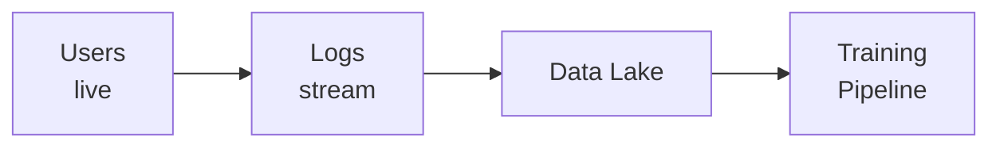

#### 5. Deployment Challenges

**Version Management:**

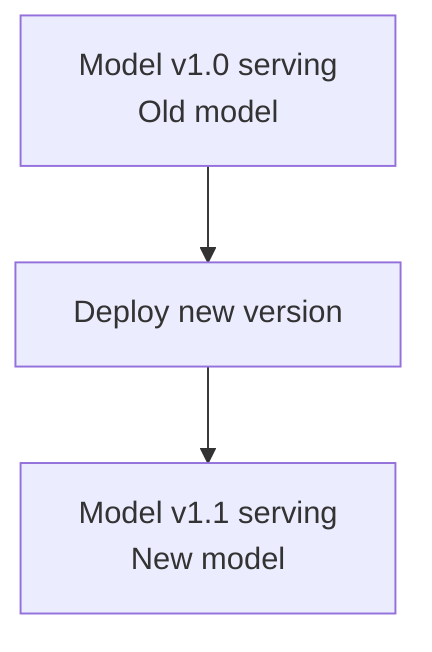

Challenges:
- Zero-downtime deployment
- Rollback if issues arise
- A/B testing new vs old
- Gradual rollout

### Solutions and Best Practices

#### 1. Automated Retraining Pipelines

```mermaid
graph LR
    A[Scheduler\nCron/Airflow] --> B[Data Collection]
    B --> C[Preprocessing]
    C --> D[Training]
    D --> E[Validation]
    E --> F{Performance Check}
    F -->|Good| G[Deploy New Model]
    F -->|Bad| H[Alert Team]
    H --> I[Keep Current Model]
```

**Tools:**
- **Apache Airflow**: Workflow orchestration
- **Kubeflow**: ML pipelines on Kubernetes
- **MLflow**: Experiment tracking and model registry
- **Azure ML/AWS SageMaker**: Cloud ML platforms

#### 2. Model Monitoring

```
Monitor These Metrics:
| • Prediction Accuracy/Error    |
| • Inference Latency            |
| • Prediction Distribution      |
| • Feature Distribution (drift) |
| • Data Quality Metrics         |
| • System Resources             |

Set up Alerts:
If accuracy < threshold → Retrain model
If latency > threshold → Scale infrastructure
If drift detected → Schedule retraining
```

#### 3. Feature Store

```
Feature Store Architecture:
|           Feature Store             |
| • Centralized feature repository   |
| • Versioned features               |
| • Consistent train/serve features  |
| • Feature monitoring               |

Benefits:
- Consistency between training and serving
- Reusability of features
- Easy experimentation
- Monitoring and versioning
```

### Comparison: Offline vs Online Learning

| Aspect | Offline Learning | Online Learning |
|---|---|---|
| **Training Time** | Periodic, batch | Continuous, incremental |
| **Adaptability** | Slow to adapt | Quick adaptation |
| **Complexity** | Simpler to implement | More complex |
| **Resources** | Periodic high usage | Constant moderate usage |
| **Data Requirements** | Needs all data at once | Can learn from streams |
| **Stability** | More stable | May be unstable |
| **Cost** | Lower operational cost | Higher operational cost |
| **Use Cases** | Stable environments | Dynamic environments |

### When to Use Offline Learning

**Good for:**
- Stable data distributions (changes slowly)
- Batch predictions are acceptable
- Lower complexity and cost preferred
- Regulatory requirements for model validation
- Historical data is sufficient

**Examples:**
- Credit scoring (patterns change slowly)
- Medical diagnosis (based on established knowledge)
- Document classification (stable categories)
- Product recommendations (can update weekly)

### When Online Learning is Better

**Good for:**
- Rapidly changing environments
- Real-time adaptation needed
- Streaming data
- Personalization at scale

**Examples:**
- Stock trading (patterns change constantly)
- Real-time fraud detection (new fraud patterns)
- Ad click prediction (user preferences evolve)
- Dynamic pricing (demand fluctuates)

### Emerging Solutions

#### 1. MLOps Platforms:
- Automate the entire ML lifecycle
- CI/CD for machine learning
- Model versioning and registry
- Monitoring and alerting

#### 2. Feature Stores:
- Feast, Tecton, AWS Feature Store
- Consistent features across train/serve
- Feature reusability

#### 3. Model Serving Infrastructure:
- TensorFlow Serving, TorchServe
- Kubernetes-based deployments
- Auto-scaling and load balancing

#### 4. Experiment Tracking:
- MLflow, Weights & Biases
- Track all experiments
- Compare model versions

### Best Practices

1. **Automate Everything**
   - Data collection
   - Feature engineering
   - Training pipeline
   - Deployment process

2. **Monitor Continuously**
   - Model performance
   - Data drift
   - System health

3. **Version Control**
   - Models
   - Data
   - Code
   - Configurations

4. **Test Thoroughly**
   - Unit tests for data pipelines
   - Integration tests
   - A/B testing in production

5. **Document**
   - Model cards
   - Data provenance
   - Deployment procedures

6. **Plan for Failure**
   - Rollback procedures
   - Fallback models
   - Error handling

---

## 10. Cost Involved

### Problem Description

Machine Learning projects involve significant costs that are often underestimated or overlooked. These costs go far beyond just training models and include infrastructure, data, personnel, and hidden operational expenses. Understanding and managing these costs is crucial for sustainable ML deployments.

### Cost Categories Overview

```mermaid
graph TD
    TC[Total ML Cost]
    TC --> IC[Infrastructure Costs]
    TC --> DC[Development Costs]
    TC --> DAC[Data Costs]
    TC --> OC[Operational Costs]
    TC --> HC[Hidden Costs]
    IC --> IC1[Compute]
    IC --> IC2[Storage]
    IC --> IC3[Network]
    DC --> DC1[Data Scientists]
    DC --> DC2[ML Engineers]
    DC --> DC3[DevOps/MLOps]
    DAC --> DAC1[Data Collection]
    DAC --> DAC2[Data Labeling]
    OC --> OC1[Serving/Inference]
    OC --> OC2[Monitoring]
    OC --> OC3[Retraining]
    HC --> HC1[Configuration]
    HC --> HC2[Technical Debt]
    HC --> HC3[Integration]
```

### 1. Infrastructure Costs

#### Compute Costs

| Resource Type | Use Case | Cost Range | Example |
|---|---|---|---|
| **CPU** | Data preprocessing, traditional ML | $0.05 - $0.50/hour | AWS c5.xlarge |
| **GPU** | Deep learning training | $1.00 - $30.00/hour | NVIDIA V100, A100 |
| **TPU** | Large-scale neural network training | $4.50 - $32.00/hour | Google Cloud TPU |
| **Edge Devices** | On-device inference | Hardware cost | Raspberry Pi, Jetson |

**Training Cost Example:**

```
Training a Large Language Model:
- Hardware: 1000 GPUs (A100)
- Cost per GPU: $2.50/hour
- Training time: 100 hours
- Total: 1000 × $2.50 × 100 = $250,000

Plus:
- Failed experiments: +50%
- Hyperparameter tuning: +30%
- Total: ~$450,000
```

#### Network Costs

| Traffic Type | Cost | Impact |
|---|---|---|
| **Ingress** | Usually free | Data coming in |
| **Egress** | $0.05 - $0.15/GB | Data going out, expensive at scale |
| **Inter-region** | $0.01 - $0.02/GB | Between regions |
| **Intra-region** | Free or minimal | Within same region |

**Example:**

```
Model Serving with 1M requests/day:
- Average prediction size: 10 KB
- Daily egress: 1M × 10 KB = 10 GB
- Monthly egress: 300 GB
- Cost: 300 × $0.09 = $27/month
```

### 2. Development Costs (Human Resources)

#### Team Composition and Costs

| Role | Responsibility | Typical Salary (US) |
|---|---|---|
| **Data Scientist** | Model development, experimentation | $100k - $180k/year |
| **ML Engineer** | ML infrastructure, deployment | $120k - $200k/year |
| **Data Engineer** | Data pipelines, infrastructure | $110k - $180k/year |
| **Software Engineer** | Integration, API development | $100k - $160k/year |
| **DevOps/MLOps** | Deployment, monitoring | $110k - $180k/year |
| **Domain Expert** | Business requirements, validation | $80k - $150k/year |

**Typical Project Team:**

```
Small Project (6 months):
- 2 Data Scientists   @ $150k = $300k/year = $150k for 6 months
- 1 ML Engineer       @ $160k = $160k/year = $80k  for 6 months
- 1 Data Engineer     @ $140k = $140k/year = $70k  for 6 months
                              Total: $300k

Medium Project (1 year):
- 3 Data Scientists   = $450k
- 2 ML Engineers      = $360k
- 2 Data Engineers    = $300k
- 1 DevOps Engineer   = $140k
                              Total: $1.25M
```

### 3. Data Costs

#### Data Collection

| Method | Cost Structure | Example Cost |
|---|---|---|
| **Web Scraping** | Development + infrastructure | $5k - $50k setup |
| **APIs** | Per request pricing | $0.001 - $1 per API call |
| **Data Purchase** | One-time or subscription | $10k - $1M+ |
| **Sensors/IoT** | Hardware + maintenance | $100 - $10k per device |
| **Surveys** | Per response | $1 - $10 per response |

#### Data Labeling

**Labeling Platforms:**
- Amazon Mechanical Turk
- Labelbox
- Scale AI
- Appen

### 4. Operational Costs

#### Serving/Inference Costs

Production Model Serving

#### Monitoring and Logging

| Component | Purpose | Monthly Cost |
|---|---|---|
| **Logging** | Store prediction logs | $50 - $500 |
| **Monitoring** | Performance metrics | $50 - $300 |
| **Alerting** | Issue notifications | $20 - $100 |
| **Dashboards** | Visualization | $50 - $200 |

#### Retraining Costs

Monthly Retraining

### 5. Hidden Costs

These are often the most significant and overlooked costs.

#### Configuration Complexity

```
ML System Configuration:
| • Data pipeline configs       |
| • Feature engineering configs |
| • Model hyperparameters       |
| • Training configs            |
| • Deployment configs          |
| • Monitoring configs          |
| • A/B test configs            |
|                               |
| Configuration Hell:           |
| • Hard to reproduce experiments |
| • Difficult to debug issues   |
| • Error-prone changes         |
```

#### Data Dependency Costs

```
Dependency Graph:
Model A ─┐
         ├──► Feature X ──► Data Source 1
Model B ─┘                       │
                                  ├──► Change impacts all
Model C ──► Feature Y ───────────┘

Cost of changes:
- Need to retrain all dependent models
- Validate all downstream systems
- Update all documentation
- Coordinate with multiple teams
```

### 6. Cloud Provider Comparison

| Provider | Strengths | Cost Characteristics |
|---|---|---|
| **AWS** | Mature services, wide adoption | Competitive, complex pricing |
| **Google Cloud** | TPUs, BigQuery, strong ML tools | Good for large-scale training |
| **Azure** | Enterprise integration | Competitive, good for MS stack |
| **On-Premise** | Full control | High upfront, lower ongoing |

### Cost Optimization Strategies

#### 1. Compute Optimization

```
Strategies:
| ✓ Use Spot/Preemptible Instances    |
|   (60-90% cost reduction)           |
| ✓ Auto-scaling                      |
|   (pay only for what you use)       |
| ✓ Model Compression                 |
|   (smaller models = cheaper serving)|
| ✓ Batch Predictions                 |
|   (instead of real-time)           |
| ✓ Right-size Instances              |
|   (don't over-provision)           |
```

#### 2. Model Optimization

| Technique | Benefit | Cost Saving |
|---|---|---|
| **Quantization** | Reduce model size | 50-75% |
| **Pruning** | Remove unnecessary weights | 30-50% |
| **Knowledge Distillation** | Smaller student model | 50-90% |
| **Early Stopping** | Stop training when good enough | 20-40% |

#### 3. Data Optimization

```
Data Lifecycle Management:
| Hot Data (frequent access)        |
| → Standard storage                |
|                                   |
| Warm Data (occasional access)     |
| → Infrequent access storage       |
| (50% cheaper)                     |
|                                   |
| Cold Data (rare access)           |
| → Archive storage                 |
| (80% cheaper)                     |
|                                   |
| Old Data (no longer needed)       |
| → Delete                          |
| (100% saving)                     |
```

### Total Cost of Ownership (TCO) Example

```
Year 1 ML Project TCO:

| DEVELOPMENT                        |
| Team (5 people):    $750,000       |
| Tools & Software:    $50,000       |
|                                    |
| DATA                               |
| Collection:          $30,000       |
| Labeling:            $50,000       |
| Storage:             $10,000       |
|                                    |
| INFRASTRUCTURE                     |
| Training (GPU):      $80,000       |
| Serving:             $15,000       |
| Monitoring:          $10,000       |
|                                    |
| OPERATIONAL                        |
| Maintenance:         $50,000       |
| Retraining:          $25,000       |
|                                    |
| HIDDEN COSTS                       |
| Integration:         $40,000       |
| Technical Debt:      $30,000       |
|                                    |
| TOTAL YEAR 1:     $1,140,000       |

Ongoing (Year 2+): $200k - $400k/year
```

### TCO Cost Breakdown (Year 1)

```mermaid
xychart-beta
    title "Year 1 ML Project TCO Breakdown"
    x-axis ["Development", "Data", "Infrastructure", "Operational", "Hidden"]
    y-axis "Cost (USD thousands)" 0 --> 900
    bar [800, 90, 105, 75, 70]
```

### Key Takeaways on Costs

1. **ML is Expensive**: Don't underestimate total costs
2. **Hidden Costs Dominate**: Configuration, integration, maintenance are often 50-80% of total cost
3. **Plan for Scale**: Costs multiply with scale
4. **Optimize Continuously**: Regular cost reviews and optimization
5. **Consider Alternatives**: Sometimes simpler solutions are better
6. **Track Everything**: Monitor and attribute costs properly
7. **Start Small**: Prove value before scaling
8. **Focus on ROI**: Ensure business value justifies costs

---

## Summary Table: All 10 Challenges

| # | Challenge | Key Issue | Primary Impact | Main Solution |
|---|---|---|---|---|
| 1 | **Data Collection** | Difficulty obtaining data | No data = no ML | APIs, web scraping, data partnerships |
| 2 | **Insufficient Data** | Not enough samples or labels | Poor model performance | Data augmentation, transfer learning |
| 3 | **Non-Representative Data** | Biased or unbalanced samples | Model doesn't generalize | Proper sampling, diverse data sources |
| 4 | **Poor Quality Data** | Errors, missing values, noise | Garbage in = garbage out | Data cleaning, validation, monitoring |
| 5 | **Irrelevant Features** | Useless variables confuse model | Slower training, worse performance | Feature selection, domain expertise |
| 6 | **Overfitting** | Model memorizes training data | Poor performance on new data | Regularization, more data, simpler model |
| 7 | **Underfitting** | Model too simple for data | Poor performance everywhere | More complex model, better features |
| 8 | **Software Integration** | Hard to deploy across platforms | Model can't be used in production | APIs, containerization, model conversion |
| 9 | **Offline Learning** | Static model becomes outdated | Degrading performance over time | Automated retraining, monitoring |
| 10 | **Cost** | ML projects are expensive | Budget overruns, cancelled projects | Cost optimization, ROI focus, MLOps |

---

## Overall ML Project Lifecycle

```mermaid
graph TD
    A[Business Problem] --> B[Data Collection]
    B --> C{Sufficient Data?}
    C -->|No| B
    C -->|Yes| D[Data Quality Check]
    D --> E{Quality OK?}
    E -->|No| F[Data Cleaning]
    F --> D
    E -->|Yes| G[Feature Engineering]
    G --> H[Feature Selection]
    H --> I[Model Selection]
    I --> J[Training]
    J --> K{Overfitting?}
    K -->|Yes| L[Regularization/More Data]
    L --> J
    K -->|No| M{Underfitting?}
    M -->|Yes| N[Complex Model/More Features]
    N --> J
    M -->|No| O[Validation]
    O --> P{Performance OK?}
    P -->|No| Q[Tune Hyperparameters]
    Q --> J
    P -->|Yes| R[Software Integration]
    R --> S[Deployment]
    S --> T[Monitoring]
    T --> U{Performance Degrading?}
    U -->|No| T
    U -->|Yes| V[Retrain Model]
    V --> B
```

---

## Key Recommendations

### For Beginners

1. **Focus on fundamentals first** – Don't jump to complex models
2. **Start with good data** – Quality over quantity initially
3. **Use existing tools** – Don't reinvent the wheel
4. **Build end-to-end projects** – Not just model training
5. **Learn MLOps basics** – Deployment is as important as training

### For Practitioners

1. **Always validate data quality** – This is often the root cause of issues
2. **Monitor production models** – Performance degrades over time
3. **Version everything** – Data, models, code, configurations
4. **Automate retraining** – Manual updates don't scale
5. **Consider costs early** – Budget for full lifecycle, not just training
6. **Document decisions** – Why you made certain choices

### For Organizations

1. **Invest in data infrastructure** – Good data is the foundation
2. **Build MLOps capabilities** – Operations matter more than one-time models
3. **Staff appropriately** – Need diverse skills (DS, MLE, DevOps, etc.)
4. **Start small, prove value** – Then scale what works
5. **Plan for hidden costs** – They often exceed visible costs
6. **Foster collaboration** – ML projects require cross-functional teams

---

## Conclusion

Machine Learning is powerful but comes with significant challenges. Understanding these 10 challenges is crucial for success:

1. **Data is king** – Most challenges (1-5) relate to data
2. **Model complexity matters** – Balance between overfitting and underfitting (6-7)
3. **Production is hard** – Integration and deployment are often underestimated (8-9)
4. **Costs add up** – Hidden costs often exceed visible costs (10)

**The Reality:**
- ML research is ~20% of the work
- Production deployment is ~80% of the work
- Most ML projects fail due to operational challenges, not algorithmic ones

**Success Factors:**
- Strong data foundation
- Proper MLOps practices
- Cross-functional collaboration
- Realistic expectations and budgets
- Continuous monitoring and improvement

Machine Learning is an iterative process. Every challenge is an opportunity to learn and improve your systems. Focus on solving real business problems with sustainable, maintainable solutions rather than chasing the latest algorithms.