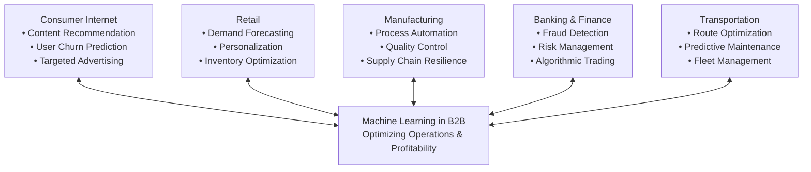
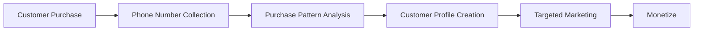
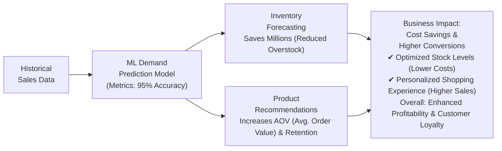
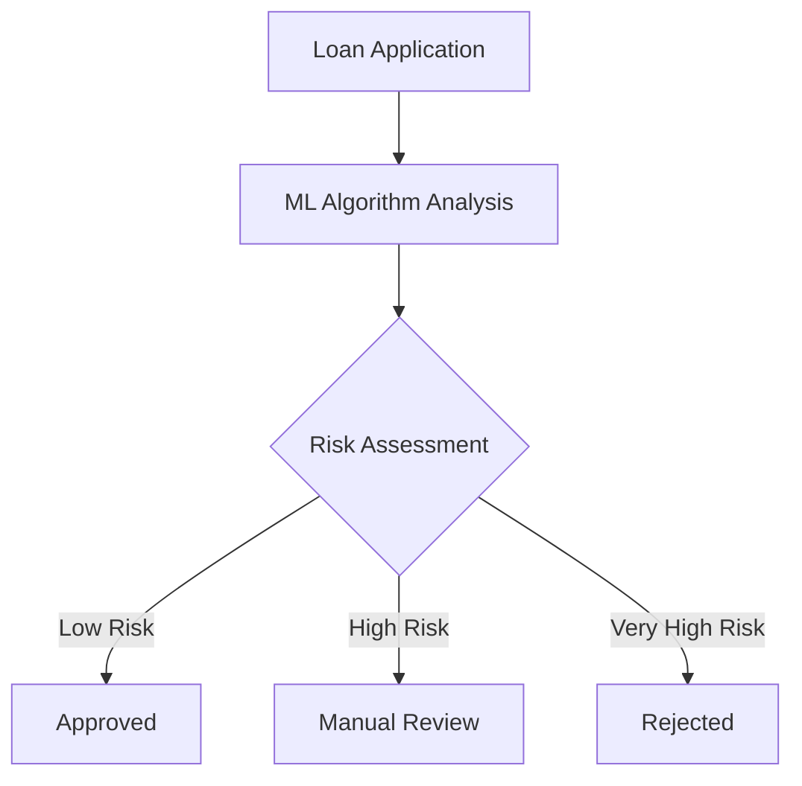
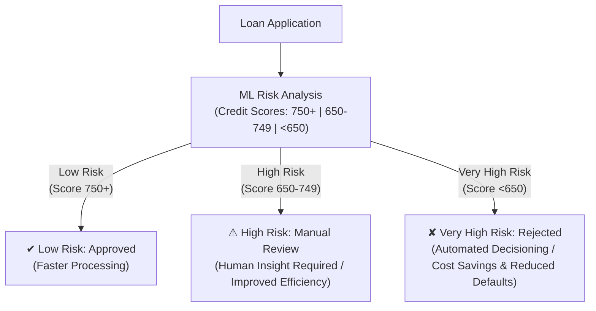
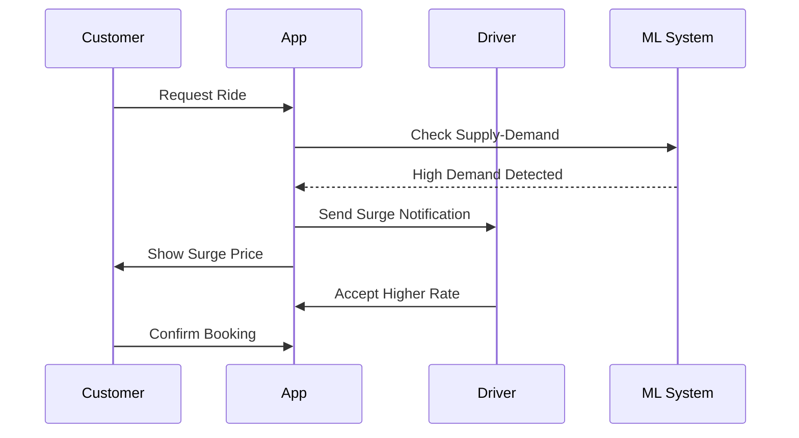
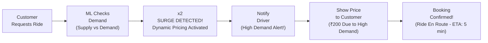
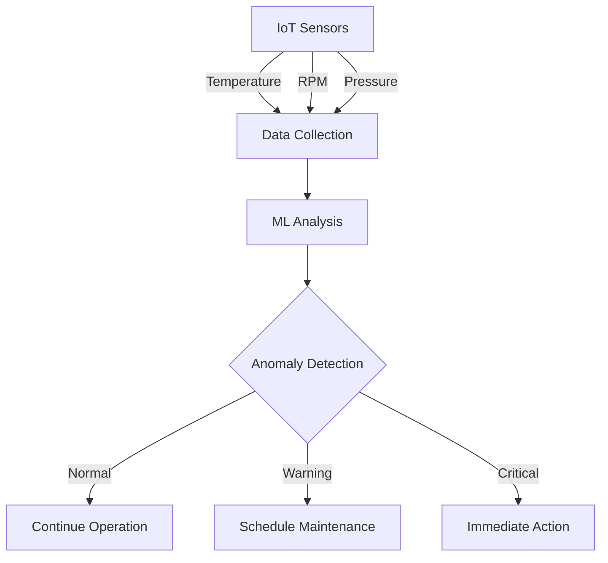
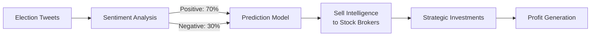
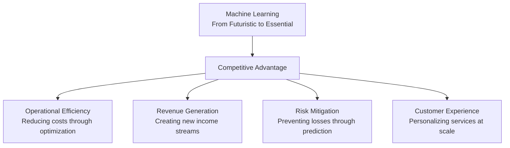

# Machine Learning Applications in Business

## Overview

Machine Learning has transformed from a future technology to an integral part of current business operations. This document explores **B2B (Business-to-Business)** applications where ML helps companies optimize operations and increase profitability.

---



> This diagram shows the five primary B2B sectors where ML is applied — Consumer Internet, Retail, Manufacturing, Banking & Finance, and Transportation — all feeding into and benefiting from a central ML system focused on optimizing operations and profitability.

---

## 1. Retail Sector

### Amazon & E-commerce Applications

| Application | Description | Business Impact |
|---|---|---|
| **Inventory Forecasting** | Predicting which products will sell more during sales events | Prevents overstocking and understocking, saving millions |
| **Demand Prediction** | Using historical sales data to forecast product demand | Optimizes warehouse management |
| **Product Recommendations** | Suggesting relevant products to customers | Increases conversion rates |

---

### Big Bazaar & Physical Retail

**Customer Profiling Process:**



> This flowchart illustrates how physical retailers collect customer data at point-of-sale, analyze purchase patterns, build behavioral profiles, and ultimately enable targeted advertising — creating an additional revenue stream alongside retail sales.

| Step | Activity | Purpose |
|---|---|---|
| 1 | Collect phone numbers at billing | Create customer database |
| 2 | Track purchase patterns | Understand buying behavior |
| 3 | Categorize customers | Health-conscious, sports enthusiast, etc. |
| 4 | Sell data to advertisers | Generate additional revenue |
| 5 | Enable targeted marketing | Higher conversion rates for advertisers |

---

### Product Placement Optimization

**Association Rules Mining** determines optimal product placement:

- Example: Beer and diapers correlation
- Frequently bought together items placed nearby
- Increases cross-selling opportunities

---

### ML Demand Prediction Model — Business Impact



> This diagram captures the end-to-end ML pipeline in e-commerce: historical sales data feeds a prediction model (95% accuracy) which simultaneously drives inventory optimization and product recommendations, resulting in measurable cost savings and higher revenue.

---

## 2. Banking & Finance

### Loan Approval System



> This flowchart models the ML-driven loan approval pipeline. A loan application is analyzed by an ML algorithm; based on the computed risk score, the system routes the application to one of three outcomes — automatic approval, manual review, or rejection.

| ML Application | Function | Benefit |
|---|---|---|
| **Credit Risk Assessment** | Analyze applicant profile against defaulter patterns | Reduces bad loans by 30–40% |
| **Branch Location Planning** | Identify optimal locations for new branches | Maximizes customer reach |
| **Customer Segmentation** | Group customers for targeted products | Improves product adoption |
| **Fraud Detection** | Real-time transaction monitoring | Prevents financial losses |

---

### Loan Risk Analysis — Credit Score Bands



> This diagram extends the basic approval flow by incorporating credit score thresholds (750+, 650–749, <650) to illustrate how ML automates risk-tiering, reducing bad loans by 30–40% and cutting processing costs through automated decisioning.

---

## 3. Transportation

### Dynamic Pricing (Surge Pricing)

**How Ola/Uber Surge Pricing Works:**



> This sequence diagram shows the real-time interaction between a customer, the ride-hailing app, drivers, and the ML system. When demand spikes, the ML system detects the imbalance, triggers surge pricing notifications to both drivers and customers, and closes a booking at the adjusted price.

| Scenario | Normal Price | Surge Multiplier | Final Price |
|---|---|---|---|
| Regular Hours | ₹100 | 1.0x | ₹100 |
| Peak Hours | ₹100 | 2.0x | ₹200 |
| Special Events | ₹100 | 3.2x | ₹320 |

**Key Mechanisms:**

- Real-time demand-supply analysis
- Driver incentivization through higher payouts
- Dynamic zone-based pricing
- Predictive demand forecasting

---

### Surge Pricing Dynamic Timeline



> This linear timeline diagram maps the step-by-step surge pricing activation: from a customer's ride request, through ML-based demand detection and multiplier application, to driver notification, price display, and final booking confirmation.

---

## 4. Manufacturing

### Tesla's Predictive Maintenance



> This flowchart illustrates Tesla's predictive maintenance pipeline: IoT sensors continuously stream temperature, RPM, and pressure data; the ML model analyzes the stream and classifies the machine state as Normal, Warning, or Critical — triggering proportional responses to prevent unexpected failures.

| Metric Monitored | Normal Range | Warning Threshold | Action Required |
|---|---|---|---|
| Temperature | 20–80°C | 81–95°C | >95°C |
| RPM | 2800–3000 | 2700–2799 | <2700 |
| Vibration | 0–5 Hz | 5.1–8 Hz | >8 Hz |

**Benefits:**

- Zero unplanned downtime
- 30% reduction in maintenance costs
- Extended equipment lifespan
- Optimized production schedules

---

## 5. Consumer Internet

### Twitter's Sentiment Analysis for Elections



> This pipeline diagram shows how election-related tweets are classified into positive/negative sentiment buckets, aggregated into a prediction signal, monetized by selling insights to financial brokers, and finally converted into strategic investment positions for profit.

**Sentiment Analysis Pipeline:**

| Stage | Process | Output |
|---|---|---|
| **Text Processing** | Clean and normalize text | Processed text |
| **Sentiment Classification** | ML model categorizes sentiment | Positive/Negative labels |
| **Aggregation** | Calculate overall sentiment | Percentage breakdown |
| **Monetization** | Sell insights to financial firms | Revenue generation |

---

### Revenue Model Example:

```
Election Prediction (70% for Party A)
     ↓
Stock Brokers buy this intelligence
     ↓
Invest in companies supporting Party A
     ↓
Stock prices rise after election
     ↓
Profit from early investment
```

---

## Key Takeaways

### Business Impact Matrix

| Sector | Primary ML Use | ROI Impact | Implementation Complexity |
|---|---|---|---|
| **Retail** | Inventory Management | 15–20% cost reduction | Medium |
| **Banking** | Risk Assessment | 30% reduction in defaults | High |
| **Transportation** | Dynamic Pricing | 25% revenue increase | Medium |
| **Manufacturing** | Predictive Maintenance | 40% downtime reduction | High |
| **Social Media** | Sentiment Analysis | New revenue streams | Low |

---

### Implementation Recommendations

1. **Start Small**: Begin with pilot projects in one department
2. **Data Quality**: Ensure clean, reliable data collection
3. **Measure Impact**: Track KPIs before and after implementation
4. **Scale Gradually**: Expand successful pilots across organization
5. **Continuous Learning**: Keep models updated with new data

---

## Conclusion



> This diagram summarizes ML's overarching value proposition in business: all four pillars — Operational Efficiency, Revenue Generation, Risk Mitigation, and Customer Experience — converge into a single competitive advantage that is now considered essential rather than futuristic.

Machine Learning is no longer a futuristic concept but a present-day necessity for competitive businesses. The applications span across:

- **Operational Efficiency**: Reducing costs through optimization
- **Revenue Generation**: Creating new income streams
- **Risk Mitigation**: Preventing losses through prediction
- **Customer Experience**: Personalizing services at scale

Companies not adopting ML risk falling behind competitors who leverage these technologies for strategic advantage.