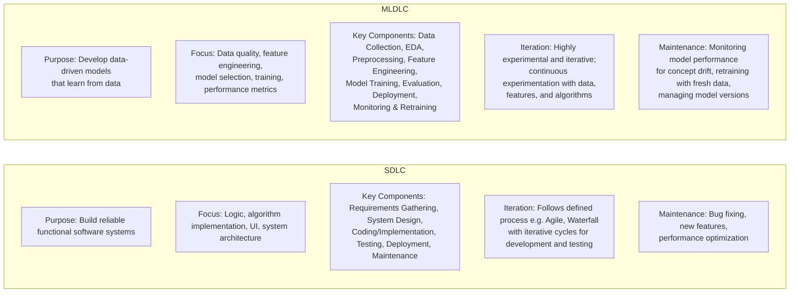
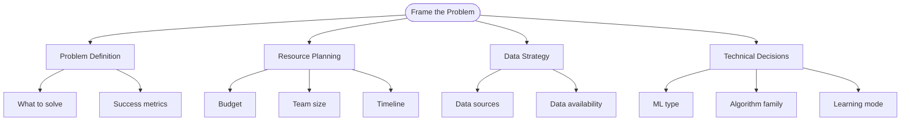
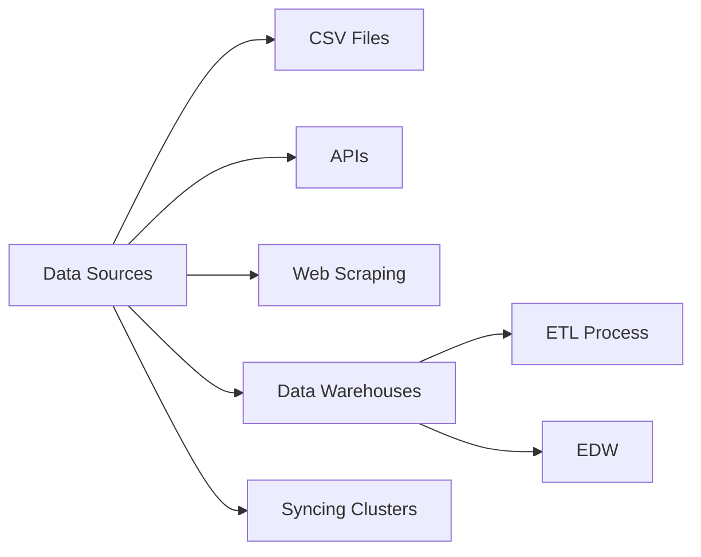
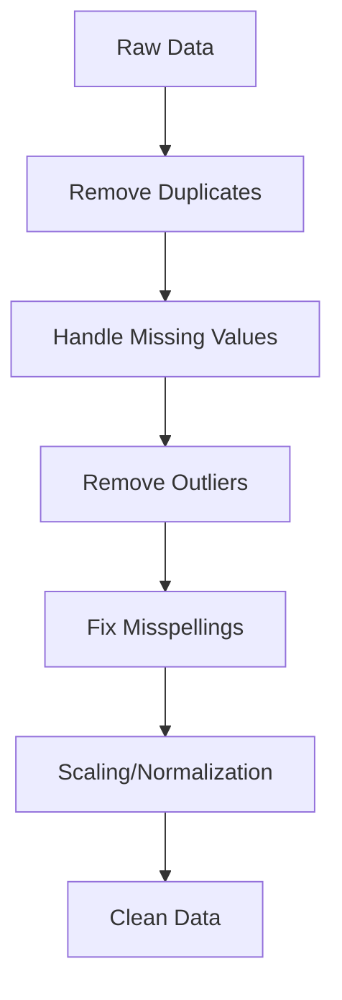
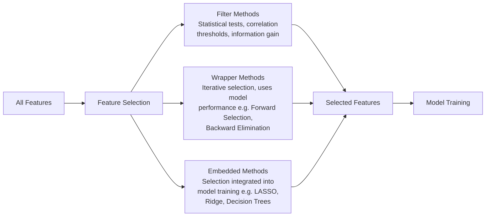
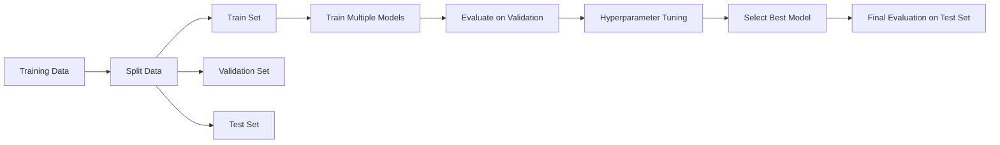
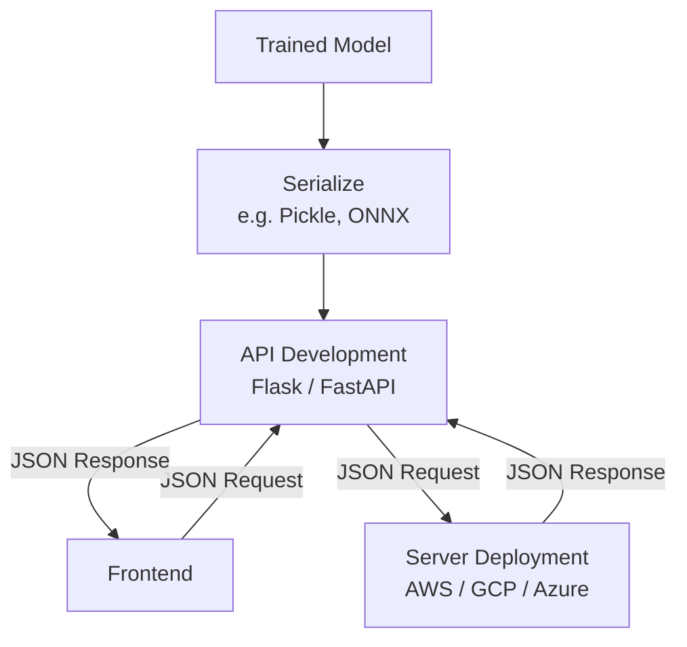
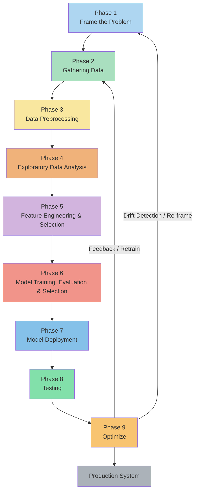

# Machine Learning Development Life Cycle

## Overview

The **Machine Learning Development Life Cycle (MLDLC)** is analogous to the Software Development Life Cycle (SDLC) but specifically designed for building machine learning-based software products. It provides a structured set of guidelines from idea conception to production deployment.

---

## SDLC vs MLDLC

| Aspect | SDLC | MLDLC |
|---|---|---|
| **Purpose** | Software Development | ML-based Software Development |
| **Focus** | Code & Architecture | Data, Models & Predictions |
| **Key Components** | Requirements, Design, Code, Testing | Data, Features, Models, Deployment |
| **Iteration** | Less frequent | Highly iterative (retraining) |
| **Maintenance** | Bug fixes, updates | Model retraining, drift handling |

### SDLC vs. MLDLC: Key Differences

> This diagram contrasts the two lifecycle models across five key dimensions: Purpose, Focus, Key Components, Iteration style, and Maintenance approach. SDLC is code-centric while MLDLC is data and model-centric.

---

# The 9 Phases of MLDLC

---

## Phase 1: Frame the Problem

### Objective

Define the problem clearly before starting development to avoid mid-project pivots that waste time and resources.

### Key Questions to Answer

| Question | Purpose |
|---|---|
| What exactly is the problem? | Clear problem definition |
| Who are the customers/users? | Target audience identification |
| What type of ML problem is it? | Classification, Regression, Clustering, etc. |
| Supervised or Unsupervised? | Algorithm category selection |
| Online or Batch learning? | Deployment mode decision |
| What algorithms might help? | Initial algorithm exploration |
| Where will the data come from? | Data source identification |
| What is the budget? | Resource allocation |
| How many team members needed? | Team planning |
| What will the product look like? | UI/UX consideration |

### Deliverables

- Problem statement document
- Project scope definition
- Resource requirements
- Initial project timeline
- Success metrics definition

### Key Questions & Deliverables for Phase 1

> This mind-map diagram shows how "Frame the Problem" branches into four major dimensions — Problem Definition, Resource Planning, Data Strategy, and Technical Decisions — each with specific sub-questions to answer before development begins.

---

## Phase 2: Gathering Data

### Objective

Collect relevant data from various sources as data is the foundation of any ML project.

### Data Sources

> This diagram illustrates the five primary data source types and shows that Data Warehouses further connect to ETL Processes and Enterprise Data Warehouses (EDW) for large-scale data integration.

### Common Data Collection Methods

| Method | Description | Use Cases | Tools |
|---|---|---|---|
| **CSV Files** | Direct file downloads | Structured data, readily available datasets | pandas, Excel |
| **APIs** | HTTP requests to fetch data | Real-time data, third-party services | requests, REST APIs |
| **Web Scraping** | Extracting data from websites | Unstructured web data, pricing info | BeautifulSoup, Scrapy, Selenium |
| **Data Warehouses** | Enterprise data storage | Large-scale organizational data | SQL, Snowflake, BigQuery |
| **ETL Pipelines** | Extract, Transform, Load processes | Data integration from multiple sources | Apache Airflow, Talend |
| **Streaming Data** | Real-time data feeds | IoT sensors, live transactions | Kafka, Kinesis |

### Best Practices

- Ensure data quality and relevance
- Document data sources and collection methods
- Verify data access permissions and compliance
- Plan for data versioning
- Consider data privacy and security

---

## Phase 3: Data Preprocessing

### Objective

Clean and prepare raw data for analysis and modeling.

### Key Activities

> This flowchart shows the sequential preprocessing pipeline: starting from raw data, each step progressively cleans and transforms the data — culminating in model-ready clean data.

### Preprocessing Steps

| Step | Description | Techniques |
|---|---|---|
| **Remove Duplicates** | Eliminate redundant records | `drop_duplicates()` in pandas |
| **Handle Missing Values** | Fill or remove null values | Imputation, deletion, interpolation |
| **Remove Outliers** | Eliminate extreme values | IQR method, Z-score, domain knowledge |
| **Fix Misspellings** | Correct text inconsistencies | Fuzzy matching, standardization |
| **Feature Scaling** | Normalize feature ranges | StandardScaler, MinMaxScaler, RobustScaler |
| **Encoding** | Convert categorical to numerical | One-hot encoding, Label encoding, Target encoding |
| **Data Type Conversion** | Ensure correct data types | Type casting, datetime parsing |

### Data Quality Checklist

- ✅ No duplicate records
- ✅ Missing values handled appropriately
- ✅ Outliers identified and treated
- ✅ Consistent data formats
- ✅ Scaled features (where necessary)
- ✅ Encoded categorical variables

---

## Phase 4: Exploratory Data Analysis (EDA)

### Objective

Understand data patterns, relationships, and distributions to inform modeling decisions.

### Key Activities

| Activity | Purpose | Tools |
|---|---|---|
| **Visualization** | Visual data exploration | Matplotlib, Seaborn, Plotly |
| **Univariate Analysis** | Single variable distribution | Histograms, box plots, density plots |
| **Bivariate Analysis** | Relationship between two variables | Scatter plots, correlation matrices |
| **Outlier Detection** | Identify anomalies | Box plots, statistical methods |
| **Imbalance Check** | Class distribution analysis | Count plots, class ratios |

### EDA Essentials Diagram

```mermaid
graph TD
    EDA([EDA])

    EDA --> UA[Univariate Analysis]
    EDA --> OD[Outlier Detection]
    EDA --> IC[Imbalance Check]
    EDA --> BA[Bivariate Analysis]
    EDA --> VIS[Visualization]

    UA --> FD[Frequency Distribution]
    UA --> CT[Central Tendency: Mean, Median, Mode]
    UA --> DIS[Dispersion: Variance, Std Dev]
    UA --> DS[Distribution Shape: Skewness, Kurtosis]

    OD --> VD[Visual Detection]
    OD --> SM[Statistical Methods: Z-Score, IQR]
    OD --> DK[Domain Knowledge Check]

    IC --> TVD[Target Variable Distribution]
    IC --> RT[Resampling Techniques]

    BA --> CA[Correlation Analysis]
    BA --> CvN[Categorical vs. Numerical]
    BA --> CvC[Categorical vs. Categorical]

    VIS --> UD[Understanding Distributions]
    VIS --> IR[Identifying Relationships]
    VIS --> EC[Exploring Categorical Data]
```

> This diagram maps all five EDA components (Univariate Analysis, Outlier Detection, Imbalance Check, Bivariate Analysis, Visualization) and their sub-techniques, providing a complete picture of what to perform during data exploration.

### Common Visualizations

| Visualization | Use Case |
|---|---|
| Histogram | Distribution of numerical features |
| Box Plot | Outlier detection, quartile analysis |
| Scatter Plot | Relationship between two continuous variables |
| Heatmap | Correlation matrix visualization |
| Bar Chart | Categorical variable frequency |
| Pair Plot | Multiple feature relationships |

### Key Insights to Discover

- Feature distributions (normal, skewed, multimodal)
- Correlations between features
- Class imbalance issues
- Missing data patterns
- Outlier presence and impact

---

## Phase 5: Feature Engineering and Selection

### Objective

Create new features and select the most relevant ones to improve model performance.

### Feature Engineering

**Feature Creation Techniques:**

- Mathematical transformations (log, square root, polynomial)
- Domain-specific features
- Interaction features (combining multiple features)
- Aggregation features (grouping and summarizing)
- Time-based features (from datetime)
- Text features (TF-IDF, word embeddings)

### Feature Selection

**Selection Methods:**

| Method | Type | Description |
|---|---|---|
| **Filter Methods** | Statistical | Chi-square, correlation, variance threshold |
| **Wrapper Methods** | Model-based | Forward/Backward selection, RFE |
| **Embedded Methods** | Built-in | Lasso, Ridge, Tree-based importance |

### Feature Engineering & Selection Pipeline

> This pipeline shows how all features flow through three parallel selection strategies (Filter, Wrapper, Embedded) into a refined set of Selected Features, which then feed directly into Model Training.

### Benefits

- Reduces overfitting
- Improves model performance
- Decreases training time
- Enhances model interpretability

---

## Phase 6: Model Training, Evaluation and Selection

### Objective

Train multiple models, evaluate their performance, and select the best one.

### Model Training Pipeline

> This pipeline shows how training data is split into three sets (Train, Validation, Test), followed by model training, evaluation, hyperparameter tuning, and final model selection.

### Common ML Algorithms

| Problem Type | Algorithms |
|---|---|
| **Classification** | Logistic Regression, SVM, Decision Trees, Random Forest, XGBoost, Neural Networks |
| **Regression** | Linear Regression, Ridge, Lasso, Random Forest, Gradient Boosting |
| **Clustering** | K-Means, DBSCAN, Hierarchical Clustering |
| **Dimensionality Reduction** | PCA, t-SNE, UMAP |

### Evaluation Metrics

| Problem Type | Metrics |
|---|---|
| **Classification** | Accuracy, Precision, Recall, F1-Score, ROC-AUC, Confusion Matrix |
| **Regression** | MSE, RMSE, MAE, $R^2$, Adjusted $R^2$ |
| **Clustering** | Silhouette Score, Davies-Bouldin Index |

### Ensemble Learning

**Ensemble Techniques:**

- **Bagging**: Random Forest, Bagged Decision Trees
- **Boosting**: AdaBoost, Gradient Boosting, XGBoost, LightGBM, CatBoost
- **Stacking**: Combining multiple models with a meta-learner

### Hyperparameter Tuning

| Method | Description | Pros | Cons |
|---|---|---|---|
| **Grid Search** | Exhaustive search over specified parameter values | Thorough | Computationally expensive |
| **Random Search** | Random combinations of parameters | Faster than grid search | May miss optimal combination |
| **Bayesian Optimization** | Probabilistic model-based optimization | Efficient | Complex implementation |

### Model Selection Criteria

- Performance on validation set
- Training time and efficiency
- Model complexity and interpretability
- Deployment requirements
- Scalability needs

---

## Phase 7: Model Deployment

### Objective

Convert trained model into a production-ready software application accessible to users.

### Deployment Architecture

> This architecture diagram shows the full deployment flow: a trained model is serialized, wrapped in a REST API, and deployed to cloud servers. A frontend communicates via JSON requests/responses through the API layer.

### Deployment Steps

| Step | Description | Tools/Technologies |
|---|---|---|
| **Model Serialization** | Save trained model to file | pickle, joblib, ONNX |
| **API Creation** | Build REST API for model inference | Flask, FastAPI, Django |
| **Containerization** | Package application with dependencies | Docker |
| **Cloud Deployment** | Deploy to cloud infrastructure | AWS (EC2, Lambda), GCP, Azure |
| **Orchestration** | Manage containerized applications | Kubernetes, Docker Swarm |
| **Monitoring Setup** | Track model performance | Prometheus, Grafana, CloudWatch |

### Deployment Modes

| Mode | Description | Use Cases |
|---|---|---|
| **Batch Inference** | Process data in batches periodically | Recommendation systems, reporting |
| **Real-time Inference** | Immediate predictions on demand | Chatbots, fraud detection |
| **Edge Deployment** | Model runs on edge devices | Mobile apps, IoT devices |
| **Streaming** | Continuous data processing | Real-time analytics, monitoring |

### Cloud Platforms

- **AWS**: EC2, SageMaker, Lambda
- **Google Cloud Platform (GCP)**: Vertex AI, Cloud Run, App Engine
- **Microsoft Azure**: Azure ML, App Service
- **Heroku**: Simple PaaS deployment

---

## Phase 8: Testing

### Objective

Validate model performance in production with real users before full rollout.

### Testing Strategy

#### A/B Testing

**A/B Testing Framework:**

| Component | Description |
|---|---|
| **Control Group (A)** | Users receiving current/old model |
| **Treatment Group (B)** | Users receiving new model |
| **Metrics** | KPIs to compare performance |
| **Duration** | Testing period (typically 1-4 weeks) |
| **Sample Size** | Statistical significance calculation |

### Testing Types

| Testing Type | Purpose | Timeline |
|---|---|---|
| **Alpha Testing** | Internal testing with team | Before beta |
| **Beta Testing** | Testing with selected users | 1-2 weeks |
| **Canary Release** | Gradual rollout to small percentage | Incremental |
| **Shadow Mode** | Run parallel to production without affecting users | Validation |

### Key Metrics to Monitor

- Prediction accuracy in production
- Response time/latency
- Error rates
- User engagement
- Business metrics (conversion, revenue, etc.)

---

## Phase 9: Optimize

### Objective

Continuously improve and maintain the production system for optimal performance, reliability, and efficiency.

### Model Retraining Strategy

**Retraining Triggers:**

| Trigger Type | Description | Example |
|---|---|---|
| **Time-based** | Scheduled intervals | Weekly, monthly retraining |
| **Performance-based** | When metrics degrade | Accuracy drops below threshold |
| **Data-based** | When data distribution changes | Concept drift detected |
| **Event-based** | Significant business events | New product launch, market shift |

### Critical Optimization Tasks

| Task | Purpose | Tools/Techniques |
|---|---|---|
| **Backup** | Disaster recovery, rollback capability | Version control, model registry |
| **Data Backup** | Preserve training data | Cloud storage, databases |
| **Load Balancing** | Distribute traffic efficiently | Nginx, AWS ELB, Kubernetes |
| **Auto-scaling** | Handle variable traffic | AWS Auto Scaling, Kubernetes HPA |
| **Model Versioning** | Track model iterations | MLflow, DVC, Weights & Biases |
| **Monitoring** | Detect issues early | Prometheus, Grafana, DataDog |
| **Cost Optimization** | Reduce infrastructure costs | Right-sizing, spot instances |

### Model Drift

| Drift Type | Description | Example |
|---|---|---|
| **Data Drift** | Input feature distributions change | Customer demographics shift |
| **Concept Drift** | Relationship between features and target changes | Market behavior changes |
| **Label Drift** | Target variable distribution changes | Product categories evolve |

### Monitoring Dashboard

**Key Metrics to Track:**

- **Model Performance**: Accuracy, precision, recall, F1-score
- **System Performance**: Latency, throughput, error rate
- **Resource Utilization**: CPU, memory, disk, network
- **Business Metrics**: Conversions, revenue, user satisfaction
- **Data Quality**: Missing values, outliers, distribution shifts

### Best Practices

- ✅ Automate retraining pipelines
- ✅ Maintain model version history
- ✅ Set up comprehensive monitoring
- ✅ Implement gradual rollout strategies
- ✅ Document all changes and decisions
- ✅ Regular security audits
- ✅ Cost monitoring and optimization
- ✅ Disaster recovery planning

---

## Complete MLDLC Workflow Summary

> This end-to-end MLDLC workflow diagram shows all 9 phases in sequence, highlighting the cyclical nature of the process — the Optimize phase feeds back into Frame the Problem (via drift detection) and Gathering Data (via retraining feedback), making MLDLC a continuous improvement loop.

---

## Key Takeaways

### For Students and Beginners

1. **Don't stop at model training –** The journey doesn't end with achieving good accuracy
2. **Understand the complete pipeline –** From problem definition to production deployment
3. **Focus on end-to-end skills –** Companies look for candidates who can build complete ML products
4. **Practice deployment –** Learn Docker, APIs, cloud platforms
5. **Monitor and maintain –** Production systems require continuous attention