# Complete Guide to Data-Based Job Roles

## Overview

The field of Data Science and Machine Learning offers four distinct career paths, each playing a crucial role in the machine learning development lifecycle (MLDLC). Understanding these roles is essential for anyone looking to build a career in this domain.

---

## The Four Core Data Roles

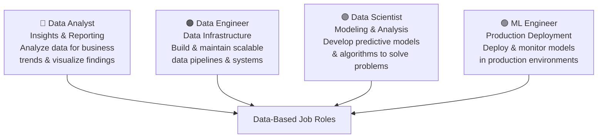

> **Diagram Explanation:** This diagram illustrates the four core data roles centered around the concept of "Data-Based Job Roles." Each role occupies a distinct quadrant of specialization: Data Analyst (insights), Data Engineer (infrastructure), Data Scientist (modeling), and ML Engineer (deployment). Each role specializes in MLDLC phases.

---

## How These Roles Map to MLDLC

Each role corresponds to specific phases of the Machine Learning Development Life Cycle:

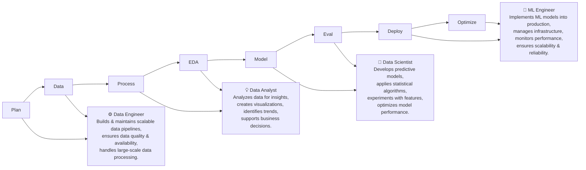

> **Diagram Explanation:** This diagram maps each of the four roles to specific phases in the MLDLC pipeline (Plan → Data → Process → EDA → Model → Eval → Deploy → Optimize). It shows that Data Engineers handle early pipeline phases, Analysts focus on EDA, Data Scientists own modeling, and ML Engineers take over at deployment. The process is described as an **Iterative & Collaborative Process** from MLDLC Start to MLDLC End.

---

## Why Multiple Roles?

In large organizations, the ML development process is complex and extensive. **One person cannot handle all aspects efficiently**, especially in production environments. Each role specializes in specific stages:

| Stage | Primary Role | Secondary Roles |
|---|---|---|
| **Planning** | Product Manager, Data Scientist | All team members |
| **Data Acquisition** | Data Engineer | Data Analyst |
| **Data Preprocessing** | Data Engineer, Data Analyst | Data Scientist |
| **Exploratory Analysis** | Data Analyst, Data Scientist | - |
| **Model Building** | Data Scientist | ML Engineer |
| **Model Evaluation** | Data Scientist | ML Engineer |
| **Deployment** | ML Engineer | Data Engineer, DevOps |
| **Optimization & Maintenance** | ML Engineer | Data Scientist |

---

# 1. Data Engineer

## Definition

**A Data Engineer is responsible for bringing data to the table in a format that others can use.**

## The Core Problem They Solve

In production environments, data doesn't come neatly packaged. Companies have:

- **OLTP (Online Transaction Processing)** databases – Used by production applications
- Multiple data sources – APIs, third-party services, web scraping
- Complex data formats – Structured, unstructured, semi-structured

## Key Concepts

### OLTP vs OLAP

| Aspect | OLTP (Online Transaction Processing) | OLAP (Online Analytical Processing) |
|---|---|---|
| **Purpose** | Run applications | Analysis and reporting |
| **Users** | End users of applications | Data analysts, scientists |
| **Operations** | Insert, Update, Delete | Read, Aggregate, Analyze |
| **Performance** | Fast transactions | Complex queries |
| **Data Volume** | Current, detailed | Historical, summarized |
| **Example** | E-commerce shopping cart | Sales analysis dashboard |
| **Data Structure** | Normalized | Denormalized, star schema |

**Why not use OLTP directly?**

- Running complex analytical queries on production databases can slow down the application
- Analytics needs historical data; OLTP may archive/delete old data
- Different optimization requirements

```mermaid
graph LR
    subgraph OLTP["OLTP - Online Transaction Processing"]
        FT["Fast Transactions\nHigh Volume\nFocus on rapid data entry"]
        EU["End Users\nOperational Staff\nSupports daily business ops"]
        IUD["Insert/Update/Delete\nTransactional operations"]
        EC["E-commerce\nCart Example\nReal-time order processing"]
        NS["Normalized Structure\n3NF\nReduces redundancy"]
    end

    subgraph WHY["Why Separate?"]
        WS["Slows Apps (Locks & Contention):\nRunning heavy reports on OLTP\nimpacts operational performance."]
        HN["Historical Needs (Decision Support):\nOLAP optimized for analyzing large\nvolumes of historical data for trends."]
    end

    subgraph OLAP["OLAP - Online Analytical Processing"]
        CQ["Complex Queries\nAd-hoc Analysis\nFocus on data retrieval"]
        AN["Analysts\nBusiness Intelligence\nSupports strategic decisions"]
        RA["Read/Aggregate\nReporting & analysis"]
        SD["Sales Dashboard\nInteractive business insights"]
        SS["Star Schema\nDimensional\nOptimized for querying"]
    end

    OLTP --> WHY --> OLAP
```

> **Diagram Explanation:** This diagram contrasts OLTP (left) and OLAP (right) systems, with the center explaining *why* they must be kept separate. OLTP is designed for high-volume transactional operations (insert/update/delete) and is normalized to reduce redundancy. OLAP is optimized for read-heavy, analytical workloads using a denormalized star schema, supporting business intelligence and reporting needs.

## Job Responsibilities

| Responsibility | Description | Tools/Technologies |
|---|---|---|
| **Scrape data from sources** | Extract data from various origins | Python (BeautifulSoup, Scrapy), APIs |
| **Move/Store data optimally** | Transfer data to warehouses/data lakes | SQL, Apache Kafka, Apache Airflow |
| **Build data pipelines/APIs** | Create automated data flow systems | Apache Spark, Airflow, Luigi |
| **Handle databases/warehouses** | Manage and optimize data storage | PostgreSQL, MySQL, Snowflake, BigQuery |
| **ETL/ELT processes** | Extract, Transform, Load operations | Apache NiFi, Talend, dbt |

## Skills Required

### Technical Skills

| Skill Category | Specific Skills | Proficiency Level |
|---|---|---|
| **Algorithms & Data Structures** | Arrays, Trees, Hash Tables, Graphs, Sorting | Strong grasp |
| **Programming Languages** | Java, Python, Scala | Advanced |
| **Script Writing** | Bash, Shell scripting | Intermediate |
| **Database Management** | SQL, NoSQL | Advanced (DBMS expertise) |
| **Big Data Tools** | Apache Spark, Hadoop, Kafka, Hive | Production-level |
| **Cloud Platforms** | AWS (S3, Redshift, EMR), GCP (BigQuery), Azure | Hands-on experience |
| **Distributed Systems** | Understanding of distributed computing | Strong foundation |
| **Data Pipelines** | ETL/ELT design and implementation | Expert level |

### Soft Skills Level

| Soft Skill | Level | Reason |
|---|---|---|
| **Analytical Skills** | MEDIUM | Focus on data flow, not deep analysis |
| **Business Acumen** | LOW | Less interaction with business decisions |
| **Data Storytelling** | LOW | Minimal presentation requirements |
| **Communication Skills** | MEDIUM | Coordinate with analytics team |
| **Software Skills** | HIGH | Core technical role |

## Career Path & Salary

**Entry Level**: \$70,000 – \$90,000 **Mid Level**: \$90,000 – \$130,000 **Senior Level**: \$130,000 – \$180,000+ **Principal/Staff**: \$180,000 – \$250,000+

## Common Tools Stack

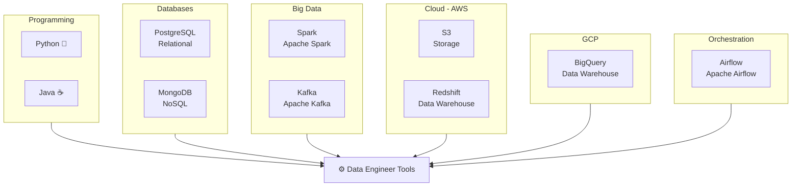

> **Diagram Explanation:** This mind-map style diagram groups the Data Engineer's tool ecosystem into six categories: Programming (Python, Java), Databases (PostgreSQL, MongoDB), Big Data (Spark, Kafka), Cloud/AWS (S3, Redshift), GCP (BigQuery), and Orchestration (Apache Airflow). Together these tools cover the full data pipeline lifecycle from ingestion to storage and scheduling.

---

# 2. Data Analyst

## Definition

**A Data Analyst extracts insights from data and communicates findings to stakeholders through reports and visualizations.**

## The Core Value Proposition

Data Analysts bridge the gap between raw data and business decisions. They:

- Transform data into actionable insights
- Create dashboards and reports for stakeholders
- Answer business questions through data analysis
- Identify trends and patterns

## Job Responsibilities

| Responsibility | Description |
|---|---|
| **Cleaning and organizing raw data** | Ensure data quality and consistency |
| **Analyzing data to derive insights** | Use statistical methods to understand patterns |
| **Creating data visualizations** | Build charts, graphs, and dashboards |
| **Producing and maintaining reports** | Generate regular business reports |
| **Collaborating with teams** | Work with stakeholders based on insights |
| **Optimizing data collection** | Improve data gathering procedures |

## Detailed Workflow

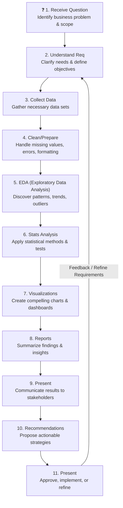

> **Diagram Explanation:** This circular workflow diagram shows the 11-step process a Data Analyst follows from receiving a business question to presenting final recommendations. The feedback arrow from step 11 back to step 2 highlights the iterative nature of analytical work — findings often prompt refined requirements and further investigation.

## Skills Required

### Technical Skills

| Skill Category | Specific Skills |
|---|---|
| **Statistical Programming** | Basic statistical concepts, hypothesis testing |
| **Programming Languages** | R, SAS, Python (pandas, NumPy) |
| **Creative & Analytical Thinking** | Problem-solving, pattern recognition |
| **Business Acumen** | Medium to High – Understand business context |
| **Communication Skills** | Strong – Present findings to non-technical audiences |
| **Data Mining & Cleaning** | Data wrangling, handling missing values |
| **Data Visualization** | Tableau, Power BI, matplotlib, seaborn |
| **Data Storytelling** | Craft narratives around data |
| **SQL** | Intermediate to Advanced |
| **Advanced Excel** | Pivot tables, VLOOKUP, complex formulas |

### Soft Skills Level

| Soft Skill | Level | Reason |
|---|---|---|
| **Analytical Skills** | HIGH | Core responsibility – deriving insights |
| **Business Acumen** | MEDIUM TO HIGH | Must understand business context |
| **Data Storytelling** | HIGH | Essential for communicating findings |
| **Communication Skills** | MEDIUM TO HIGH | Present to stakeholders regularly |
| **Software Skills** | MEDIUM | Use BI tools and basic programming |

## Common Tools & Technologies

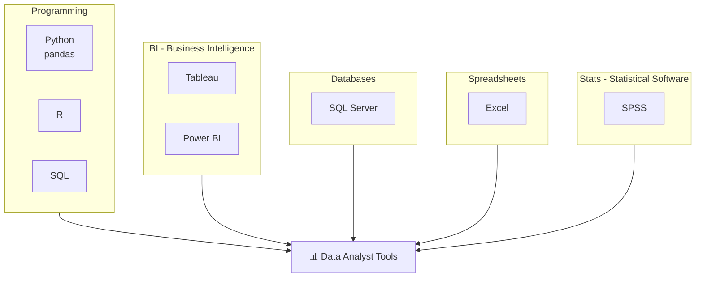

> **Diagram Explanation:** This diagram maps the Data Analyst's tool ecosystem across five categories: Programming (Python/pandas, R, SQL), Business Intelligence (Tableau, Power BI), Databases (SQL Server), Spreadsheets (Excel), and Statistical Software (SPSS). These tools enable the full workflow from data querying and cleaning to visualization and reporting.

## Typical Deliverables

| Deliverable | Format | Audience | Frequency |
|---|---|---|---|
| **Executive Dashboard** | Interactive BI tool | C-level executives | Weekly/Monthly |
| **Sales Report** | PDF/PowerPoint | Sales team | Monthly |
| **Customer Analysis** | Presentation | Marketing team | Quarterly |
| **KPI Tracking** | Dashboard | Various departments | Real-time/Daily |
| **Ad-hoc Analysis** | Document/Email | Requesting team | As needed |

## Career Path & Salary

**Entry Level (Junior Analyst)**: \$50,000 – \$70,000 **Mid Level (Analyst)**: \$70,000 – \$95,000
**Senior Level (Senior Analyst)**: \$95,000 – \$120,000 **Lead/Principal**: \$120,000 – \$150,000+

---

# 3. Data Scientist

## Definition

> "A data scientist is someone who is better at statistics than any software engineer and better at software engineering than any statistician."

Data Scientists combine statistical expertise, programming skills, and domain knowledge to build predictive models and extract insights from complex data.

## Core Responsibilities

Data Scientists are the **model builders** in the MLDLC. They:

- Design and implement machine learning algorithms
- Conduct advanced statistical analysis
- Build predictive models
- Experiment with different approaches
- Communicate findings to technical and non-technical audiences

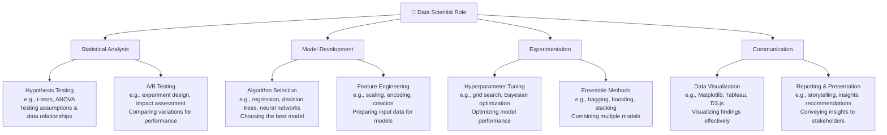

> **Diagram Explanation:** This diagram shows the Data Scientist's role as a continuous cycle of four core activities: Statistical Analysis, Model Development, Experimentation, and Communication. Each activity branches into specific sub-tasks — for example, Statistical Analysis includes hypothesis testing and A/B testing, while Model Development covers algorithm selection and feature engineering. The cycle represents continuous discovery, development, and deployment.

## The Unique Value

Data Scientists sit at the intersection of multiple disciplines:

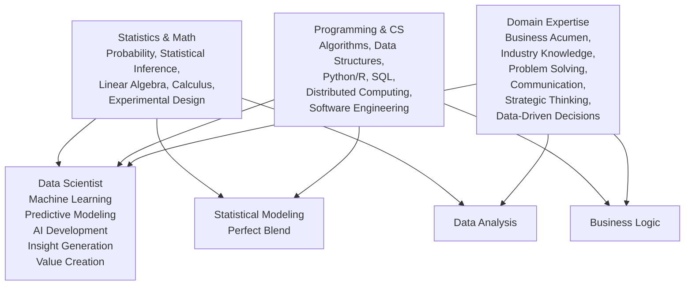

> **Diagram Explanation:** This Venn-diagram-style graph illustrates that a Data Scientist is formed at the intersection of three disciplines: Statistics & Math, Programming & CS, and Domain Expertise. The overlapping regions yield Statistical Modeling, Business Logic, and Data Analysis skills — all of which converge in the Data Scientist role. This "perfect blend" is what makes Data Scientists uniquely valuable.

## Skills Required

### Technical Skills – The Full Stack

| Skill Category | Specific Skills | Usage |
|---|---|---|
| **Mathematics** | Linear Algebra, Calculus, Probability, Statistics | Model understanding and development |
| **Programming** | Python, R (primary); Java, Scala (optional) | Implementation and experimentation |
| **Machine Learning** | Supervised/Unsupervised learning, Deep Learning | Core skill |
| **Statistics** | Hypothesis testing, Regression, Time series | Analysis and validation |
| **Data Manipulation** | pandas, NumPy, dplyr | Data wrangling |
| **Visualization** | matplotlib, seaborn, ggplot2, Plotly | Exploratory analysis and presentation |
| **SQL** | Advanced queries, joins, window functions | Data extraction |
| **Big Data** | Spark (optional but valuable) | Large-scale processing |
| **Cloud Platforms** | AWS SageMaker, GCP Vertex AI | Training and experimentation |

### Machine Learning Skills

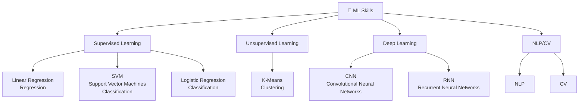

> **Diagram Explanation:** This diagram maps the Machine Learning skill tree for Data Scientists across four major branches: Supervised Learning (regression and classification algorithms), Unsupervised Learning (clustering), Deep Learning (CNNs, RNNs), and NLP/CV (Natural Language Processing and Computer Vision). This represents a progressive skill development path with approximately 85% completion shown in the source.

### Soft Skills Level

| Soft Skill | Level | Reason |
|---|---|---|
| **Analytical Skills** | HIGH | Core competency – complex problem solving |
| **Business Acumen** | HIGH | Must understand business problems deeply |
| **Data Storytelling** | HIGH | Explain complex models to stakeholders |
| **Communication Skills** | HIGH | Bridge technical and business teams |
| **Software Skills** | MEDIUM | Good programming, not software architecture |

## Typical Workflow

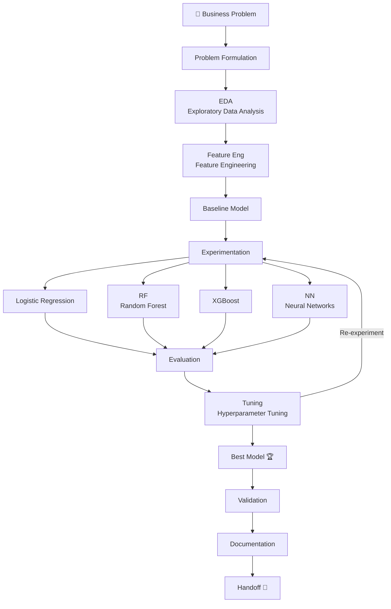

> **Diagram Explanation:** This flowchart captures the complete Data Scientist workflow from business problem to model handoff. After EDA and feature engineering, a baseline model is established, then multiple algorithms (Logistic Regression, Random Forest, XGBoost, Neural Networks) are experimented with. The cycle of Evaluation → Hyperparameter Tuning → Best Model selection continues until the model is validated, documented, and handed off to the ML Engineer.

## Data Scientist vs Data Analyst

| Aspect | Data Analyst | Data Scientist |
|---|---|---|
| **Primary Focus** | Insights from existing data | Predictions and modeling |
| **Methods** | Descriptive statistics, BI | Machine learning, advanced statistics |
| **Tools** | Excel, Tableau, SQL | Python, R, TensorFlow, PyTorch |
| **Output** | Reports, dashboards | Predictive models, algorithms |
| **Questions** | "What happened?" "Why did it happen?" | "What will happen?" "What should we do?" |
| **Programming** | Basic to intermediate | Advanced |
| **Math/Stats** | Basic statistics | Advanced mathematics and statistics |
| **Experimentation** | A/B testing | Algorithm experimentation |
| **Model Building** | Rarely | Core responsibility |

## Career Path & Salary

**Entry Level (Junior Data Scientist)**: \$80,000 – \$110,000 **Mid Level (Data Scientist)**: \$110,000 – \$150,000 **Senior Level (Senior Data Scientist)**: \$150,000 – \$190,000 **Lead/Staff**: \$190,000 – \$250,000+ **Principal/Research Scientist**: \$250,000 – \$400,000+

## Common Deliverables

| Deliverable | Description | Audience |
|---|---|---|
| **Predictive Model** | Trained ML model with documentation | ML Engineers, Product team |
| **Model Performance Report** | Metrics, validation results, comparison | Technical stakeholders |
| **Technical Documentation** | Architecture, assumptions, methodology | Engineering team |
| **Insights Presentation** | Business implications of findings | Executive team |
| **Jupyter Notebooks** | Exploratory analysis and experiments | Technical team, future reference |
| **Research Paper** | Novel approaches or findings (in research roles) | Academic/research community |

---

# 4. ML Engineer (Machine Learning Engineer)

## Definition

**An ML Engineer bridges the gap between data science and production software engineering. They take models built by data scientists and deploy them to production-ready environments.**

## The Critical Bridge

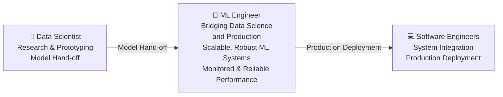

> **Diagram Explanation:** This diagram depicts the ML Engineer as a bridge between the Data Scientist (who produces research-grade models via prototyping) and Software Engineers (who handle system integration and production deployment). The ML Engineer takes the model hand-off, makes it scalable and robust, ensures monitored and reliable performance, and then delivers a production-ready system.

## Why ML Engineers Are Needed

**The Gap Problem:**

- **Data Scientists**: Strong in statistics and modeling, may lack production software skills
- **Software Engineers**: Strong in software development, may lack ML/Data Science knowledge
- **ML Engineers**: Bridge this gap with both skill sets

## Job Responsibilities

| Responsibility | Description | Activities |
|---|---|---|
| **Deploy ML models to production** | Make models accessible to applications | Containerization, API creation, cloud deployment |
| **Scale and optimize models** | Ensure models handle production load | Performance tuning, distributed computing |
| **Monitor deployed models** | Track performance and detect issues | Logging, metrics, drift detection |
| **Maintain production systems** | Keep systems running smoothly | Updates, bug fixes, retraining pipelines |
| **Model versioning** | Track and manage model iterations | Version control, model registry |
| **Infrastructure management** | Set up and maintain ML infrastructure | Kubernetes, Docker, cloud resources |

## Detailed Workflow

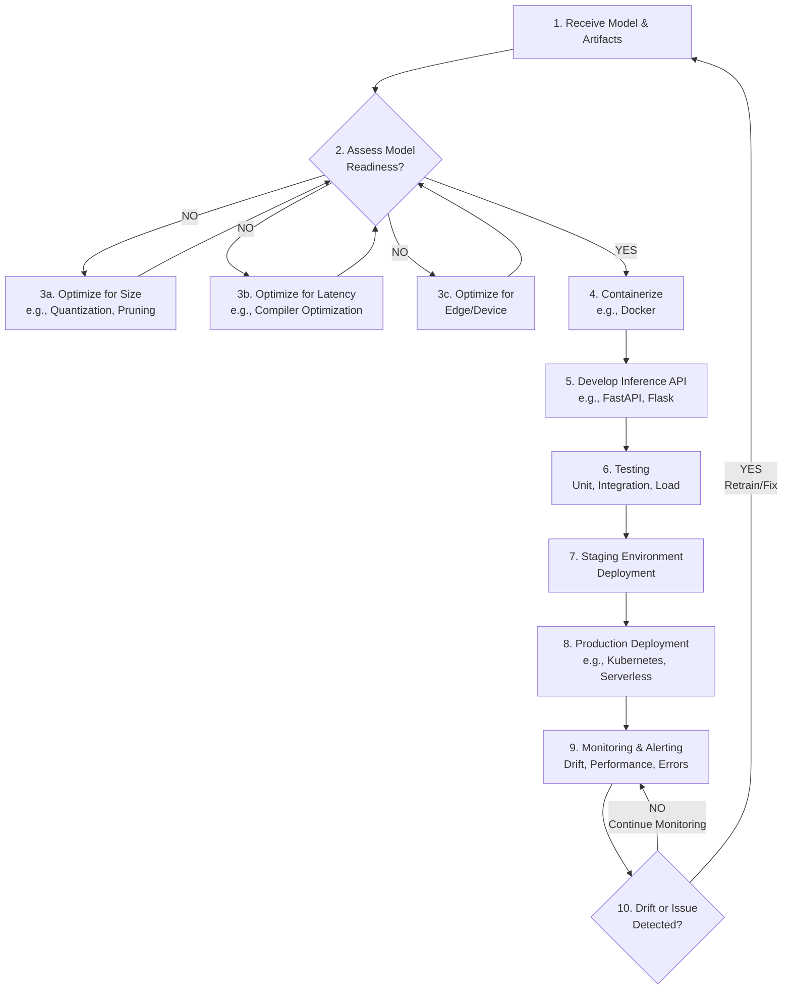

> **Diagram Explanation:** This flowchart depicts the complete ML Engineer deployment workflow. Beginning with receiving a model, it first assesses model readiness — if not ready, it loops through optimization steps (size, latency, edge). Once ready, the model is containerized (Docker), an inference API is developed (FastAPI/Flask), tested, staged, and deployed to production (Kubernetes/Serverless). Post-deployment monitoring detects drift or issues; if found, the model is retrained and the cycle repeats.

## Skills Required

### Technical Skills

| Skill Category | Specific Skills | Proficiency Level |
|---|---|---|
| **Mathematics** | Linear Algebra, Statistics | Intermediate (understand models) |
| **Programming** | Python, Java, Scala | Advanced (production-level code) |
| **Distributed Systems** | Microservices, load balancing, scaling | Strong understanding |
| **Data Modeling** | Feature stores, data pipelines | Intermediate to Advanced |
| **ML Models** | Understanding of various algorithms | Good grasp (not necessarily building) |
| **Software Engineering** | Design patterns, testing, CI/CD | Expert level |
| **System Design** | Architecture, scalability, reliability | Advanced |
| **Cloud Platforms** | AWS, GCP, Azure deployment services | Hands-on production experience |
| **Containers & Orchestration** | Docker, Kubernetes | Expert level |
| **Monitoring & Logging** | Prometheus, Grafana, ELK stack | Production experience |

### Soft Skills Level

| Soft Skill | Level | Reason |
|---|---|---|
| **Analytical Skills** | MEDIUM TO HIGH | Understand model behavior and performance |
| **Business Acumen** | MEDIUM | Focus on technical implementation |
| **Data Storytelling** | LOW | Minimal presentation requirements |
| **Communication Skills** | HIGH | Bridge data scientists and software engineers |
| **Software Skills** | HIGH | Core technical role – production engineering |

## ML Engineer Tech Stack

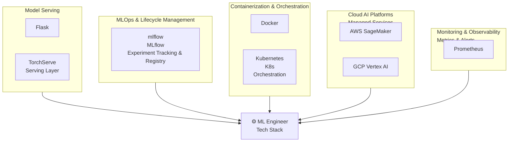

> **Diagram Explanation:** This diagram shows the ML Engineer's tech stack organized across five domains: Model Serving (Flask, TorchServe), MLOps & Lifecycle Management (MLflow for experiment tracking and model registry), Containerization (Docker, Kubernetes), Cloud AI Platforms (AWS SageMaker, GCP Vertex AI), and Monitoring & Observability (Prometheus for metrics and alerts).

## Key Differences: ML Engineer vs Data Scientist

| Aspect | Data Scientist | ML Engineer |
|---|---|---|
| **Primary Goal** | Build best performing model | Deploy model to production |
| **Environment** | Jupyter notebooks, research | Production systems, APIs |
| **Focus** | Model accuracy, innovation | Scalability, reliability, latency |
| **Code Quality** | Experimental, exploratory | Production-grade, tested |
| **Metrics** | Accuracy, F1, AUC | Latency, throughput, uptime |
| **Tools** | scikit-learn, TensorFlow, PyTorch | Docker, Kubernetes, Flask, FastAPI |
| **Skills** | Statistics, ML algorithms | Software engineering, DevOps |
| **Output** | Trained model, notebooks | Production API, deployed system |
| **Testing** | Model validation | Unit tests, integration tests, load tests |
| **Deployment** | Not primary responsibility | Core responsibility |
| **Monitoring** | Model performance metrics | System health, performance, drift |

## Career Path & Salary

**Entry Level (ML Engineer I)**: \$90,000 – \$120,000 **Mid Level (ML Engineer II)**: \$120,000 – \$160,000 **Senior Level (Senior ML Engineer)**: \$160,000 – \$210,000 **Staff/Principal**: \$210,000 – \$300,000+ **Distinguished/Fellow**: \$300,000 – \$500,000+

## Common Deliverables

| Deliverable | Description | Stakeholders |
|---|---|---|
| **Production API** | REST/gRPC endpoint for model inference | Frontend developers, product team |
| **Deployment Documentation** | Setup, configuration, troubleshooting | DevOps, SRE, future ML engineers |
| **Monitoring Dashboard** | Real-time system metrics | Engineering team, management |
| **Performance Report** | Latency, throughput, cost | Technical leadership |

---

# Complete Skills Comparison Table

| Skill Category | Data Analyst | Data Engineer | Data Scientist | ML Engineer |
|---|---|---|---|---|
| **ANALYTICAL SKILLS** | HIGH | MEDIUM | HIGH | MEDIUM TO HIGH |
| **BUSINESS ACUMEN** | MEDIUM TO HIGH | LOW | HIGH | MEDIUM |
| **DATA STORYTELLING** | HIGH | LOW | HIGH | LOW |
| **SOFT SKILLS (Communication)** | MEDIUM TO HIGH | MEDIUM | HIGH | HIGH |
| **SOFTWARE SKILLS** | MEDIUM | HIGH | MEDIUM | HIGH |
| **Mathematics & Statistics** | MEDIUM | LOW TO MEDIUM | HIGH | MEDIUM |
| **Programming** | MEDIUM | HIGH | HIGH | HIGH |
| **Machine Learning** | LOW | LOW | HIGH | MEDIUM TO HIGH |
| **System Design** | LOW | MEDIUM TO HIGH | LOW | HIGH |
| **Data Infrastructure** | LOW | HIGH | LOW TO MEDIUM | MEDIUM TO HIGH |

---

# Salary Comparison by Experience

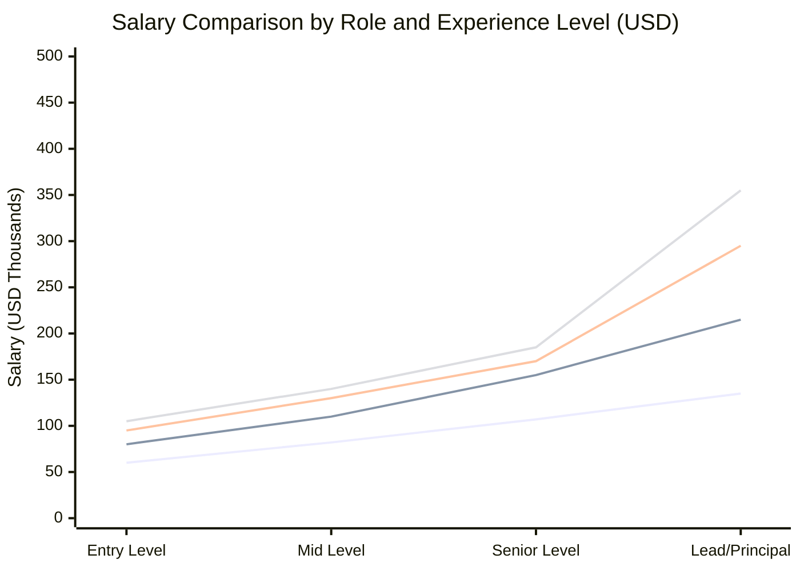

> **Chart Explanation:** This line chart compares the salary trajectories of all four data roles across four experience levels. ML Engineers and Data Scientists command the highest salaries at senior and principal levels, reflecting the complexity and demand of their work. Data Analysts have the lowest ceiling but the lowest barrier to entry, making them an accessible starting point.

**Note:** Salaries vary significantly by location, company size, and industry. These are approximate US market ranges.

| Role | Entry Level | Mid Level | Senior Level | Lead/Principal |
|---|---|---|---|---|
| **Data Analyst** | \$50K – \$70K | \$70K – \$95K | \$95K – \$120K | \$120K – \$150K |
| **Data Engineer** | \$70K – \$90K | \$90K – \$130K | \$130K – \$180K | \$180K – \$250K |
| **Data Scientist** | \$80K – \$110K | \$110K – \$150K | \$150K – \$190K | \$190K – \$400K |
| **ML Engineer** | \$90K – \$120K | \$120K – \$160K | \$160K – \$210K | \$210K – \$500K |

---

# Which Role Is Right For You?

## Decision Framework

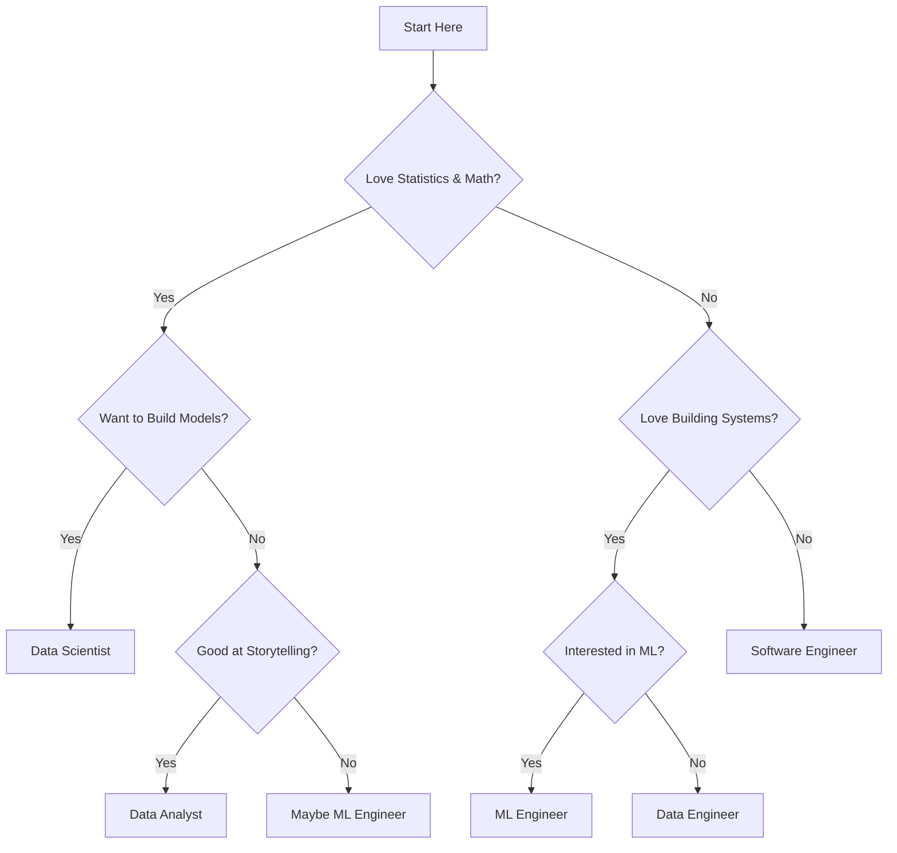

> **Diagram Explanation:** This decision tree guides aspiring data professionals to the most suitable role based on their personal strengths and interests. Starting with affinity for math/statistics, it branches through questions about model building, storytelling, systems engineering, and ML interest to arrive at one of four data roles (or Software Engineer as an alternative). Use this as a self-assessment tool.

## Quick Guide

**Choose Data Analyst if you:**
- ✅ Enjoy working with data and finding insights
- ✅ Have strong communication skills
- ✅ Like creating visualizations and reports
- ✅ Want to directly impact business decisions
- ✅ Prefer less heavy programming

**Choose Data Engineer if you:**
- ✅ Love building robust systems
- ✅ Enjoy working with databases and pipelines
- ✅ Like solving scalability challenges
- ✅ Have strong programming skills
- ✅ Don't need constant stakeholder interaction

**Choose Data Scientist if you:**
- ✅ Love mathematics and statistics
- ✅ Enjoy experimentation and research
- ✅ Want to build predictive models
- ✅ Like solving complex problems
- ✅ Can balance technical and business needs

**Choose ML Engineer if you:**
- ✅ Enjoy both ML and software engineering
- ✅ Want to see models in production
- ✅ Like DevOps and infrastructure work
- ✅ Prefer building scalable systems over research
- ✅ Can work across teams effectively

---

# Job Search Strategy

## Finding Job Opportunities

**Recommended Platforms:**

1. **AngelList** – Startup jobs
2. **LinkedIn** – All types of companies
3. **Indeed** – Wide variety
4. **Glassdoor** – Company insights + jobs
5. **Kaggle Jobs** – Data science specific
6. **DataJobs** – Specialized board

## Research Strategy

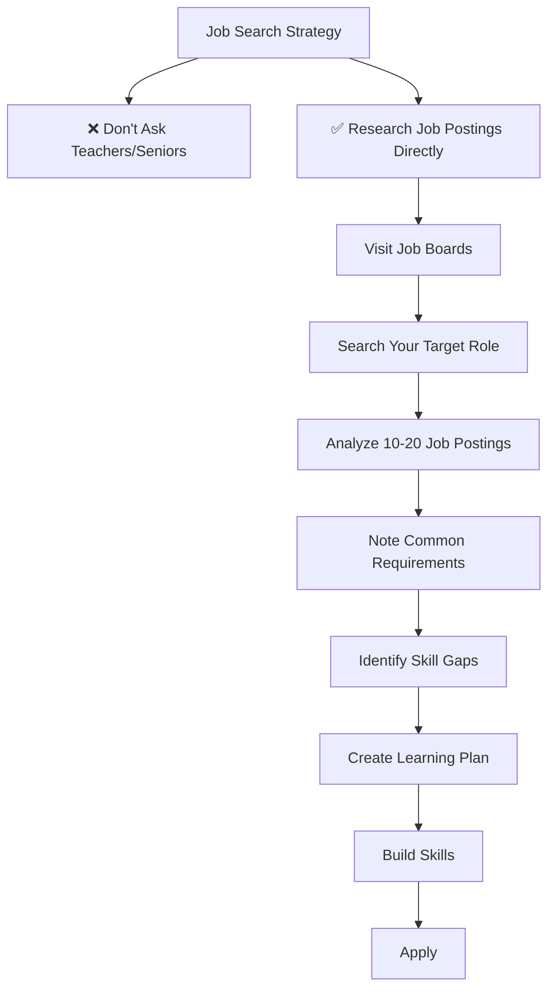

> **Diagram Explanation:** This diagram presents two paths from the Job Search Strategy node: the discouraged path (asking teachers/seniors for job guidance) and the recommended path (direct research of job postings). The right path flows through a systematic process of visiting job boards, searching your target role, analyzing 10–20 postings, noting common requirements, identifying skill gaps, creating a learning plan, building those skills, and finally applying.

## What Companies Really Want

**How to find requirements:**

1. Go to job posting sites
2. Search for your desired role
3. Look at 15-20 recent postings
4. Note the common skills across all postings
5. Those are your must-have skills

**Example Research:**

```
Search: "Data Scientist"
Common across 20 jobs:
- Python ✓
- SQL ✓
- Statistics ✓
- Machine Learning ✓
- Communication ✓

Learn these first!
```

---

# Building Your Skills

## Learning Roadmap by Role

### Data Analyst Path


**Timeline: 3-6 months**

### Data Engineer Path


**Timeline: 6-12 months**

### Data Scientist Path


**Timeline: 8-15 months**

### ML Engineer Path


**Timeline: 9-18 months**

---

# Interview Preparation

## Common Interview Topics by Role

### Data Analyst Interviews

| Topic | Weight | Example Questions |
|---|---|---|
| SQL | 40% | "Write a query to find the top 5 products by revenue" |
| Statistics | 20% | "Explain p-values and statistical significance" |
| Case Studies | 20% | "How would you analyze customer churn?" |
| Tools | 10% | "Create a dashboard showing key metrics" |
| Behavioral | 10% | "Tell me about a time you influenced decision-making" |

### Data Engineer Interviews

| Topic | Weight | Example Questions |
|---|---|---|
| Coding | 40% | "Implement an ETL pipeline", algorithms, data structures |
| System Design | 30% | "Design a data warehouse for an e-commerce company" |
| SQL | 15% | "Optimize this slow query" |
| Big Data | 10% | "When would you use Spark vs traditional SQL?" |
| Behavioral | 5% | "Describe a challenging data pipeline you built" |

### Data Scientist Interviews

| Topic | Weight | Example Questions |
|---|---|---|
| ML Algorithms | 35% | "Explain gradient boosting", "When to use SVM vs Random Forest" |
| Statistics | 25% | "Explain bias-variance tradeoff", hypothesis testing |
| Coding | 20% | "Implement logistic regression from scratch" |
| Case Studies | 15% | "Design a recommendation system" |
| Behavioral | 5% | "How do you communicate technical results to non-technical stakeholders" |

### ML Engineer Interviews

| Topic | Weight | Example Questions |
|---|---|---|
| Coding | 35% | Data structures, algorithms, production code quality |
| System Design | 30% | "Design a scalable ML serving system" |
| ML Concepts | 20% | "How do you handle model drift?", optimization techniques |
| DevOps/MLOps | 10% | "How do you deploy and monitor models?" |
| Behavioral | 5% | "Describe a production ML system you built" |

---

# Final Recommendations

**Based on your current situation:**

```mermaid
graph TD
    BG{"What's Your Background?"}
    SM["Strong Math/Stats"]
    PROG["Strong Programming"]
    BIZ["Business Background"]
    JS["Just Starting"]

    DS_R["Data Scientist"]
    DE_MLE["Data Engineer or ML Engineer"]
    DA_R["Data Analyst"]
    DA_START["Start with Data Analyst"]

    BG --> SM --> DS_R
    BG --> PROG --> DE_MLE
    BG --> BIZ --> DA_R
    BG --> JS --> DA_START
```

> **Diagram Explanation:** This decision tree maps a person's existing background to the recommended starting role. Strong Math/Stats backgrounds align with Data Scientist; programming backgrounds fit Data Engineer or ML Engineer; business backgrounds suit Data Analyst; and those just starting out are best advised to begin as a Data Analyst for its lower barrier to entry and broad applicability.

## General Advice

### 1. If You're Confused: Start with Data Analyst
- Easier entry point
- Good salary for beginners
- Can transition to other roles later
- Learn business skills

### 2. If You Love Math: Go for Data Scientist
- Most challenging intellectually
- Highest potential salary
- Research opportunities
- Requires dedication

### 3. If You Don't Want Heavy Math: Data Engineer
- Focuses on systems and pipelines
- Less statistics, more programming
- Great job security
- High demand

### 4. If You Want Best of Both: ML Engineer
- Combine ML knowledge with engineering
- See your work in production
- Great career growth
- Challenging but rewarding