# Tensors in Machine Learning

---

## What are Tensors?

**Tensor Definition**: A tensor is a **container for storing numerical data –** essentially a data structure for organizing numbers.

### Key Points:

- Tensors are the fundamental data structure in Machine Learning
- All major ML frameworks (NumPy, TensorFlow, PyTorch) use tensors as their basic data structure
- TensorFlow got its name from tensors **–** highlighting their importance
- Almost always contain numbers (99.99% of the time)
- Occasionally can contain characters, but very rarely

### Relationship to Mathematical Concepts:

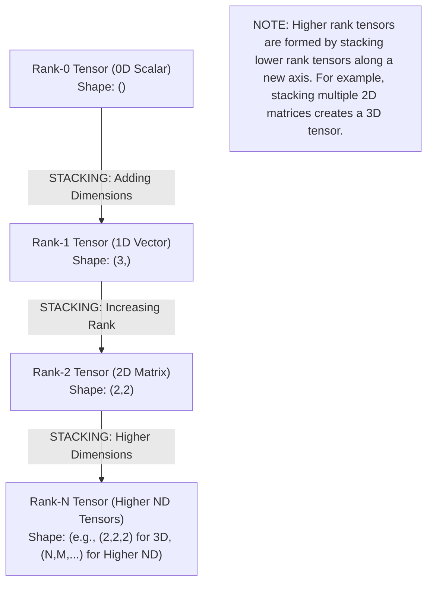

> This diagram shows the **Tensor Hierarchy Pyramid**: each level is built by stacking lower-rank tensors along a new axis. A scalar (0D) stacks into a vector (1D), which stacks into a matrix (2D), and so on up to N-dimensional tensors.

---

## Why Study Tensors?

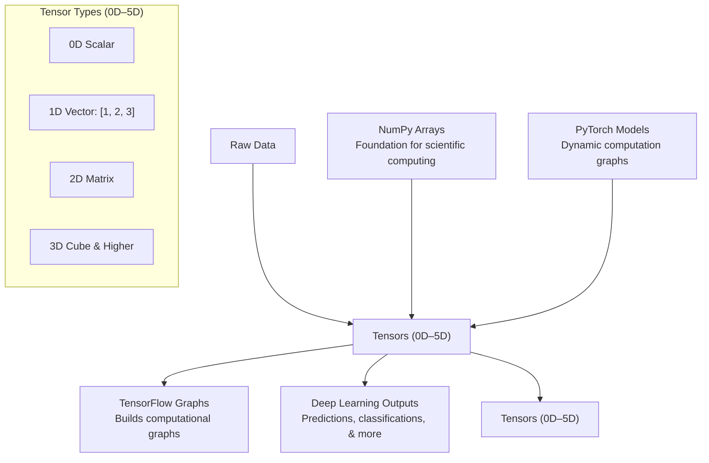

> This diagram illustrates **Why Tensors Matter in ML**: Raw data enters as tensors (0D–5D), which are the core abstraction used by NumPy, PyTorch, and TensorFlow to build models and produce deep learning outputs.

### Critical Reasons:

1. **Foundation of ML Libraries**: All leading ML frameworks (scikit-learn, TensorFlow, PyTorch) use tensors as their primary data structure
2. **Mandatory for Practice**: Cannot do practical machine learning without understanding tensors
3. **Essential for Deep Learning**: Absolutely required for deep learning applications
4. **Data Representation**: Tensors provide a standardized way to represent all types of data in ML

> **Historical Note**: The most popular deep learning library from Google is called "TensorFlow" because tensors are so fundamental to its operation.

---

## Tensor Types & Dimensions

### Complete Tensor Hierarchy

| Tensor Type | Dimensions | Rank | Mathematical Name | Example | NumPy Code |
|-------------|------------|------|-------------------|---------|------------|
| **0D Tensor** | 0 | 0 | Scalar | 4 | `np.array(4)` |
| **1D Tensor** | 1 | 1 | Vector | `[1, 2, 3, 4]` | `np.array([1,2,3,4])` |
| **2D Tensor** | 2 | 2 | Matrix | `[[1,2,3], [4,5,6], [7,8,9]]` | `np.array([[1,2,3],[4,5,6],[7,8,9]])` |
| **3D Tensor** | 3 | 3 | 3D Array | NLP data, Time series | `np.array([[[ ...]]])` |
| **4D Tensor** | 4 | 4 | 4D Array | Image batches | Multiple 3D tensors |
| **5D Tensor** | 5 | 5 | 5D Array | Video batches | Multiple 4D tensors |

---

## Detailed Breakdown of Each Tensor Type

### 1. 0D Tensor (Scalar)

**Definition**: A single number

**Properties**:

- Number of axes (ndim) = 0
- No dimensions
- Just a single numerical value

**Example**:

```python
import numpy as np

# Creating a 0D tensor
a = np.array(4)

print(a)        # Output: 4
print(a.ndim)   # Output: 0 (no dimensions)
```

**Visual Representation**:

```
Just a point: 4
```

---

### 2. 1D Tensor (Vector)

**Definition**: A list/array of numbers in a single dimension

**Properties**:

- Number of axes (ndim) = 1
- Has length/size
- Single row of elements

**Important Distinction**:

- A 1D tensor IS a vector
- But a vector can have N dimensions WITHIN it
- Example: Vector `[1, 2, 3, 4]` is a 1D tensor with 4 dimensions/elements

**Example**:

```python
import numpy as np

# Creating a 1D tensor
arr = np.array([1, 2, 3, 4])

print(arr)        # Output: [1 2 3 4]
print(arr.ndim)   # Output: 1
print(arr.shape)  # Output: (4,)
```

**Visual Representation**:

```
[1, 2, 3, 4] → Single axis (horizontal line)
```

**Confusion Clarification**:

- `[1, 2, 3, 4]` = 1D Tensor (one axis)
- But contains 4 numbers = 4-dimensional vector
- Shape: `(4,)` means 4 elements in the first (and only) axis

---

### 3. 2D Tensor (Matrix)

**Definition**: A rectangular grid of numbers (rows × columns)

**Properties**:

- Number of axes (ndim) = 2
- Has rows and columns
- Shape format: `(rows, columns)`

**Example**:

```python
import numpy as np

# Creating a 2D tensor
mat = np.array([[1, 2, 3],
                [4, 5, 6],
                [7, 8, 9]])

print(mat)
# Output:
# [[1 2 3]
#  [4 5 6]
#  [7 8 9]]

print(mat.ndim)   # Output: 2
print(mat.shape)  # Output: (3, 3)
```

**Visual Representation**:

```
┌─────────────┐
│ 1   2   3   │
│ 4   5   6   │
│ 7   8   9   │
└─────────────┘
    3 × 3 Matrix
```

---

### 4. 3D Tensor

**Definition**: A cube/stack of matrices (depth × rows × columns)

**Properties**:

- Number of axes (ndim) = 3
- Think of it as multiple 2D matrices stacked together
- Shape format: `(depth, rows, columns)` or `(samples, timesteps, features)`

**Common Use Cases**:

1. **Time Series Data**: Stock prices, sensor readings
2. **NLP Data**: Text sequences, word embeddings
3. **Medical Data**: Sequential patient measurements

**Example**:

```python
import numpy as np

# Creating a 3D tensor (2 matrices of 2×3)
tensor_3d = np.array([
    [[1, 2, 3], [4, 5, 6]],
    [[7, 8, 9], [10, 11, 12]]
])

print(tensor_3d.ndim)    # Output: 3
print(tensor_3d.shape)   # Output: (2, 2, 3)
```

**Visual Representation**:

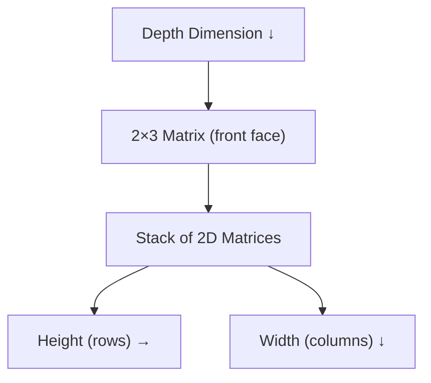

> This diagram shows a 3D Tensor as a **stack of 2D matrices**: the depth dimension indexes which matrix slice you're on, while height and width define the row/column structure of each slice.

---

### 5. 4D Tensor

**Definition**: A collection of 3D tensors (commonly used for image data)

**Properties**:

- Number of axes (ndim) = 4
- Shape format: `(batch_size, height, width, channels)`
- Most common in Computer Vision applications

**Primary Use Case: Images**

**Understanding Image Data**:

- Each image is made of pixels
- Each pixel has a numerical value
- For color images: 3 channels (Red, Green, Blue)
- Multiple images form a 4D tensor

**Example – Single Color Image**:

```python
# Shape: (height, width, channels)
# Example: 480 × 720 image with 3 color channels (RGB)
single_image_shape = (480, 720, 3)
```

**Example – Batch of Images**:

```python
import numpy as np

# 50 color images of size 480×720
batch_of_images = np.zeros((50, 480, 720, 3))

print(batch_of_images.ndim)    # Output: 4
print(batch_of_images.shape)   # Output: (50, 480, 720, 3)
```

**Shape Breakdown**:

- **Dimension 0** (50): Number of images in batch
- **Dimension 1** (480): Height of each image (pixels)
- **Dimension 2** (720): Width of each image (pixels)
- **Dimension 3** (3): Color channels (R, G, B)

**Visual Representation**:

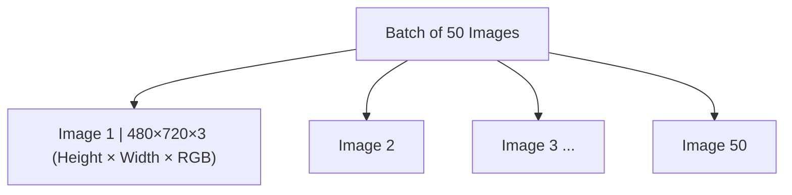

> Each node in this diagram represents one image in the batch. Every image is a 3D tensor of shape $480 \times 720 \times 3$, and stacking 50 of them produces a 4D tensor of shape $(50, 480, 720, 3)$.

**Color Channels Explained**:

```
Red Channel      Green Channel    Blue Channel
┌──────────┐     ┌──────────┐     ┌──────────┐
│  100     │  +  │   50     │  +  │  200     │
│  ...     │     │  ...     │     │  ...     │
│  ...     │     │  ...     │     │  ...     │
└──────────┘     └──────────┘     └──────────┘
     ↓                ↓                ↓
           Combined to form final color image
```

---

### 6. 5D Tensor

**Definition**: A collection of 4D tensors (commonly used for video data)

**Properties**:

- Number of axes (ndim) = 5
- Shape format: `(batch_size, frames, height, width, channels)`
- Used in video processing and analysis

**Understanding Video Data**:

- Video = sequence of images (frames)
- Each frame = 3D tensor (height × width × channels)
- Multiple frames = 4D tensor
- Multiple videos = 5D tensor

**Example – Video Processing**:

```
60-second video at 30fps with 480×720 resolution and 3 color channels:

- Frames per second (FPS): 30
- Total frames: 60 seconds × 30 fps = 1,800 frames
- Resolution: 480 × 720
- Channels: 3 (RGB)

Single video shape: (1800, 480, 720, 3)

Batch of 4 videos shape: (4, 1800, 480, 720, 3)
```

**Storage Calculation Example**:

```
4 videos × 1800 frames × 480 height × 720 width × 3 channels = Total elements
4 × 1800 × 480 × 720 × 3 = 7,464,960,000 elements

If each element is 32 bits (4 bytes):
7,464,960,000 × 4 bytes = 29,859,840,000 bytes
= 29,160,000 KB
= 28,476 MB
≈ 27.8 GB

This is why video formats like MP4, MKV use compression!
```

**Visual Representation**:

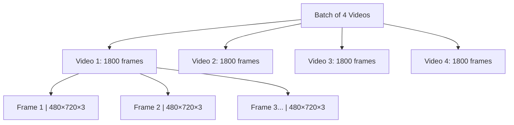

> A 5D tensor stores a **batch of videos**: each video is itself a sequence of frames (4D), and each frame is a 3D RGB image. The full shape $(4, 1800, 480, 720, 3)$ encodes batch × frames × height × width × channels.

---

### Tensor Types: An Exploding Hierarchy

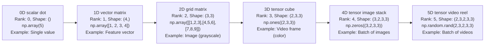

> This left-to-right flow shows the **exploding hierarchy** of tensor ranks: from a single dot (0D scalar) to a full video batch (5D), each step adds one new dimension.

---

## Key Concepts: Rank, Axes, and Shape

### Understanding the Terminology

| Concept | Definition | Example |
|---------|------------|---------|
| **Rank** | Number of axes (dimensions) in a tensor | A 3D tensor has rank = 3 |
| **Axes** | The directions/dimensions of the tensor | 2D tensor has 2 axes (rows, columns) |
| **Shape** | The size along each axis | $(3, 4, 5)$ = 3 elements in axis 0, 4 in axis 1, 5 in axis 2 |
| **ndim** | NumPy property that returns the rank | `tensor.ndim` returns number of dimensions |

### Important Relationships:

- **Number of axes = Rank = ndim**
- More axes = Higher dimensional tensor
- Shape defines the actual size of data along each axis

### Visual Guide to Shape:

```python
# 1D Tensor
[1, 2, 3]
Shape: (3,)
└─ 3 elements along axis 0

# 2D Tensor
[[1, 2, 3],
 [4, 5, 6]]
Shape: (2, 3)
│    └─ 3 elements along axis 1 (columns)
└──── 2 elements along axis 0 (rows)

# 3D Tensor
[[[1, 2], [3, 4]],
  [5, 6], [7, 8]]]
Shape: (2, 2, 2)
│    │    └─ 2 elements along axis 2
│    └───── 2 elements along axis 1
└───────── 2 elements along axis 0
```

**Understanding Tensor Shape & Axes (Diagram)**:

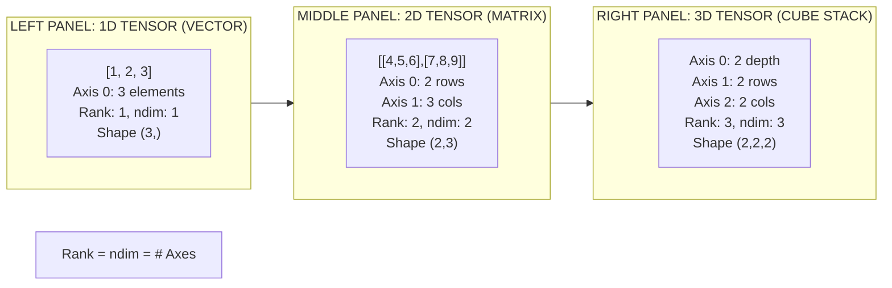

> Each panel shows how **Rank = ndim = Number of Axes**: the 1D vector has 1 axis (elements), the 2D matrix has 2 axes (rows and columns), and the 3D cube has 3 axes (depth, rows, columns).

---

## Real-World Examples

### Example 1: 1D Tensor – Student Data

**Scenario**: Storing student placement data

```python
import numpy as np

# Student data: [cgpa, IQ, state, placement]
# W = 0 (not placed), K = 1 (placed)
student_1 = np.array([8.1, 91, 0])  # CGPA=8.1, IQ=91, Not placed

# Binary representation
student_binary = np.array([1, 0, 1, 0, 1, 1, 0, 1, ...])  # 1000+ digits

print(student_1.shape)   # Output: (3,)
print(student_1.ndim)    # Output: 1
```

**Use Case**: Machine learning model to predict student placement

---

### Example 2: 2D Tensor – Tabular Data

**Scenario**: Multiple students' data

```python
# cgpa | IQ | state | placement
students_data = np.array([
    [8.1, 91, 0, 1],    # Student 1
    [7.2, 85, 1, 0],    # Student 2
    [9.0, 95, 0, 1],    # Student 3
    # ... more students
])

print(students_data.shape)   # Output: (n_students, 4)
print(students_data.ndim)    # Output: 2
```

**Interpretation**:

- Each row = One student (sample)
- Each column = One feature
- This is the most common format for traditional ML

---

### Example 3: 3D Tensor – NLP (Natural Language Processing)

**Scenario**: Processing text data with embeddings

```python
# Example: Processing sentences like "Hi Nitish Rahul Ankit"

# Shape: (samples, sequence_length, embedding_dim)
nlp_tensor = np.array([
    [[1, 0, 0, 0], [0, 1, 0, 0]],   # Sentence 1: "Hi Nitish"
    [[1, 0, 0, 0], [0, 0, 1, 0]],   # Sentence 2: "Hi Rahul"
    [[1, 0, 0, 0], [0, 0, 0, 1]]    # Sentence 3: "Hi Ankit"
])

print(nlp_tensor.shape)   # Output: (3, 2, 4)
# 3 sentences, 2 words each, 4-dimensional embedding
```

**Breakdown**:

- **Axis 0**: Number of sentences/samples (3)
- **Axis 1**: Number of words per sentence (2)
- **Axis 2**: Embedding dimension (4)

**Alternative Example – Time Series**:

```python
# Stock market data
# Shape: (days, features)
# Features: [highest, lowest, opening, closing]

# Single day
day_1 = [highest, lowest, opening, closing]

# Multiple days
time_series = np.array([
    [h1, l1, o1, c1],   # Day 1
    [h2, l2, o2, c2],   # Day 2
    [h3, l3, o3, c3],   # Day 3
    # ...
])

# With multiple stocks: (365 days, 2 features)
# Then add another dimension for multiple time series
# Final shape: (10, 365, 2) = 3D tensor
```

---

### Example 4: 4D Tensor – Computer Vision

**Scenario**: Training a CNN on images

```python
# Batch of color images
# Shape: (batch, height, width, channels)

# Example: 200 images of 200×200 pixels with RGB channels
image_batch = np.random.rand(200, 200, 200, 3)

print(image_batch.shape)   # Output: (200, 200, 200, 3)
print(image_batch.ndim)    # Output: 4
```

**Real Application**:

- **Image Classification**: Cat vs Dog
- **Object Detection**: Finding objects in images
- **Facial Recognition**: Identifying people

**Memory Consideration**:

```
200 images × 200 height × 200 width × 3 channels = 24,000,000 elements
At 32 bits per element = 96,000,000 bits
= 12,000,000 bytes
= 11.44 MB
```

---

### Example 5: 5D Tensor – Video Processing

**Scenario**: Processing multiple videos for action recognition

```python
# Batch of videos
# Shape: (batch, frames, height, width, channels)

# Example: 4 videos, 60 seconds each at 30fps, 480×720, RGB
video_batch = np.random.rand(4, 1800, 480, 720, 3)

print(video_batch.shape)   # Output: (4, 1800, 480, 720, 3)
print(video_batch.ndim)    # Output: 5
```

---

## Practical Implementation with NumPy

### Basic Operations

#### Creating Tensors

```python
import numpy as np

# 0D Tensor (Scalar)
scalar = np.array(42)
print(f"Scalar: {scalar}, ndim: {scalar.ndim}, shape: {scalar.shape}")

# 1D Tensor (Vector)
vector = np.array([1, 2, 3, 4, 5])
print(f"Vector: {vector}, ndim: {vector.ndim}, shape: {vector.shape}")

# 2D Tensor (Matrix)
matrix = np.array([[1, 2, 3],
                   [4, 5, 6]])
print(f"Matrix:\n{matrix}\nndim: {matrix.ndim}, shape: {matrix.shape}")

# 3D Tensor
tensor_3d = np.array([[[1, 2], [3, 4]],
                       [[5, 6], [7, 8]]])
print(f"3D Tensor:\n{tensor_3d}\nndim: {tensor_3d.ndim}, shape: {tensor_3d.shape}")
```

#### Checking Tensor Properties

```python
# Check number of dimensions
print(tensor.ndim)

# Check shape
print(tensor.shape)

# Check data type
print(tensor.dtype)

# Check total number of elements
print(tensor.size)
```

---

## Tensor Shape Transformation Guide

### Common Shape Manipulations

| Operation | Purpose | Example |
|-----------|---------|---------|
| `reshape()` | Change shape without changing data | $(6,) \rightarrow (2, 3)$ |
| `flatten()` | Convert to 1D | $(2, 3) \rightarrow (6,)$ |
| `squeeze()` | Remove dimensions of size 1 | $(1, 3, 1) \rightarrow (3,)$ |
| `expand_dims()` | Add dimension of size 1 | $(3,) \rightarrow (1, 3)$ |
| `transpose()` | Swap axes | $(2, 3) \rightarrow (3, 2)$ |

```python
# Examples
original = np.array([[1, 2, 3], [4, 5, 6]])  # Shape: (2, 3)

# Reshape to 1D
flat = original.reshape(-1)                         # Shape: (6,)

# Reshape to different 2D
reshaped = original.reshape(3, 2)                   # Shape: (3, 2)

# Add batch dimension
batched = np.expand_dims(original, axis=0)          # Shape: (1, 2, 3)

# Transpose
transposed = original.T                             # Shape: (3, 2)
```

---

## Tensor Operations Summary Table

| Tensor Type | Rank | Shape Format | Common Use Cases | Size Factor |
|-------------|------|--------------|-----------------|-------------|
| 0D (Scalar) | 0 | `()` | Single values, scalars | $1$ |
| 1D (Vector) | 1 | `(n,)` | Feature vectors, sequences | $n$ |
| 2D (Matrix) | 2 | `(m, n)` | Tabular data, spreadsheets | $m \times n$ |
| 3D | 3 | `(d, m, n)` | Time series, NLP, sequences | $d \times m \times n$ |
| 4D | 4 | `(b, h, w, c)` | Image batches, CNNs | $b \times h \times w \times c$ |
| 5D | 5 | `(b, f, h, w, c)` | Video batches, video CNNs | $b \times f \times h \times w \times c$ |

---

## Mermaid Diagrams

### Tensor Hierarchy

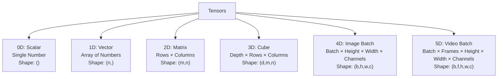

> This tree shows the **complete tensor hierarchy** rooted at the abstract "Tensors" concept, branching out to each rank type with its mathematical name, structure description, and shape notation.

### Tensor Dimensions Flow

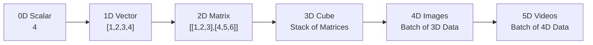

> This left-to-right flow diagram shows how **dimensionality increases** step-by-step: from a single scalar, through vectors and matrices, up to 4D image batches and 5D video batches.

### Data Type to Tensor Mapping

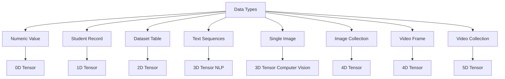

> This diagram maps **real-world data types to their corresponding tensor ranks**: numeric values are scalars (0D), tabular datasets are matrices (2D), text/image sequences are 3D, image batches are 4D, and video collections are 5D.

### Image to 4D Tensor Conversion

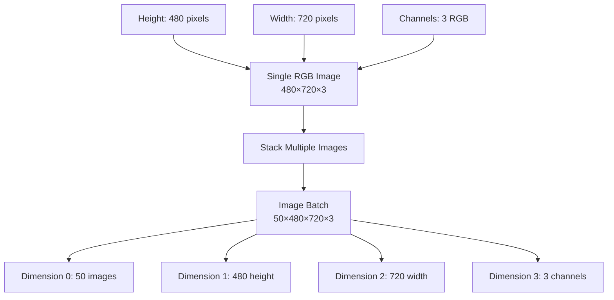

> This diagram shows how a **single RGB image** (a 3D tensor: height × width × channels) is stacked with others to form a **4D image batch**, decomposing each of the 4 dimensions.

### Video to 5D Tensor Conversion

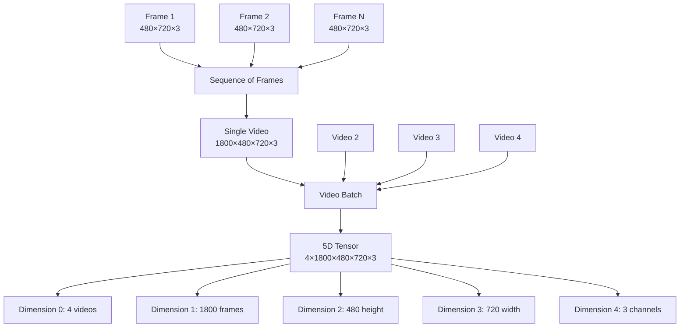

> This diagram illustrates how **individual frames stack into a single video** (4D), and multiple videos stack into a **5D batch tensor**, with all 5 dimensions labeled at the bottom.

---

## Key Takeaways

### Essential Points to Remember:

1. **Tensors are containers for numbers –** the fundamental data structure in ML

2. **Rank = Number of Axes = ndim –** all refer to the same concept

3. **Shape defines the size** along each axis

4. **Higher dimensions = More complex data**:
   - 0D: Single value
   - 1D: List of values
   - 2D: Table
   - 3D: Time series, NLP
   - 4D: Images
   - 5D: Videos

5. **In Computer Science**: Array terminology

6. **In Mathematics/Physics**: Tensor terminology

7. **In ML**: Both terms used interchangeably

8. **Common Shapes**:
   - Traditional ML: Mostly 2D (samples × features)
   - NLP: 3D (samples × sequence × embedding)
   - Computer Vision: 4D (batch × height × width × channels)
   - Video Processing: 5D (batch × frames × height × width × channels)

9. **Storage Considerations**:
   - Higher dimensional tensors require more memory
   - Videos especially need compression (MP4, MKV, etc.)
   - Always consider computational resources

10. **Practical Tip**: Start with understanding 0D to 3D tensors thoroughly, as these cover 90% of use cases in machine learning

---

## Section 1: Creating Basic Tensors

### 1.1 Scalar (0D Tensor)

```python
# Creating a 0D tensor (scalar)
scalar = np.array(4)

print("=" * 50)
print("0D TENSOR (SCALAR)")
print("=" * 50)
print(f"Value: {scalar}")
print(f"Number of dimensions (ndim): {scalar.ndim}")
print(f"Shape: {scalar.shape}")
print(f"Data type: {scalar.dtype}")
print(f"Size (total elements): {scalar.size}")
print()

# Another example
temperature = np.array(98.6)
print(f"Temperature: {temperature}")
print(f"Is scalar: {temperature.ndim == 0}")
```

**Expected Output**:

```
Value: 4
Number of dimensions (ndim): 0
Shape: ()
Data type: int64
Size (total elements): 1
```

---

### 1.2 Vector (1D Tensor)

```python
# Creating a 1D tensor (vector)
vector = np.array([1, 2, 3, 4])

print("=" * 50)
print("1D TENSOR (VECTOR)")
print("=" * 50)
print(f"Value: {vector}")
print(f"Number of dimensions (ndim): {vector.ndim}")
print(f"Shape: {vector.shape}")
print(f"Data type: {vector.dtype}")
print(f"Size (total elements): {vector.size}")
print()

# Accessing elements
print("Indexing examples:")
print(f"First element: {vector[0]}")
print(f"Last element: {vector[-1]}")
print(f"Slice [1:3]: {vector[1:3]}")
print()

# Different ways to create vectors
zeros_vector = np.zeros(5)
ones_vector = np.ones(5)
range_vector = np.arange(10)
linspace_vector = np.linspace(0, 1, 5)

print("Different creation methods:")
print(f"Zeros: {zeros_vector}")
print(f"Ones: {ones_vector}")
print(f"Range: {range_vector}")
print(f"Linspace: {linspace_vector}")
```

**Expected Output**:

```
Value: [1 2 3 4]
Number of dimensions (ndim): 1
Shape: (4,)
Data type: int64
Size (total elements): 4
```

---

### 1.3 Matrix (2D Tensor)

```python
# Creating a 2D tensor (matrix)
matrix = np.array([[1, 2, 3],
                   [4, 5, 6],
                   [7, 8, 9]])

print("=" * 50)
print("2D TENSOR (MATRIX)")
print("=" * 50)
print(f"Value:\n{matrix}")
print(f"\nNumber of dimensions (ndim): {matrix.ndim}")
print(f"Shape: {matrix.shape}")
print(f"Data type: {matrix.dtype}")
print(f"Size (total elements): {matrix.size}")
print()

# Accessing elements
print("Indexing examples:")
print(f"Element at [0,0]: {matrix[0, 0]}")
print(f"Element at [1,2]: {matrix[1, 2]}")
print(f"First row: {matrix[0, :]}")
print(f"First column: {matrix[:, 0]}")
print(f"Sub-matrix [0:2, 0:2]:\n{matrix[0:2, 0:2]}")
print()

# Different creation methods
zeros_matrix = np.zeros((3, 4))
ones_matrix = np.ones((2, 3))
identity = np.eye(3)
random_matrix = np.random.rand(2, 3)

print("Different creation methods:")
print(f"Zeros (3×4):\n{zeros_matrix}\n")
print(f"Ones (2×3):\n{ones_matrix}\n")
print(f"Identity (3×3):\n{identity}\n")
print(f"Random (2×3):\n{random_matrix}")
```

**Expected Output**:

```
Value:
[[1 2 3]
 [4 5 6]
 [7 8 9]]

Number of dimensions (ndim): 2
Shape: (3, 3)
Data type: int64
Size (total elements): 9
```

---

### 1.4 3D Tensor

```python
# Creating a 3D tensor
tensor_3d = np.array([
    [[1, 2, 3], [4, 5, 6]],
    [[7, 8, 9], [10, 11, 12]]
])

print("=" * 50)
print("3D TENSOR")
print("=" * 50)
print(f"Value:\n{tensor_3d}")
print(f"\nNumber of dimensions (ndim): {tensor_3d.ndim}")
print(f"Shape: {tensor_3d.shape}")
print(f"Data type: {tensor_3d.dtype}")
print(f"Size (total elements): {tensor_3d.size}")
print()

# Shape interpretation
depth, rows, cols = tensor_3d.shape
print("Shape breakdown:")
print(f"  - Depth (number of 2D matrices): {depth}")
print(f"  - Rows (in each matrix): {rows}")
print(f"  - Columns (in each matrix): {cols}")
print()

# Accessing elements
print("Indexing examples:")
print(f"First matrix:\n{tensor_3d[0]}\n")
print(f"Second matrix:\n{tensor_3d[1]}\n")
print(f"Element at [1, 0, 2]: {tensor_3d[1, 0, 2]}")
```

**Expected Output**:

```
Value:
[[[ 1  2  3]
  [ 4  5  6]]

 [[ 7  8  9]
  [10 11 12]]]

Number of dimensions (ndim): 3
Shape: (2, 2, 3)
```

---

## Section 2: Real-World Examples

### 2.1 Example: Student Data (1D Tensor)

```python
print("=" * 50)
print("REAL-WORLD EXAMPLE 1: STUDENT DATA")
print("=" * 50)

# Student features: [CGPA, IQ, State, Placement]
# W = 0 (not placed), K = 1 (placed)
student_1 = np.array([8.1, 91, 0, 1])

print(f"Student 1 data: {student_1}")
print(f"Shape: {student_1.shape}")
print(f"Interpretation:")
print(f"  - CGPA: {student_1[0]}")
print(f"  - IQ: {student_1[1]}")
print(f"  - State: {student_1[2]} (0=W, 1=K)")
print(f"  - Placement: {student_1[3]} (0=No, 1=Yes)")
```

---

### 2.2 Example: Student Dataset (2D Tensor)

```python
print("\n" + "=" * 50)
print("REAL-WORLD EXAMPLE 2: STUDENT DATASET")
print("=" * 50)

# Multiple students
# Each row: [CGPA, IQ, State, Placement]
students = np.array([
    [8.1, 91, 0, 1],    # Student 1: High CGPA, placed
    [7.2, 85, 1, 0],    # Student 2: Good CGPA, not placed
    [9.0, 95, 0, 1],    # Student 3: Excellent CGPA, placed
    [6.5, 78, 1, 0],    # Student 4: Average CGPA, not placed
    [8.5, 88, 0, 1]     # Student 5: High CGPA, placed
])

print(f"Dataset shape: {students.shape}")
print(f"Number of students: {students.shape[0]}")
print(f"Number of features: {students.shape[1]}")
print(f"\nDataset:\n{students}\n")

# Statistics
print("Dataset statistics:")
print(f"  - Average CGPA: {students[:, 0].mean():.2f}")
print(f"  - Average IQ: {students[:, 1].mean():.2f}")
print(f"  - Placement rate: {students[:, 3].mean() * 100:.1f}%")
```

---

### 2.3 Example: NLP Data (3D Tensor)

```python
print("\n" + "=" * 50)
print("REAL-WORLD EXAMPLE 3: NLP DATA")
print("=" * 50)

# Text data: "Hi Nitish", "Hi Rahul", "Hi Ankit"
# One-hot encoding for words: Hi, Nitish, Rahul, Ankit
nlp_data = np.array([
    [[1, 0, 0, 0], [0, 1, 0, 0]],   # "Hi Nitish"
    [[1, 0, 0, 0], [0, 0, 1, 0]],   # "Hi Rahul"
    [[1, 0, 0, 0], [0, 0, 0, 1]]    # "Hi Ankit"
])

print(f"NLP tensor shape: {nlp_data.shape}")
print(f"Interpretation:")
print(f"  - Number of sentences: {nlp_data.shape[0]}")
print(f"  - Words per sentence: {nlp_data.shape[1]}")
print(f"  - Embedding dimension: {nlp_data.shape[2]}")
print(f"\nFirst sentence 'Hi Nitish':\n{nlp_data[0]}")
print(f"\nWord 'Hi' encoding: {nlp_data[0, 0]}")
print(f"Word 'Nitish' encoding: {nlp_data[0, 1]}")
```

---

### 2.4 Example: Time Series Data (3D Tensor)

```python
print("\n" + "=" * 50)
print("REAL-WORLD EXAMPLE 4: TIME SERIES DATA")
print("=" * 50)

# Stock market data
# 5 days of trading, 4 features per day: [High, Low, Open, Close]
stock_data = np.array([
    # Day 1
    [[150.5, 148.2, 149.0, 150.0]],
    # Day 2
    [[151.2, 149.5, 150.0, 150.8]],
    # Day 3
    [[152.0, 150.0, 150.8, 151.5]],
    # Day 4
    [[151.8, 150.2, 151.5, 150.9]],
    # Day 5
    [[152.5, 150.5, 150.9, 152.0]]
])

print(f"Stock data shape: {stock_data.shape}")
print(f"Days of data: {stock_data.shape[0]}")
print(f"Timestamps per day: {stock_data.shape[1]}")
print(f"Features: {stock_data.shape[2]}")
print(f"\nDay 1 data: {stock_data[0]}")
print(f"High price on Day 1: {stock_data[0, 0, 0]}")
print(f"Close price on Day 1: {stock_data[0, 0, 3]}")
```

---

### 2.5 Example: Image Data (4D Tensor)

```python
print("\n" + "=" * 50)
print("REAL-WORLD EXAMPLE 5: IMAGE DATA")
print("=" * 50)

# Simulating a batch of color images
# 10 images of 64×64 pixels with 3 color channels (RGB)
image_batch = np.random.rand(10, 64, 64, 3)

print(f"Image batch shape: {image_batch.shape}")
print(f"Interpretation:")
print(f"  - Number of images: {image_batch.shape[0]}")
print(f"  - Image height: {image_batch.shape[1]} pixels")
print(f"  - Image width: {image_batch.shape[2]} pixels")
print(f"  - Color channels: {image_batch.shape[3]} (RGB)")
print()

# Memory calculation
total_elements = image_batch.size
memory_mb = (total_elements * 8) / (1024 * 1024)  # 8 bytes for float64
print(f"Memory usage:")
print(f"  - Total elements: {total_elements:,}")
print(f"  - Memory (float64): {memory_mb:.2f} MB")

# Single image
single_image = image_batch[0]
print(f"\nSingle image shape: {single_image.shape}")
print(f"Single image size: {single_image.size:,} elements")
```

---

### 2.6 Example: Video Data (5D Tensor)

```python
print("\n" + "=" * 50)
print("REAL-WORLD EXAMPLE 6: VIDEO DATA")
print("=" * 50)

# Simulating a batch of videos
# 2 videos, each 30 frames, 128×128 pixels, RGB
video_batch = np.random.rand(2, 30, 128, 128, 3)

print(f"Video batch shape: {video_batch.shape}")
print(f"Interpretation:")
print(f"  - Number of videos: {video_batch.shape[0]}")
print(f"  - Frames per video: {video_batch.shape[1]}")
print(f"  - Frame height: {video_batch.shape[2]} pixels")
print(f"  - Frame width: {video_batch.shape[3]} pixels")
print(f"  - Color channels: {video_batch.shape[4]} (RGB)")
print()

# Memory calculation
total_elements = video_batch.size
memory_mb = (total_elements * 8) / (1024 * 1024)  # 8 bytes for float64
memory_gb = memory_mb / 1024
print(f"Memory usage:")
print(f"  - Total elements: {total_elements:,}")
print(f"  - Memory (float64): {memory_mb:.2f} MB = {memory_gb:.3f} GB")

# Single video
single_video = video_batch[0]
print(f"\nSingle video shape: {single_video.shape}")
print(f"Single frame shape: {single_video[0].shape}")
```

---

## Section 3: Tensor Operations

### 3.1 Shape Manipulation

```python
print("=" * 50)
print("TENSOR SHAPE MANIPULATION")
print("=" * 50)

# Original array
original = np.arange(24)
print(f"Original array: {original}")
print(f"Original shape: {original.shape}\n")

# Reshape to 2D
reshaped_2d = original.reshape(6, 4)
print(f"Reshaped to (6, 4):\n{reshaped_2d}\n")

# Reshape to 3D
reshaped_3d = original.reshape(2, 3, 4)
print(f"Reshaped to (2, 3, 4):\n{reshaped_3d}\n")

# Reshape with -1 (auto-calculate)
auto_reshape = original.reshape(-1, 6)
print(f"Reshaped to (-1, 6) [auto-calculated]:\n{auto_reshape}\n")

# Flatten
flattened = reshaped_2d.flatten()
print(f"Flattened: {flattened}")
print(f"Flattened shape: {flattened.shape}\n")

# Transpose
matrix = np.array([[1, 2, 3], [4, 5, 6]])
print(f"Original matrix (2×3):\n{matrix}\n")
transposed = matrix.T
print(f"Transposed matrix (3×2):\n{transposed}\n")
```

---

### 3.2 Adding and Removing Dimensions

```python
print("=" * 50)
print("ADDING AND REMOVING DIMENSIONS")
print("=" * 50)

# Original vector
vector = np.array([1, 2, 3, 4, 5])
print(f"Shape: {vector.shape}\n")

# Add dimension at the beginning (batch dimension)
with_batch = np.expand_dims(vector, axis=0)
print(f"With batch dimension: {with_batch}")
print(f"Shape: {with_batch.shape}\n")

# Add dimension at the end
with_feature = np.expand_dims(vector, axis=-1)
print(f"With feature dimension:\n{with_feature}")
print(f"Shape: {with_feature.shape}\n")

# Using newaxis
newaxis_batch = vector[np.newaxis, :]
newaxis_feature = vector[:, np.newaxis]
print(f"Using newaxis (batch): {newaxis_batch}, shape: {newaxis_batch.shape}")
print(f"Using newaxis (feature):\n{newaxis_feature}\nshape: {newaxis_feature.shape}")

# Squeeze - remove dimensions of size 1
squeezable = np.array([[[1, 2, 3]]])
print(f"Original (with size-1 dims): {squeezable}, shape: {squeezable.shape}")
squeezed = np.squeeze(squeezable)
print(f"After squeeze: {squeezed}, shape: {squeezed.shape}")
```

---

### 3.3 Element-wise Operations

```python
print("\n" + "=" * 50)
print("ELEMENT-WISE OPERATIONS")
print("=" * 50)

a = np.array([[1, 2, 3],
              [4, 5, 6]])
b = np.array([[10, 20, 30],
              [40, 50, 60]])

print(f"Array A:\n{a}\n")
print(f"Array B:\n{b}\n")

# Addition
print(f"A + B:\n{a + b}\n")

# Subtraction
print(f"A - B:\n{a - b}\n")

# Multiplication (element-wise)
print(f"A * B:\n{a * b}\n")

# Division
print(f"A / B:\n{a / b}\n")

# Power
print(f"A ** 2:\n{a ** 2}\n")

# Square root
print(f"sqrt(A):\n{np.sqrt(a)}\n")
```

---

### 3.4 Aggregation Operations

```python
print("=" * 50)
print("AGGREGATION OPERATIONS")
print("=" * 50)

matrix = np.array([[1, 2, 3, 4],
                   [5, 6, 7, 8],
                   [9, 10, 11, 12]])

print(f"Matrix:\n{matrix}\n")

# Sum
print(f"Total sum: {matrix.sum()}")
print(f"Sum along axis 0 (columns): {matrix.sum(axis=0)}")
print(f"Sum along axis 1 (rows): {matrix.sum(axis=1)}\n")

# Mean
print(f"Overall mean: {matrix.mean():.2f}")
print(f"Mean along axis 0: {matrix.mean(axis=0)}")
print(f"Mean along axis 1: {matrix.mean(axis=1)}\n")

# Max and Min
print(f"Maximum value: {matrix.max()}")
print(f"Minimum value: {matrix.min()}")
print(f"Max along axis 0: {matrix.max(axis=0)}")
print(f"Max along axis 1: {matrix.max(axis=1)}\n")

# Argmax and Argmin (indices)
print(f"Index of maximum value: {matrix.argmax()}")
print(f"Index of maximum along axis 1: {matrix.argmax(axis=1)}")
```

---

### 3.5 Broadcasting

```python
print("\n" + "=" * 50)
print("BROADCASTING")
print("=" * 50)

# Matrix + Vector
matrix = np.array([[1, 2, 3],
                   [4, 5, 6]])
vector = np.array([10, 20, 30])

print(f"Matrix (2×3):\n{matrix}\n")
print(f"Vector (3,): {vector}\n")

result = matrix + vector
print(f"Matrix + Vector (broadcasting):\n{result}\n")

# Matrix + Scalar
scalar = 100
result_scalar = matrix + scalar
print(f"Matrix + 100:\n{result_scalar}\n")

# Column vector broadcasting
col_vector = np.array([[10],
                       [20]])
print(f"Column vector (2×1):\n{col_vector}\n")
result_col = matrix + col_vector
print(f"Matrix + Column Vector:\n{result_col}")
```

---

## Section 4: Practical Exercises

### Exercise 1: Create Your Own Tensors

```python
print("=" * 50)
print("EXERCISE 1: CREATE YOUR OWN TENSORS")
print("=" * 50)

# TODO: Create the following tensors
# 1. A 0D tensor with your age
age = np.array(25)  # Replace with your age

# 2. A 1D tensor with 5 random numbers
random_vector = np.random.rand(5)

# 3. A 2D tensor (4×3) with sequential numbers
sequential_matrix = np.arange(12).reshape(4, 3)

# 4. A 3D tensor representing 3 color images (32×32 pixels)
image_stack = np.random.rand(3, 32, 32, 3)

print(f"1. Age (0D): {age}, shape: {age.shape}")
print(f"2. Random vector (1D): {random_vector}, shape: {random_vector.shape}")
print(f"3. Sequential matrix (2D):\n{sequential_matrix}\nshape: {sequential_matrix.shape}")
print(f"4. Image stack (4D): shape: {image_stack.shape}")
```

---

### Exercise 2: Shape Transformations

```python
print("\n" + "=" * 50)
print("EXERCISE 2: SHAPE TRANSFORMATIONS")
print("=" * 50)

# Start with a 1D array
arr = np.arange(60)
print(f"Original 1D array: shape = {arr.shape}\n")

# TODO: Transform into different shapes
# 1. (12, 5)
shape1 = arr.reshape(12, 5)
print(f"1. Reshaped to (12, 5): shape = {shape1.shape}")

# 2. (3, 4, 5)
shape2 = arr.reshape(3, 4, 5)
print(f"2. Reshaped to (3, 4, 5): shape = {shape2.shape}")

# 3. (2, 5, 6)
shape3 = arr.reshape(2, 5, 6)
print(f"3. Reshaped to (2, 5, 6): shape = {shape3.shape}")

# 4. Add a batch dimension to shape1
shape1_batch = np.expand_dims(shape1, axis=0)
print(f"4. Shape1 with batch dim: shape = {shape1_batch.shape}")
```

---

### Exercise 3: Real Dataset Simulation

```python
print("\n" + "=" * 50)
print("EXERCISE 3: SIMULATE A REAL DATASET")
print("=" * 50)

# Simulate a classification dataset
# 100 samples, 10 features, 3 classes
n_samples = 100
n_features = 10
n_classes = 3

# Create feature matrix (2D)
X = np.random.randn(n_samples, n_features)
print(f"Feature matrix X: shape = {X.shape}")

# Create labels (1D)
y = np.random.randint(0, n_classes, size=n_samples)
print(f"Labels y: shape = {y.shape}")

# Convert labels to one-hot encoding (2D)
y_onehot = np.eye(n_classes)[y]
print(f"One-hot labels: shape = {y_onehot.shape}\n")

# Statistics
print(f"Mean of features: {X.mean(axis=0)[:3]}... (showing first 3)")
print(f"Std of features: {X.std(axis=0)[:3]}... (showing first 3)")
print(f"Class distribution: {np.bincount(y)}")
```

---

## Section 5: Memory Calculation Examples

### Example: Calculate Memory for Different Scenarios

```python
print("=" * 50)
print("MEMORY CALCULATIONS")
print("=" * 50)

def calculate_memory(shape, dtype=np.float32):
    """Calculate memory required for a tensor"""
    elements = np.prod(shape)
    bytes_per_element = np.dtype(dtype).itemsize
    total_bytes = elements * bytes_per_element

    # Convert to different units
    kb = total_bytes / 1024
    mb = kb / 1024
    gb = mb / 1024

    return {
        'elements': elements,
        'bytes': total_bytes,
        'KB': kb,
        'MB': mb,
        'GB': gb
    }

# Example calculations
scenarios = [
    ("MNIST (60k images, 28×28, grayscale)", (60000, 28, 28, 1)),
    ("CIFAR-10 batch (128 images, 32×32, RGB)", (128, 32, 32, 3)),
    ("ImageNet image (224×224, RGB)", (1, 224, 224, 3)),
    ("HD video frame (1080p, RGB)", (1, 1080, 1920, 3)),
    ("1 min 30fps 480p video (RGB)", (1800, 480, 640, 3))
]

for name, shape in scenarios:
    result = calculate_memory(shape)
    print(f"\n{name}")
    print(f"  Shape: {shape}")
    print(f"  Elements: {result['elements']:,}")
    print(f"  Memory: {result['MB']:.2f} MB ({result['GB']:.4f} GB)")
```

---

## 🎯 Quick Decision Guide

### "What dimension should I use?"

```
Is it a single value?
└─→ 0D (Scalar)

Is it a list of values?
└─→ 1D (Vector)

Is it a table/spreadsheet?
└─→ 2D (Matrix)

Is it text/time series?
└─→ 3D (Samples × Sequence × Features)

Is it images?
├─ Single image? → 3D (H × W × C)
└─ Multiple images? → 4D (Batch × H × W × C)

Is it videos?
├─ Single video? → 4D (Frames × H × W × C)
└─ Multiple videos? → 5D (Batch × Frames × H × W × C)
```

---

## 📖 Further Reading

- NumPy Documentation: https://numpy.org/doc/
- TensorFlow Guide: https://www.tensorflow.org/guide/tensor
- PyTorch Tutorials: https://pytorch.org/tutorials/