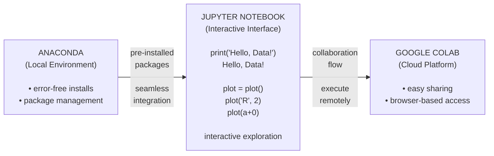
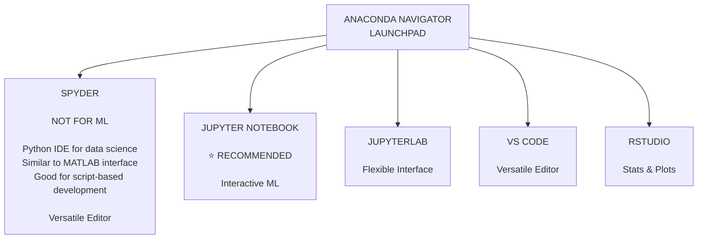
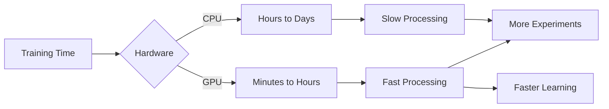
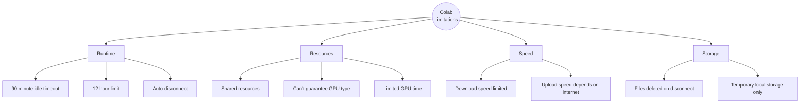
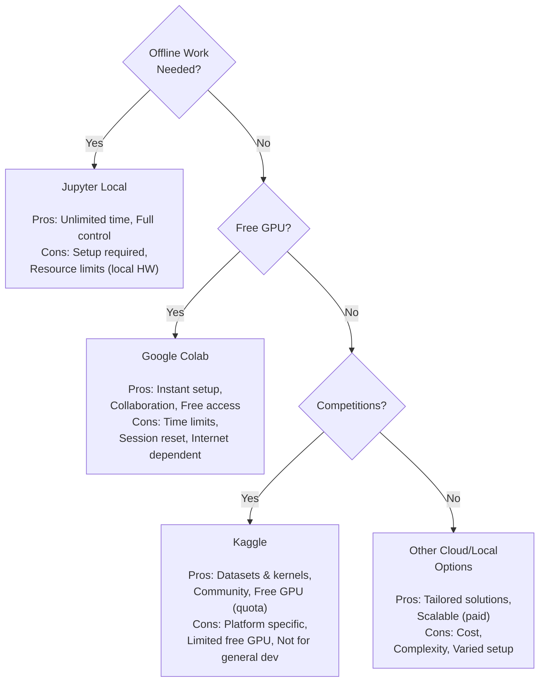

# Complete Guide: Setting Up Data Science Tools for Machine Learning

> This guide covers the essential tools for machine learning development, including Anaconda, Jupyter Notebook, and Google Colab setup.

---

## Introduction

This guide covers the three most popular platforms for data science and machine learning development:

1. **Anaconda –** Local development environment
2. **Jupyter Notebook** - Interactive computing platform
3. **Google Colab –** Cloud-based development environment

---

## Data Science Platforms & Flow



> This diagram shows the three-platform data science workflow: Anaconda serves as the local environment with pre-installed packages, which feeds seamlessly into Jupyter Notebook for interactive exploration, and finally connects to Google Colab for cloud-based collaboration and remote execution.

---

## Why These Tools?

Data science work requires multiple packages and libraries. Installing each one individually is time-consuming and error-prone. These tools solve this problem by providing:

- Pre-installed data science packages
- Interactive development environments
- Easy-to-use interfaces
- Collaboration capabilities

---

## Anaconda Setup

### What is Anaconda?

Anaconda is the most popular platform for data science and machine learning on local machines. It provides:

- All necessary data science packages pre-installed
- Package management system
- Multiple development tools
- Support for Python and R

### Installation Steps

#### 1. Download Anaconda

**Download Details:**

- **Website:** anaconda.com
- **Section:** Products → Individual Edition
- **Size:** ~500-600 MB
- **Operating Systems:** Windows, macOS, Linux

#### 2. Installation Process

| Step | Action | Notes |
|------|--------|-------|
| 1 | Run the installer | Double-click downloaded file |
| 2 | Accept license agreement | Read and accept terms |
| 3 | Choose installation type | Select "Just Me" (recommended) |
| 4 | Select destination folder | Use default path |
| 5 | Advanced options | Keep default settings |
| 6 | Complete installation | Wait for process to finish (~5-10 minutes) |

**Important Installation Notes:**

- Keep all default settings during installation
- Do NOT change the installation path unless necessary
- Ensure you have sufficient disk space (~3 GB)

---

## Anaconda Tools Overview



> This mind-map diagram shows all tools available through the Anaconda Navigator Launchpad. Jupyter Notebook is the recommended tool for ML workflows, while Spyder is explicitly marked "NOT FOR ML." JupyterLab offers a more flexible next-generation interface, VS Code is a versatile editor, and RStudio is used for statistical computing and plots.

### Available Tools

1. **Spyder**
   - Python IDE for data science
   - Similar to MATLAB interface
   - Good for script-based development
   - **Note:** Not recommended for machine learning workflows

2. **Jupyter Notebook ⭐ (Recommended)**
   - Interactive computing environment
   - Cell-by-cell code execution
   - Rich text and media support
   - Best for data science workflows

3. **JupyterLab**
   - Next-generation Jupyter interface
   - More features than Jupyter Notebook
   - Good for complex projects

---

## Jupyter Notebook

### Why Jupyter Notebook?

Jupyter Notebook is the most popular tool for data science because:

- ✅ Execute code cell-by-cell
- ✅ View results immediately
- ✅ Add rich documentation
- ✅ Include visualizations inline
- ✅ Share work easily
- ✅ Support for multiple languages

### Launching Jupyter Notebook

#### Method 1: From Anaconda Navigator

```
Anaconda Navigator → Jupyter Notebook → Launch
```

#### Method 2: From Command Line

```bash
# Open terminal/command prompt
jupyter notebook
```

**What Happens:**

1. A black terminal window opens (DO NOT CLOSE IT)
2. Your browser opens automatically
3. Jupyter interface appears at `http://localhost:8888`

### Creating Your First Notebook

#### Step-by-Step Guide

##### 1. Create a Project Folder

```
Click "New" → Select "Folder"
Check the new folder → Click "Rename" → Enter name (e.g., "100-Days-of-ML")
```

##### 2. Open the Folder

```
Click on folder name to enter it
```

##### 3. Create a Notebook

```
Inside folder: Click "New" → Select "Python 3"
A new notebook opens in a new tab
```

---

## Cell Types

### 1. Code Cells (Default)

**Purpose:** Write and execute Python code

**Execution:**

- **Shift + Enter** → Run cell and move to next
- **Ctrl + Enter** → Run cell and stay
- **Alt + Enter** → Run cell and insert new cell below

**Example:**

```python
# This is a code cell
print("Hello, Machine Learning!")

# Import libraries
import pandas as pd
import numpy as np

# Simple calculation
result = 5 + 3
print(f"Result: {result}")
```

Output appears immediately below the cell

### 2. Markdown Cells

**Purpose:** Add documentation, notes, and formatting

**How to Create:**

1. Select cell
2. Change from "Code" to "Markdown" in dropdown
3. Write markdown text
4. Press Shift+Enter to render

### Markdown Features in Jupyter

| Feature | Syntax | Example |
|---------|--------|---------|
| Headers | `# H1`, `## H2`, `### H3` | `# Main Title` |
| Bold | `**text**` | **Important** |
| Italic | `*text*` | *Emphasis* |
| Lists | `- item` or `1. item` | - First item |
| Links | `[text](url)` | Click here |
| Images | `` | image |
| Code | `` `code` `` | `variable` |

### Advanced Markdown Examples

**Headings Structure:**

```markdown
# How to Import Dataset

## Step 1: Import Libraries
Here we import the necessary libraries...

## Step 2: Load Data
We load the data from CSV file...
```

**Styled Text:**

```markdown
We will **import** different types of data.

This is *important* to understand.

You can use <span style="color:red">colored text</span> too.
```

**Interactive Elements:**

```python
# Jupyter supports interactive widgets
from IPython.display import display, HTML

# Display HTML
display(HTML("<h2 style='color:blue'>Interactive Content</h2>"))
```

---

## Working with Data in Jupyter

### Example Workflow

#### 1. Import Dataset from Kaggle

```python
# Import necessary libraries
import pandas as pd
import numpy as np
import matplotlib.pyplot as plt
import seaborn as sns

# Display settings
%matplotlib inline
pd.set_option('display.max_columns', None)
```

#### 2. Load Data

```python
# Load CSV file
df = pd.read_csv('data.csv')

# Display first few rows
df.head()

# Get dataset information
df.info()
```

#### 3. Analyze Data

```python
# Statistical summary
df.describe()

# Check for missing values
df.isnull().sum()

# Visualize data
plt.figure(figsize=(10, 6))
sns.heatmap(df.corr(), annot=True, cmap='coolwarm')
plt.show()
```

**Key Advantages:**

1. Test code incrementally
2. Fix errors without re-running everything
3. Inspect intermediate results
4. Iterate quickly on data analysis
5. Debug efficiently

---

## Google Colab

### What is Google Colab?

Google Colaboratory (Colab) is a free cloud-based Jupyter notebook environment that provides:

- ✅ Free GPU/TPU access
- ✅ No setup required
- ✅ Automatic saving to Google Drive
- ✅ Easy sharing and collaboration
- ✅ Pre-installed libraries

### Key Advantages Over Local Setup

| Feature | Local Jupyter | Google Colab |
|---------|--------------|--------------|
| Cost | Free (after hardware) | Completely Free |
| **Setup** | Install Anaconda (~10 min) | Instant access |
| **GPU Access** | Requires expensive hardware ($500+) | Free GPU/TPU |
| Storage | Local disk | Google Drive (15 GB free) |
| **Collaboration** | Manual sharing | Real-time collaboration |
| **Maintenance** | User responsibility | Maintained by Google |
| Accessibility | Single machine | Any device with internet |
| Updates | Manual | Automatic |

### Accessing Google Colab

#### Method 1: Direct URL

```
https://colab.research.google.com
```

#### Method 2: Google Drive

```
Google Drive → New → More → Google Colaboratory
```

---

## Colab vs Jupyter Notebook

**Similarities:**

- Same cell structure (Code and Markdown)
- Same keyboard shortcuts
- Same execution model
- Compatible file format (.ipynb)

**Differences:**

| Aspect | Jupyter Notebook | Google Colab |
|--------|-----------------|--------------|
| File location | Local machine | Google Drive |
| Execution | Local computer | Google servers |
| GPU/TPU | Not available | Free access |
| Internet | Not required | Required |
| Sharing | Manual file sharing | Direct link sharing |
| Collaboration | Not possible | Real-time collaboration |

---

## Setting Up GPU in Colab

### Why Use GPU?



> This diagram illustrates why GPU matters for ML: with a CPU, training takes hours to days resulting in slow processing, while a GPU compresses the same training into minutes to hours, enabling fast processing, more experiments, and faster learning overall.

**CPU vs GPU Performance:**

- Simple ML models: CPU is sufficient
- Deep Learning: GPU is 10-100x faster
- Image processing: GPU essential
- Large datasets: GPU recommended

### Enabling GPU

**Steps:**

```
1. Runtime → Change runtime type
2. Hardware accelerator dropdown → Select "GPU"
3. Click Save
4. Notebook will restart with GPU enabled
```

**Verification Code:**

```python
# Check if GPU is available
import tensorflow as tf
print("GPU Available:", tf.config.list_physical_devices('GPU'))

# Or using PyTorch
import torch
print("GPU Available:", torch.cuda.is_available())
print("GPU Name:", torch.cuda.get_device_name(0) if torch.cuda.is_available())
```

### GPU Types in Colab

| GPU Type | Memory | Relative Speed | Typical Availability |
|----------|--------|---------------|---------------------|
| Tesla K80 | 12 GB | 1x (Baseline) | High |
| Tesla T4 | 16 GB | 2-3x | Medium |
| Tesla P100 | 16 GB | 4-5x | Low |

**Note:** GPU type assignment is automatic and based on availability.

---

## File Operations

### 1. Upload Files (Temporary)

```python
from google.colab import files

# Upload files
uploaded = files.upload()

# Files are in /content/ directory
# They will be deleted when runtime disconnects
```

### 2. Download Files

```python
from google.colab import files

# Download a file
files.download('output.csv')
```

### 3. Mount Google Drive (Recommended)

```python
from google.colab import drive

# Mount Google Drive
drive.mount('/content/drive')

# Access files
# Files are in /content/drive/MyDrive/
```

**Best Practice:** Always mount Google Drive for persistent storage.

---

## Google Drive Integration

### Setting Up Drive Access

**Step-by-Step:**

```python
# 1. Import drive module
from google.colab import drive

# 2. Mount the drive
drive.mount('/content/drive')

# 3. Click the authorization link
# 4. Sign in to your Google account
# 5. Copy the authorization code
# 6. Paste it back in Colab

# 7. Access your files
import os
os.listdir('/content/drive/MyDrive/')
```

### Working with Drive Files

```python
# Read a CSV from Drive
import pandas as pd

df = pd.read_csv('/content/drive/MyDrive/datasets/data.csv')
print(df.head())

# Save results to Drive
result_df.to_csv('/content/drive/MyDrive/results/output.csv', index=False)

# All files in Drive are persistent!
```

---

## Colab Features

### 1. Code Snippets

```
Click "Code snippets" icon (< >) in left sidebar
Browse pre-written code:
- Camera Capture
- Authentication
- Forms
- Visualization examples
```

### 2. Table of Contents

```
Click "Table of contents" icon in left sidebar
Automatically generated from markdown headers
Quick navigation in long notebooks
```

### 3. Forms and Interactive Widgets

```python
#@title Enter Your Parameters { run: "auto" }
learning_rate = 0.001 #@param {type:"number"}
epochs = 100 #@param {type:"slider", min:10, max:1000, step:10}
model_type = "CNN" #@param ["CNN", "RNN", "LSTM"]
use_dropout = True #@param {type:"boolean"}

print(f"Learning Rate: {learning_rate}")
print(f"Epochs: {epochs}")
print(f"Model: {model_type}")
print(f"Dropout: {use_dropout}")
```

### 4. System Commands

```bash
# Use ! to run shell commands
!pip install transformers

# Check Python version
!python --version

# List files
!ls -la

# Check GPU
!nvidia-smi

# Install packages
!pip install package-name

# Clone git repository
!git clone https://github.com/user/repo.git
```

---

## Colab Limitations



> This mind-map categorizes all Colab limitations into four branches: Runtime (idle timeout, 12-hour limit, auto-disconnect), Resources (shared resources, no guaranteed GPU type, limited GPU time), Speed (limited download/upload speeds), and Storage (temporary files that are deleted on disconnect).

**Key Limitations:**

| Limitation | Impact | Workaround |
|------------|--------|------------|
| **12-hour runtime limit** | Long training interrupted | Save checkpoints regularly |
| **Idle timeout (90 min)** | Disconnects if no activity | Use code to keep alive |
| **Temporary storage** | Files deleted on disconnect | Mount Google Drive |
| **GPU access limits** | Not always available | Use during off-peak hours |
| **No background execution** | Stops when browser closes | Keep browser tab open |

---

## Kaggle Dataset Integration

### Why Use Kaggle?

Kaggle provides:

- 🎯 Thousands of free datasets
- 📊 High-quality, curated data
- 🏆 Competition datasets
- 💻 Direct API access
- 🔄 Regular updates

### Local Setup (Jupyter Notebook)

#### Step 1: Get API Token

1. Go to kaggle.com
2. Sign in to your account
3. Click on your profile picture (top right)
4. Select "Account" or "Settings"
5. Scroll down to "API" section
6. Click "Create New API Token"
7. `kaggle.json` file downloads automatically

#### Step 2: Place Token File

**Windows:**

```bash
# Create directory
mkdir C:\Users\YourUsername\.kaggle

# Move the file
move Downloads\kaggle.json C:\Users\YourUsername\.kaggle\
```

**Mac/Linux:**

```bash
# Create directory
mkdir ~/.kaggle

# Move the file
mv ~/Downloads/kaggle.json ~/.kaggle/

# Set permissions
chmod 600 ~/.kaggle/kaggle.json
```

#### Step 3: Install Kaggle Library

```bash
# In Jupyter Notebook
!pip install kaggle
```

#### Step 4: Download Datasets

```bash
# Search for datasets
!kaggle datasets list -s "house prices"

# Download specific dataset
!kaggle datasets download -d username/dataset-name

# Example: Download Titanic dataset
!kaggle competitions download -c titanic

# Unzip the files
import zipfile
with zipfile.ZipFile('titanic.zip', 'r') as zip_ref:
    zip_ref.extractall('titanic_data')
```

### Google Colab Setup

**Complete Workflow**

```python
# Step 1: Install Kaggle library
!pip install -q kaggle

# Step 2: Upload kaggle.json
from google.colab import files
files.upload()  # Select your kaggle.json file

# Step 3: Create .kaggle directory and move token
!mkdir -p ~/.kaggle
!cp kaggle.json ~/.kaggle/
!chmod 600 ~/.kaggle/kaggle.json

# Step 4: Verify setup
!kaggle datasets list

# Step 5: Download dataset
!kaggle datasets download -d username/dataset-name

# Step 6: Unzip dataset
!unzip dataset-name.zip -d dataset_folder

# Step 7: Load data
import pandas as pd
df = pd.read_csv('dataset_folder/file.csv')
```

---

## Large Dataset Example

**Problem:** Large datasets (2+ GB) take long to upload to Colab

**Solution:** Use Kaggle API to download directly to Colab

### Example: Image Dataset (2 GB)

```python
# 1. Setup Kaggle API (as shown above)

# 2. Find dataset URL on Kaggle
# Example: kaggle.com/username/face-mask-detection

# 3. Copy the API command from Kaggle
# Click on dataset → Click on 3 dots → Copy API command

# 4. Run in Colab
!kaggle datasets download -d username/face-mask-detection

# 5. Unzip efficiently
!unzip -q face-mask-detection.zip

# 6. List contents
!ls -lh

# The 2GB dataset is now available instantly!
```

### Verification

```python
import os

# Check if files exist
dataset_path = '/content/face-mask-detection'
files = os.listdir(dataset_path)
print(f"Total files: {len(files)}")
print(f"Sample files: {files[:5]}")

# Load images
from PIL import import Image
import matplotlib.pyplot as plt

# Display sample image
img_path = os.path.join(dataset_path, files[0])
img = Image.open(img_path)
plt.imshow(img)
plt.axis('off')
plt.show()
```

**Guidelines:**

| Dataset Size | Recommended Method | Time Estimate |
|-------------|-------------------|---------------|
| < 100 MB | Direct upload | 1-5 minutes |
| 100 MB - 1 GB | Kaggle API | 2-10 minutes |
| 1 GB - 5 GB | Kaggle API | 5-30 minutes |
| > 5 GB | Google Drive mount | Variable |

---

## Best Practices

### Notebook Naming Convention

```
[Number]-[Short-Description]-[Version].ipynb
```

Examples:
- `01-data-loading-v1.ipynb`
- `02-exploratory-analysis-v2.ipynb`
- `03-model-cnn-v3.ipynb`

### Template Structure

```python
# =======================================
# 1. IMPORTS AND SETUP
# =======================================
import numpy as np
import pandas as pd
import matplotlib.pyplot as plt
import seaborn as sns
from sklearn.model_selection import train_test_split

# Display settings
%matplotlib inline
plt.style.use('seaborn')
sns.set_palette("husl")

# =======================================
# 2. CONFIGURATION
# =======================================
RANDOM_SEED = 42
TEST_SIZE = 0.2
DATA_PATH = '/content/data/'

# Set random seeds for reproducibility
np.random.seed(RANDOM_SEED)

# =======================================
# 3. HELPER FUNCTIONS
# =======================================
def load_data(file_path):
    """Load and return dataset"""
    return pd.read_csv(file_path)

def plot_distribution(data, column):
    """Plot distribution of a column"""
    plt.figure(figsize=(10, 6))
    sns.histplot(data[column], kde=True)
    plt.title(f'Distribution of {column}')
    plt.show()

# =======================================
# 4. MAIN ANALYSIS
# =======================================
# [Your code here]

# =======================================
# 5. RESULTS
# =======================================
# [Save and display results]
```

---

## Version Control Best Practices

### Using Git with Notebooks

```bash
# Initialize git repository
git init

# Create .gitignore
echo "*.ipynb_checkpoints" >> .gitignore
echo "__pycache__/" >> .gitignore
echo "*.pyc" >> .gitignore
echo "data/" >> .gitignore
echo "models/" >> .gitignore

# Add files
git add .

# Commit
git commit -m "Initial commit: Project setup"

# Push to GitHub
git remote add origin https://github.com/username/repo.git
git push -u origin main
```

### Clean Notebook Before Committing

```bash
# Clear all outputs before committing
# In Jupyter: Kernel → Restart & Clear Output
# Or use nbconvert
!jupyter nbconvert --clear-output --inplace notebook.ipynb
```

---

## Performance Optimization

### Memory Management

```python
# Check memory usage
import sys

def get_size(obj):
    """Get size of object in MB"""
    return sys.getsizeof(obj) / (1024 * 1024)

# Example
df = pd.read_csv('large_file.csv')
print(f"DataFrame size: {get_size(df):.2f} MB")

# Optimize data types
df['category'] = df['category'].astype('category')
df['integer_col'] = df['integer_col'].astype('int32')
```

### Efficient Data Loading

```python
# Load only necessary columns
columns_to_use = ['col1', 'col2', 'col3']
df = pd.read_csv('file.csv', usecols=columns_to_use)

# Load in chunks for large files
chunk_size = 10000
chunks = []
for chunk in pd.read_csv('large_file.csv', chunksize=chunk_size):
    # Process chunk
    processed_chunk = process(chunk)
    chunks.append(processed_chunk)

df = pd.concat(chunks, ignore_index=True)
```

---

## Tool Comparison

### Detailed Feature Comparison

| Feature | Jupyter Notebook | Google Colab | Kaggle Notebooks |
|---------|-----------------|--------------|-----------------|
| Cost | Free (after hardware) | Free | Free |
| **Setup Time** | ~30 minutes | < 1 minute | < 1 minute |
| **GPU Access** | ❌ (Need to buy) | ✅ Free | ✅ Free |
| **TPU Access** | ❌ | ✅ Free | ✅ Free |
| RAM | Depends on machine | ~12 GB | ~16 GB |
| Disk Space | Depends on machine | ~100 GB | ~16 GB |
| **Session Time** | Unlimited | 12 hours max | 9 hours max |
| **Idle Timeout** | None | 90 minutes | 60 minutes |
| Internet Required | No | Yes | Yes |
| **Offline Work** | ✅ Yes | ❌ No | ❌ No |
| Collaboration | Manual sharing | Real-time | Real-time |
| **Data Persistence** | ✅ Permanent | Via Drive | Via Datasets |
| Version Control | Git integration | Google Drive versions | Built-in versions |
| Package Install | Permanent | Per session | Per session |
| **Custom Environment** | ✅ Full control | ⚠️ Limited | ⚠️ Limited |
| Privacy | ✅ Fully private | ⚠️ On Google servers | ⚠️ Can be public |

### When to Use Each Tool

**Use Jupyter Notebook (Local) When:**

- ✅ You have a powerful computer
- ✅ You need offline access
- ✅ Working with sensitive data
- ✅ Need custom environment setup
- ✅ Long-running experiments
- ✅ Production-ready development

**Use Google Colab When:**

- ✅ Learning machine learning
- ✅ Need free GPU/TPU
- ✅ Quick experiments
- ✅ Collaborating with team
- ✅ Don't have powerful hardware
- ✅ Testing new libraries

**Use Kaggle Notebooks When:**

- ✅ Participating in competitions
- ✅ Using Kaggle datasets
- ✅ Learning from community
- ✅ Sharing work publicly
- ✅ Need free GPU

---

## Data Science Tool Decision Tree



> This decision tree guides you to the right platform based on your needs. Start by asking if offline work is needed — if yes, use Jupyter Local. If not, check if free GPU is available: yes leads to Google Colab, no leads to a further check on whether you're doing competitions (Kaggle) or something else (Other Cloud/Local options).

---

## Learning Resources

### Official Documentation

| Tool | Documentation | Link |
|------|--------------|------|
| Jupyter | Official Docs | jupyter.org |
| Google Colab | Welcome Notebook | colab.research.google.com |
| Anaconda | User Guide | docs.anaconda.com |
| Kaggle | Learn | kaggle.com/learn |

---

## Conclusion

### Summary

You now have three powerful tools for data science:

1. **Anaconda + Jupyter Notebook**
   - Best for: Local development, offline work, full control
   - Setup: 30 minutes
   - Cost: Free (need computer)

2. **Google Colab**
   - Best for: Learning, free GPU, collaboration
   - Setup: Instant
   - Cost: Free

3. **Kaggle API Integration**
   - Best for: Accessing datasets quickly
   - Setup: 5 minutes
   - Cost: Free