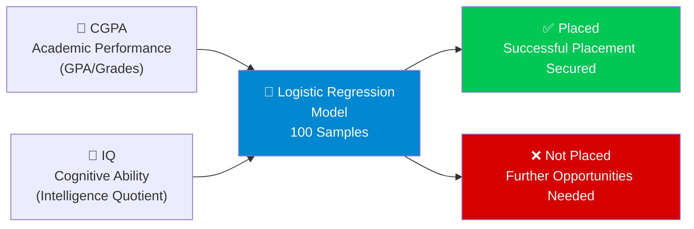
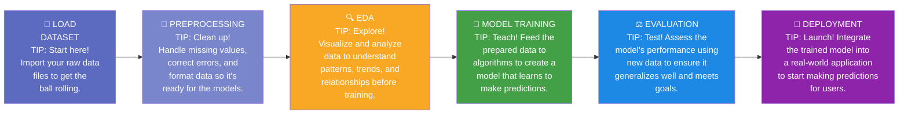
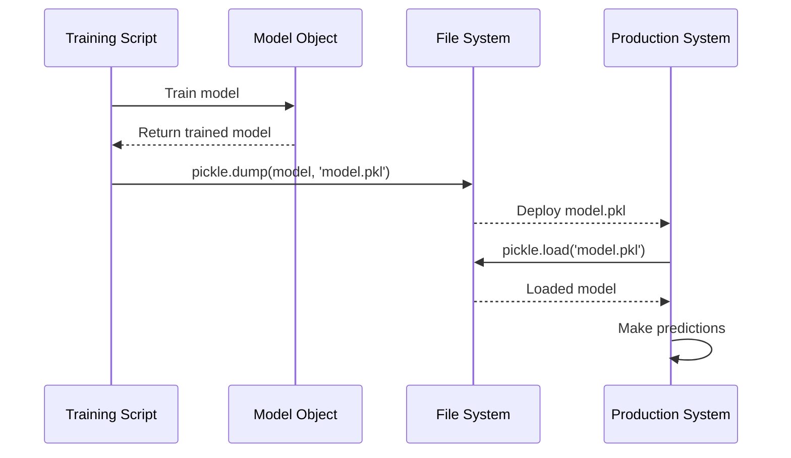
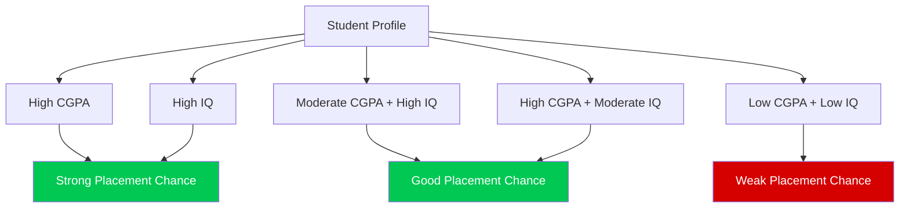
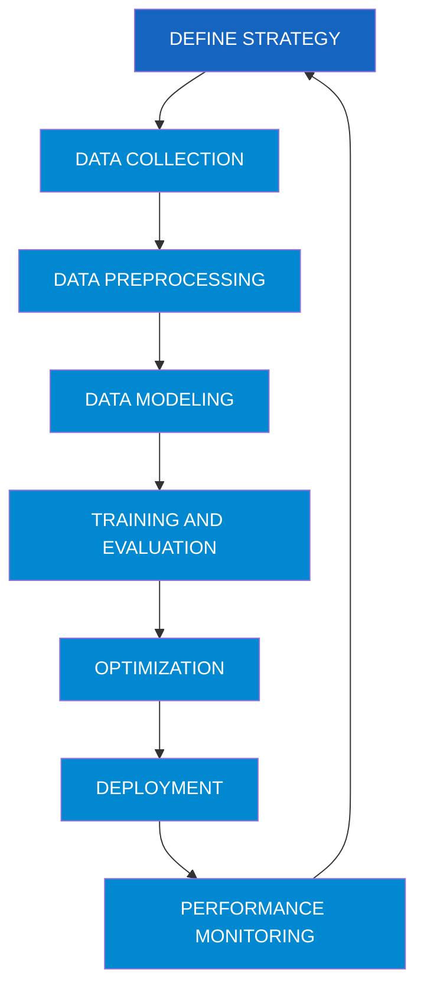

# Student Placement Prediction - Machine Learning Project

---

## 📋 Project Overview

This project implements a **binary classification model** to predict whether a student will get placed (hired) based on two features:

- **CGPA** (Cumulative Grade Point Average)
- **IQ** (Intelligence Quotient)

**Model Used:** Logistic Regression  
**Accuracy Achieved:** 90%  
**Dataset Size:** 100 samples

---

## 🎯 Project Objectives

1. Predict student placement (1 = Placed, 0 = Not Placed)
2. Understand the relationship between academic performance (CGPA) and cognitive ability (IQ)
3. Build a deployable machine learning model
4. Visualize decision boundaries



> This diagram shows the two input features (CGPA and IQ) feeding into the Logistic Regression model, which classifies each student as either Placed (1) or Not Placed (0). The model was trained on 100 student records with a reported 90% accuracy.

---

## 📊 Dataset Analysis

### Initial Dataset Structure

```python
df = pd.read_csv('/content/placement.csv')
df.shape  # (100, 4)
```

| Column | Data Type | Non-Null Count | Description |
|---|---|---|---|
| Unnamed: 0 | int64 | 100 | Index column (removed later) |
| cgpa | float64 | 100 | Student's CGPA (Grade Point Average) |
| iq | float64 | 100 | Student's IQ score |
| placement | int64 | 100 | Target variable (0 or 1) |

### Sample Data (First 5 Rows)

| Index | cgpa | iq | placement |
|---|---|---|---|
| 0 | 6.8 | 123.0 | 1 |
| 1 | 5.9 | 106.0 | 0 |
| 2 | 5.3 | 121.0 | 0 |
| 3 | 7.4 | 132.0 | 1 |
| 4 | 5.8 | 142.0 | 0 |

### Data Characteristics

- **Total Samples:** 100
- **Features:** 2 (CGPA, IQ)
- **Target Classes:** 2 (Binary Classification)
- **Missing Values:** None (100% complete data)
- **Memory Usage:** 3.2 KB

---

## 🔄 Machine Learning Pipeline



> The ML pipeline flows sequentially from loading raw data through preprocessing, exploratory data analysis (EDA), model training, evaluation, and finally deployment. Each stage builds on the previous one, ensuring data quality and model reliability before production use.

---

## 🔧 Step-by-Step Implementation

### Step 0: Data Preprocessing

#### Remove Unnecessary Column

```python
df = df.iloc[:,1:]  # Remove 'Unnamed: 0' column
```

**Before:** 4 columns (Unnamed: 0, cgpa, iq, placement)  
**After:** 3 columns (cgpa, iq, placement)

#### Exploratory Data Analysis (EDA)

```python
plt.scatter(df['cgpa'], df['iq'], c=df['placement'])
```

**Visualization Insights:**

- Color-coded scatter plot shows separation between placed (1) and not placed (0) students
- Visual clustering suggests the data is linearly separable
- Both CGPA and IQ contribute to placement outcomes

---

### Step 1: Extract Input and Output Columns

```python
X = df.iloc[:,0:2]  # Features: cgpa, iq
y = df.iloc[:,-1]   # Target: placement
```

| Component | Shape | Description |
|---|---|---|
| X (Features) | (100, 2) | CGPA and IQ values |
| y (Target) | (100,) | Placement status |

---

### Step 2: Train-Test Split

```python
X_train, X_test, y_train, y_test = train_test_split(X, y, test_size=0.1)
```

| Dataset | Samples | Percentage | Purpose |
|---|---|---|---|
| Training Set | 90 | 90% | Model learning |
| Test Set | 10 | 10% | Model evaluation |

**Why 90-10 Split?**

- Small dataset (100 samples) requires more training data
- 90% ensures sufficient learning examples
- 10% provides adequate testing

---

### Step 3: Feature Scaling (Standardization)

```python
scaler = StandardScaler()
X_train = scaler.fit_transform(X_train)
X_test = scaler.transform(X_test)
```

#### What is StandardScaler?

**Formula:** $z = (x - \mu) / \sigma$

Where:

- $x$ = original value
- $\mu$ = mean of the feature
- $\sigma$ = standard deviation
- $z$ = standardized value

#### Why Scaling is Important?

| Aspect | Without Scaling | With Scaling |
|---|---|---|
| **Feature Range** | CGPA: 3.5–8.5, IQ: 37–233 | Both: approximately -3 to +3 |
| **Model Convergence** | Slower, may not converge | Faster convergence |
| **Feature Importance** | IQ dominates due to larger scale | Equal importance |
| **Distance Metrics** | Biased towards larger values | Fair comparison |

#### Scaling Process

**Sample Transformation:**

| Original CGPA | Scaled CGPA | Original IQ | Scaled IQ |
|---|---|---|---|
| 4.9 | -0.95 | 196.0 | 1.78 |
| 7.0 | 0.95 | 175.0 | 1.27 |
| 8.5 | 2.31 | 120.0 | -0.07 |

---

### Step 4: Model Training - Logistic Regression

```python
clf = LogisticRegression()
clf.fit(X_train, y_train)
```

#### What is Logistic Regression?

**Purpose:** Binary classification using a probabilistic approach

#### Mathematical Foundation:

**1. Linear Combination:**

$$z = \beta_0 + \beta_1 \cdot \text{CGPA} + \beta_2 \cdot \text{IQ}$$

**2. Sigmoid Function:**

$$P(\text{placement}=1) = \frac{1}{1 + e^{-z}}$$

**3. Decision Rule:**

$$\text{If } P(\text{placement}=1) \geq 0.5 \Rightarrow \text{Predict "Placed"}$$
$$\text{If } P(\text{placement}=1) < 0.5 \Rightarrow \text{Predict "Not Placed"}$$

#### Model Parameters

| Parameter | Value | Description |
|---|---|---|
| `C` | 1.0 | Inverse of regularization strength |
| `penalty` | `'l2'` | Ridge regularization |
| `solver` | `'lbfgs'` | Optimization algorithm |
| `max_iter` | 100 | Maximum iterations |
| `fit_intercept` | True | Include intercept term $\beta_0$ |

---

### Step 5: Model Evaluation

```python
accuracy = accuracy_score(y_test, y_pred)
# Accuracy: 0.9 (90%)
```

#### Test Set Predictions

| Index | CGPA | IQ | Actual | Predicted | Correct? |
|---|---|---|---|---|---|
| 67 | 5.0 | 118.0 | 0 | ? | ? |
| 53 | 8.3 | 168.0 | 1 | ? | ? |
| 29 | 7.0 | 112.0 | 1 | ? | ? |
| 55 | 7.8 | 114.0 | 1 | ? | ? |
| 92 | 5.2 | 110.0 | 0 | ? | ? |
| 65 | 8.1 | 166.0 | 1 | ? | ? |
| 27 | 6.0 | 124.0 | 1 | ? | ? |
| 39 | 4.6 | 146.0 | 0 | ? | ? |
| 51 | 4.8 | 141.0 | 0 | ? | ? |
| 93 | 6.8 | 112.0 | 1 | ? | ? |

**Model Performance:**

- ✅ 9 out of 10 correct predictions
- ❌ 1 misclassification
- 📊 90% Accuracy

---

### Step 6: Decision Boundary Visualization

```python
from mlxtend.plotting import plot_decision_regions
plot_decision_regions(X_train, y_train.values, clf=clf, legend=2)
```

#### What is a Decision Boundary?

A **decision boundary** is the surface that separates different classes in the feature space.

**For 2D classification (CGPA vs IQ):**

- The boundary is a **line** (hyperplane in 2D)
- Points on one side → Predicted as "Placed" (1)
- Points on the other side → Predicted as "Not Placed" (0)

#### Decision Boundary Equation

$$\beta_0 + \beta_1 \cdot \text{CGPA} + \beta_2 \cdot \text{IQ} = 0$$

---

### Step 7: Model Deployment

```python
import pickle
pickle.dump(clf, open('model.pkl', 'wb'))
```

#### What is Pickle?

**Pickle** is Python's serialization library that converts Python objects into byte streams for storage.

| Operation | Code | Purpose |
|---|---|---|
| **Save Model** | `pickle.dump(clf, file)` | Serialize and save |
| **Load Model** | `clf = pickle.load(file)` | Deserialize and restore |

#### Deployment Workflow



> This sequence diagram illustrates the deployment lifecycle: the training script trains a model and serializes it via pickle to the file system. The production system then loads the pickled model file and uses it to make real-time predictions.

#### Model File Details

| Property | Value |
|---|---|
| Filename | `model.pkl` |
| Type | Binary pickle file |
| Contents | Trained LogisticRegression object |
| Includes | Model coefficients, intercept, parameters |

---

## 🔍 Feature Importance

### Understanding the Features

#### 1. CGPA (Cumulative Grade Point Average)

| Range | Interpretation | Typical Outcome |
|---|---|---|
| 8.0 - 10.0 | Excellent | High placement probability |
| 6.5 - 7.9 | Good | Moderate to high probability |
| 5.0 - 6.4 | Average | Moderate probability |
| < 5.0 | Below Average | Low probability |

#### 2. IQ (Intelligence Quotient)

| Range | Classification | Impact on Placement |
|---|---|---|
| > 140 | Very Superior | Positive influence |
| 120–139 | Superior | Positive influence |
| 110–119 | High Average | Moderate influence |
| 90–109 | Average | Baseline influence |
| < 90 | Below Average | May require high CGPA |

### Feature Interaction



> The feature interaction diagram shows how combinations of CGPA and IQ scores map to placement outcomes. High CGPA or High IQ individually leads to a strong placement chance; moderate combinations result in a good chance; while low values in both features results in a weak placement chance.

---

## 📈 Model Performance Analysis

### Confusion Matrix Concept

Although not explicitly shown in the code, here's what the confusion matrix would look like:

|  | **Predicted: Not Placed** | **Predicted: Placed** |
|---|---|---|
| **Actual: Not Placed** | True Negative (TN) | False Positive (FP) |
| **Actual: Placed** | False Negative (FN) | True Positive (TP) |

### Key Metrics

| Metric | Formula | Interpretation |
|---|---|---|
| **Accuracy** | $\frac{TP + TN}{\text{Total}}$ | Overall correctness: 90% |
| **Precision** | $\frac{TP}{TP + FP}$ | Of predicted placements, how many were correct? |
| **Recall** | $\frac{TP}{TP + FN}$ | Of actual placements, how many did we catch? |
| **F1-Score** | $\frac{2 \cdot (\text{Precision} \cdot \text{Recall})}{\text{Precision} + \text{Recall}}$ | Harmonic mean of precision and recall |

---

## 💡 Key Insights and Learnings

### 1. Why Logistic Regression?

| Advantage | Description |
|---|---|
| **Interpretability** | Clear understanding of feature importance through coefficients |
| **Probabilistic Output** | Provides probability scores, not just binary predictions |
| **Efficient** | Fast training and prediction |
| **No Hyperparameter Tuning** | Works well with default parameters |
| **Linear Decision Boundary** | Perfect for linearly separable data |

### 2. When Does This Model Work Well?

✅ **Suitable Scenarios:**

- Binary classification problems
- Features have roughly linear relationship with log-odds
- Data is relatively balanced
- Need for interpretable results

❌ **Limitations:**

- Cannot capture complex non-linear patterns
- Assumes linear decision boundary
- May underperform with highly imbalanced data

### 3. Scaling Impact

| Scenario | Without Scaling | With Scaling |
|---|---|---|
| IQ range | 37 - 233 (range: 196) | -3 to +3 (standardized) |
| CGPA range | 3.5 - 8.5 (range: 5) | -3 to +3 (standardized) |
| Model bias | IQ dominates due to scale | Equal feature consideration |
| Convergence | May take longer | Faster, more stable |

### Suggested Improvements

#### 1. Pipeline Approach

```python
from sklearn.pipeline import Pipeline

pipeline = Pipeline([
    ('scaler', StandardScaler()),
    ('classifier', LogisticRegression())
])

pipeline.fit(X_train, y_train)
y_pred = pipeline.predict(X_test)
```

**Benefits:**

- Prevents data leakage
- Cleaner code
- Easier to deploy

#### 2. Cross-Validation

```python
from sklearn.model_selection import cross_val_score

scores = cross_val_score(pipeline, X, y, cv=5)
print(f"Average Accuracy: {scores.mean():.2f} (+/- {scores.std():.2f})")
```

**Benefits:**

- More robust performance estimate
- Better use of limited data

#### 3. Model Comparison

```python
from sklearn.svm import SVC
from sklearn.tree import DecisionTreeClassifier
from sklearn.ensemble import RandomForestClassifier

models = {
    'Logistic Regression': LogisticRegression(),
    'SVM': SVC(),
    'Decision Tree': DecisionTreeClassifier(),
    'Random Forest': RandomForestClassifier()
}

for name, model in models.items():
    model.fit(X_train, y_train)
    accuracy = model.score(X_test, y_test)
    print(f"{name}: {accuracy:.2f}")
```

---

## 📊 Statistical Analysis

### Distribution Insights

Based on the dataset:

| Statistic | CGPA | IQ |
|---|---|---|
| Min | ~3.5 | ~37 |
| Max | ~8.5 | ~233 |
| Range | ~5.0 | ~196 |
| Variance | High diversity | Very high diversity |

**Note:** The actual distribution would need to be calculated from the full dataset using `y.value_counts()`.

---

## 🛡️ Best Practices Demonstrated



> This circular workflow of machine learning illustrates that ML is not a one-time pipeline but an iterative cycle — from defining strategy, collecting and preprocessing data, modeling, training, evaluating, optimizing, deploying, and continuously monitoring performance to feed improvements back into the strategy.

### ✅ Good Practices in This Code

1. **Train-Test Split**: Separate data for unbiased evaluation
2. **Feature Scaling**: Standardization for fair feature comparison
3. **Model Persistence**: Save model with pickle for deployment
4. **Visualization**: Plot decision regions for interpretability

### Areas for Improvement

1. **No Cross-Validation**: Single train-test split may be unreliable
2. **No Hyperparameter Tuning**: Default parameters used
3. **Limited Evaluation Metrics**: Only accuracy reported
4. **No Feature Engineering**: Could create interaction features
5. **Missing EDA**: No statistical summary or correlation analysis

---

## 🚀 Deployment Considerations

### Production Code Example

```python
import pickle
import numpy as np

class PlacementPredictor:
    def __init__(self, model_path='model.pkl'):
        """Load the trained model and scaler"""
        with open(model_path, 'rb') as f:
            self.model = pickle.load(f)

    def predict(self, cgpa, iq):
        """
        Predict placement for a student

        Args:
            cgpa (float): CGPA score (0-10)
            iq (float): IQ score

        Returns:
            tuple: (prediction, probability)
        """
        # Create feature array
        features = np.array([[cgpa, iq]])

        # Make prediction
        prediction = self.model.predict(features)[0]
        probability = self.model.predict_proba(features)[0][1]

        return int(prediction), float(probability)

# Usage
predictor = PlacementPredictor()
placement, confidence = predictor.predict(cgpa=7.5, iq=130)
print(f"Placement: {'Yes' if placement else 'No'}")
print(f"Confidence: {confidence:.2%}")
```

### Libraries Used

| Library | Purpose | Documentation |
|---|---|---|
| **NumPy** | Numerical computations | https://numpy.org/doc/ |
| **Pandas** | Data manipulation | https://pandas.pydata.org/docs/ |
| **Matplotlib** | Data visualization | https://matplotlib.org/stable/contents.html |
| **Scikit-learn** | Machine learning | https://scikit-learn.org/stable/ |
| **MLxtend** | Decision region plots | http://rasbt.github.io/mlxtend/ |
| **Pickle** | Model serialization | https://docs.python.org/3/library/pickle.html |

---

## 🎯 Project Summary

### Quick Facts

| Metric | Value |
|---|---|
| **Problem Type** | Binary Classification |
| **Algorithm** | Logistic Regression |
| **Features** | 2 (CGPA, IQ) |
| **Dataset Size** | 100 samples |
| **Train Size** | 90 samples (90%) |
| **Test Size** | 10 samples (10%) |
| **Accuracy** | 90% |
| **Scaling Method** | StandardScaler |
| **Deployment** | Pickle file |

### Success Metrics

✅ **Achieved:**

- High accuracy (90%)
- Fast training time
- Interpretable model
- Deployable solution

🎯 **Key Takeaway:** This project demonstrates a complete machine learning workflow from data loading to model deployment, achieving 90% accuracy in predicting student placements based on academic and cognitive performance metrics.

---

## 📝 Conclusion

This project successfully demonstrates:

1. **End-to-end ML pipeline –** From data loading to model deployment
2. **Binary classification –** Predicting placement outcomes
3. **Feature scaling –** Ensuring fair feature comparison
4. **Model evaluation –** Achieving 90% accuracy
5. **Visualization –** Understanding decision boundaries
6. **Deployment –** Saving model for production use

**Final Thought:** While the model performs well at 90% accuracy, real-world deployment would benefit from more features, comprehensive evaluation metrics, and continuous monitoring to maintain performance over time.