# ML System Design Framework

---

## 1. Business Problem to ML Problem

### Framework Overview

The first critical step is translating a business objective into a machine learning problem.

### Netflix Case Study: Churn Prediction

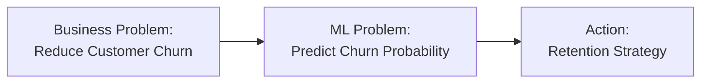

> This diagram shows the three-stage translation process: the business goal of reducing churn is reformulated as an ML prediction task, which then drives a concrete retention action.

---

### Churn Analysis

| Metric         | Value       | Impact               |
|----------------|-------------|----------------------|
| Total Users    | 100         | Baseline             |
| Churned Users  | 19.7        | **19.7% churn rate** |
| Retained Users | 98          | 98% retention target |
| Users Left     | 2           | Acceptable churn     |
| At-Risk Users  | 84% circled | High-risk segment    |
| Safe Users     | 6.5 circled | Low-risk segment     |

---

### Translation Process

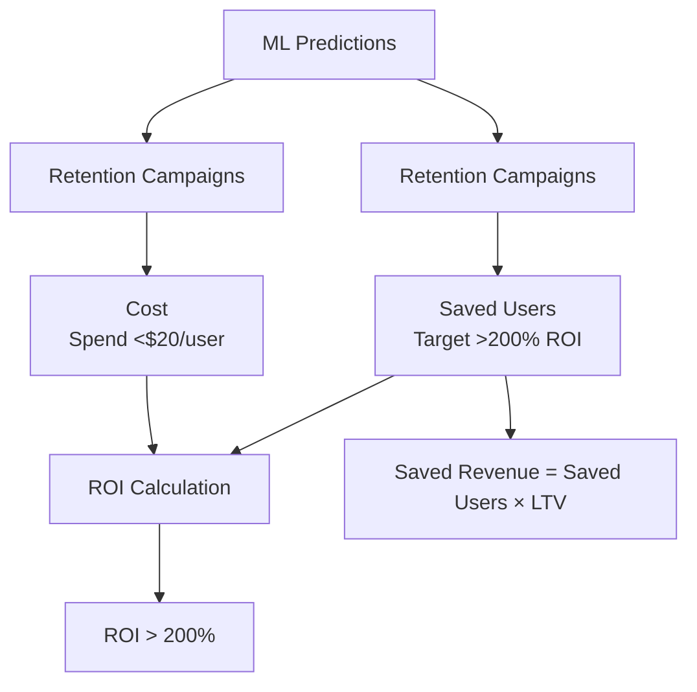

```mermaid
xychart-beta
    title "Churn Rate Over Time"
    x-axis ["Q1", "Q2", "Q3", "Q4"]
    y-axis "Churn Rate (%)" 0 --> 6
    line "Churn Rate" [5, 4.2, 3.5, 2.8]
```

> Churn rate was successfully reduced from 5% to <3% in 12 months, driven by ML-powered campaigns. Lower churn increases lifetime value (LTV).

The ROI formula is:

$$\text{ROI} = \frac{\text{Saved Revenue} - \text{Cost}}{\text{Cost}}$$

---

### Business to ML Translation Table

| Business Problem      | ML Problem Type      | Target Variable  | Success Metric      |
|-----------------------|----------------------|------------------|---------------------|
| **Reduce Churn**      | Binary Classification | Churn (Yes/No)   | Accuracy, Recall, F1 |
| Increase Revenue      | Regression           | Revenue Amount   | RMSE, MAE           |
| Personalize Content   | Recommendation       | User-Item Rating | NDCG, MAP           |
| Detect Fraud          | Anomaly Detection    | Fraud (Yes/No)   | Precision, Recall   |
| Customer Segmentation | Clustering           | Segment ID       | Silhouette Score    |

---

## 2. Type of Problem

### Problem Classification Framework

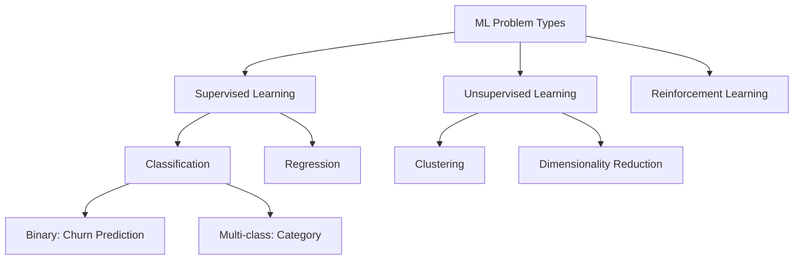

> This tree maps the full landscape of ML problem types. The Netflix churn problem falls under Supervised Learning → Classification → Binary Classification.

**Key Elements:**

- **Big Picture** → End Product → Prediction
- **Input**: User behavior data
- **Output**:
  - **Supervised**: Churn prediction (labeled data)
  - **Classification**: Binary outcome (churn/no churn)
- **Process**: Regression techniques (despite being classification, can use regression for probability)

---

### Detailed Problem Type Table

| Type             | Subtype          | Example              | Input              | Output        | Algorithm                        |
|------------------|------------------|----------------------|--------------------|---------------|----------------------------------|
| **Supervised**   | Classification   | Churn Prediction     | User features      | Churn (0/1)   | Logistic Regression, RF, XGBoost |
|                  | Regression       | Revenue Forecast     | Historical data    | Dollar amount | Linear Regression, Trees         |
| **Unsupervised** | Clustering       | User Segmentation    | User features      | Cluster ID    | K-Means, DBSCAN                  |
|                  | Association      | Market Basket        | Transactions       | Rules         | Apriori, Growth                  |
| **Reinforcement**| Policy Learning  | Content Ordering     | State, Action      | Reward        | Q-Learning, DQN                  |

---

### Netflix Churn Problem Characteristics

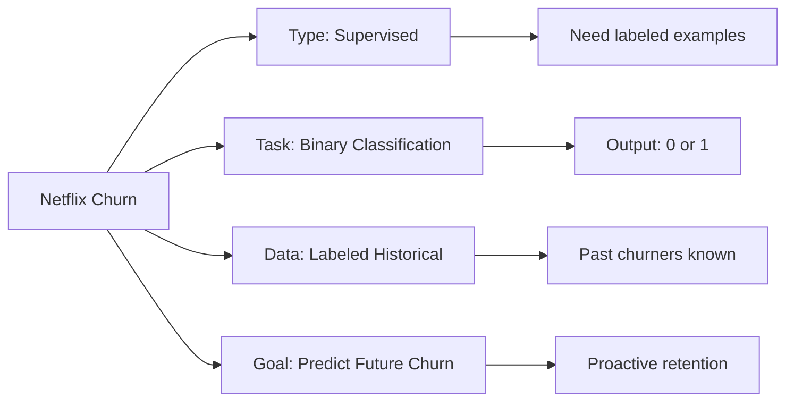

> This diagram captures all four key characteristics of the Netflix churn ML problem, showing how each dimension connects to a specific technical implication.

---

## 3. Current Solution (Baseline)

### Analyzing Existing Systems

**From whiteboard:**

- **Current Churn Rate**: 5% → ↓10%
- **Improved Rate**: 6% (target: reduce further)
- **Next Goal**: Predict future churn

### Baseline Performance Table

| Metric          | Current System       | Target  | Gap                    |
|-----------------|----------------------|---------|------------------------|
| Churn Rate      | 5% → 6%              | < 3%    | Need 50% improvement   |
| Precision       | ~60-70% (assumed)    | >80%    | +20% needed            |
| Recall          | ~50-60% (assumed)    | >85%    | +30% needed            |
| False Positives | High                 | Low     | Reduce retention costs |

---

### Why Establish Baselines?

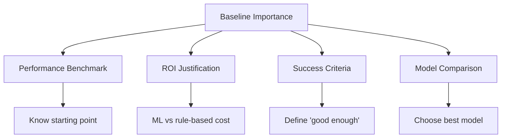

> Baselines serve four critical purposes: they set the starting benchmark, justify the cost of building ML vs simpler alternatives, define the "done" threshold, and enable apples-to-apples model comparison.

---

### Common Baseline Approaches

| Approach          | Description            | When to Use          | Netflix Example                      |
|-------------------|------------------------|----------------------|--------------------------------------|
| **Rule-Based**    | Simple if-then rules   | Known patterns       | If inactive > 30 days → churn        |
| **Statistical**   | Basic statistics       | Simple relationships | Users with low watch time            |
| **Random**        | Random predictions     | Worst-case benchmark | 50% accuracy baseline                |
| **Majority Class**| Predict most common    | Class imbalance      | Always predict "no churn"            |
| **Simple ML**     | Basic algorithm        | Quick implementation | Logistic regression                  |

---

## 4. Getting Data

### Data Collection Strategy

1. **Watch Time**: Duration of content consumption
2. **Search but did not find**: Failed search attempts
3. **Content left in the middle**: Incomplete viewing
4. **Clicked on recommendations (order)**: Engagement with suggestions

---

### Data Architecture

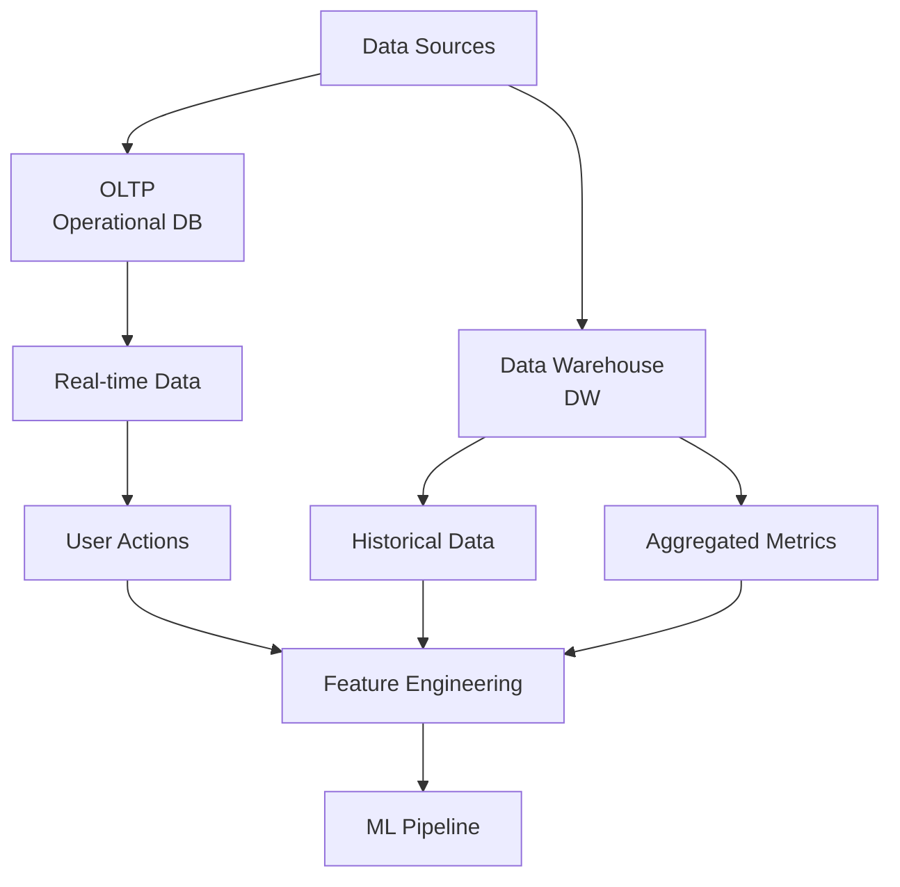

> Data flows from two main sources — real-time operational databases (OLTP) and a historical Data Warehouse — converge at the Feature Engineering stage before feeding the ML Pipeline.

---

### Complete ML Pipeline for Churn Prediction

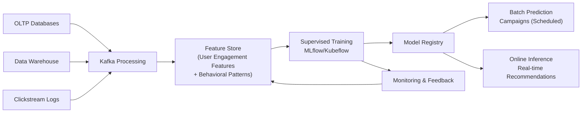

> The full ML pipeline ingests data from OLTP, Data Warehouse, and Clickstream sources; processes via Kafka into a Feature Store; trains supervised models tracked in MLflow; and serves predictions both as batch campaigns and real-time online inference, with monitoring looping back for retraining.

---

### Data Sources Comparison

| Source   | Type          | Latency            | Use Case             | Netflix Example        |
|----------|---------------|--------------------|----------------------|------------------------|
| **OLTP** | Transactional | Real-time          | Current operations   | Active sessions        |
| **DW**   | Analytical    | Batch (hours/daily)| Historical analysis  | Past 90 days behavior  |
| **Logs** | Event stream  | Near real-time     | User interactions    | Click streams          |
| **APIs** | External      | Variable           | Enrichment           | Demographics           |

---

### Netflix Feature Categories

#### 1. Engagement Features

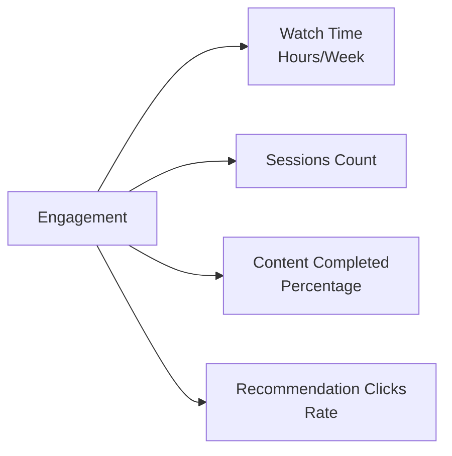

> Engagement features capture how deeply users interact with the platform, from raw watch time to the rate at which they act on content recommendations.

| Feature                | Description               | Signal                   | Calculation                         |
|------------------------|---------------------------|--------------------------|-------------------------------------|
| **Watch Time**         | Total viewing duration    | High = engaged           | SUM(session_duration)               |
| **Failed Searches**    | Searches with no result   | High = frustrated        | COUNT(search WHERE result = 0)      |
| **Abandonment Rate**   | Content left incomplete   | High = dissatisfied      | AVG(watch_time / content_length)    |
| **Recommendation CTR** | Click-through rate        | Low = poor personalization | clicks / impressions              |

---

#### 2. Behavioral Features

| Category      | Features                             | Why Important               |
|---------------|--------------------------------------|-----------------------------|
| **Frequency** | Login frequency, Watch frequency     | Habit formation             |
| **Recency**   | Days since last watch                | Recent activity = retention |
| **Diversity** | Genre variety, Content types         | Content satisfaction        |
| **Patterns**  | Weekend vs weekday, Time of day      | Usage habits                |

---

#### 3. Content Preferences

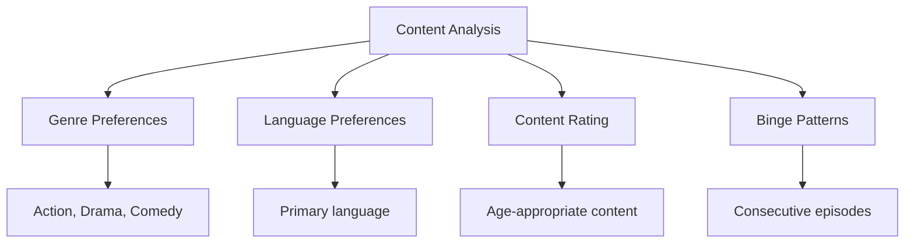

> Content preference features allow the model to understand what a user values, enabling differentiation between disengagement due to poor content fit versus other causes.

---

## 5. Metrics to Measure

### ML Metrics Framework

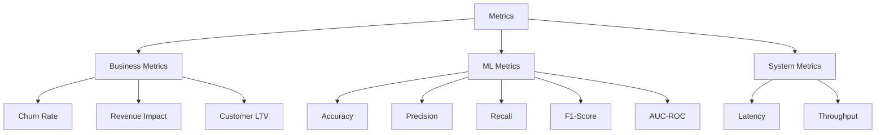

> Metrics are organized into three tiers: Business (measures actual business impact), ML (measures model quality), and System (measures infrastructure performance).

---

### Churn Prediction Metrics

#### Confusion Matrix

|                      | Predicted: No Churn    | Predicted: Churn    |
|----------------------|------------------------|---------------------|
| **Actual: No Churn** | True Negative (TN)     | False Positive (FP) |
| **Actual: Churn**    | False Negative (FN)    | True Positive (TP)  |

---

#### Key Metrics Formulas

| Metric          | Formula                                                                 | Interpretation                          | Netflix Goal                        |
|-----------------|-------------------------------------------------------------------------|-----------------------------------------|-------------------------------------|
| **Precision**   | $\dfrac{TP}{TP + FP}$                                                   | Of predicted churners, % actually churned | >80% (avoid wasted retention)    |
| **Recall**      | $\dfrac{TP}{TP + FN}$                                                   | Of actual churners, % we caught         | >85% (catch most churners)          |
| **F1-Score**    | $2 \times \dfrac{\text{Precision} \times \text{Recall}}{\text{Precision} + \text{Recall}}$ | Harmonic mean      | >82% (balanced)                     |
| **AUC-ROC**     | Area under ROC curve                                                    | Overall discriminative ability          | >0.85                               |
| **Specificity** | $\dfrac{TN}{TN + FP}$                                                   | % of non-churners correctly identified  | >90%                                |

---

### Business Impact Metrics

| Business Metric        | Formula                                              | Netflix Target |
|------------------------|------------------------------------------------------|----------------|
| **Churn Rate**         | (Churned Users / Total Users) × 100                  | <3%            |
| **Retention Rate**     | 100% − Churn Rate                                    | >97%           |
| **Customer LTV**       | Avg Monthly Revenue × Avg Lifetime (months)          | Maximize       |
| **ROI of Retention**   | (Saved Revenue − Campaign Cost) / Campaign Cost      | >200%          |
| **Cost per Save**      | Total Campaign Cost / Saved Users                    | <$20           |

**Key formulas:**

$$\text{Churn Rate} = \frac{\text{Churned Users}}{\text{Total Users}} \times 100$$

$$\text{Customer LTV} = \text{Avg Monthly Revenue} \times \text{Avg Lifetime (months)}$$

$$\text{ROI} = \frac{\text{Saved Revenue} - \text{Campaign Cost}}{\text{Campaign Cost}}$$

---

### Metric Selection Guide

**Model Performance Uplift targets:**

```mermaid
xychart-beta
    title "Model Performance Uplift"
    x-axis ["Precision", "Recall", "F1", "AUC"]
    y-axis "Score (%)" 0 --> 100
    bar "Target" [80, 85, 82, 85]
    bar "Baseline (assumed)" [65, 55, 60, 72]
```

> This chart compares the target performance thresholds against the assumed baseline for each metric. The gap quantifies the improvement ML needs to deliver to justify the investment.

---

## 6. Online vs Batch Prediction

### Deployment Strategies

- **OLTP → DW → MLaaS** (ML as a Service) → **Trained Model → MLeOps**

---

### Hybrid Churn Prediction Pipeline

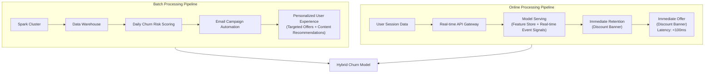

> The Hybrid Pipeline combines batch scoring (daily, for proactive email campaigns) with online real-time inference (sub-100ms, for in-session interventions). The Hybrid Churn Model sits at the center, fed by both pipelines.

---

### Comparison Table

| Aspect             | Batch Prediction              | Online Prediction               |
|--------------------|-------------------------------|----------------------------------|
| **Timing**         | Scheduled (daily/weekly)      | Real-time (milliseconds)         |
| **Latency**        | Hours to days                 | <100ms                           |
| **Volume**         | All users at once             | One user at a time               |
| **Infrastructure** | Spark, Hadoop cluster         | REST API, microservice           |
| **Cost**           | Lower per prediction          | Higher per prediction            |
| **Use Case**       | Proactive retention emails    | Dynamic UI personalization       |
| **Data Freshness** | Stale (yesterday's data)      | Fresh (current session)          |
| **Complexity**     | Simpler                       | More complex                     |

---

### Netflix Churn: Which Approach?

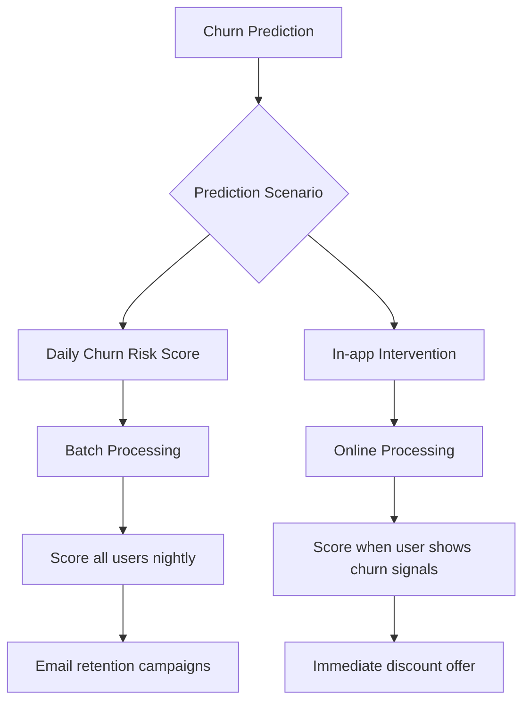

> This decision flowchart splits churn interventions into two tracks: proactive (batch, nightly scoring → email campaigns) and reactive (online, triggered by live churn signals → instant discount offers).

---

### Recommended Approach for Netflix

**Hybrid Strategy:**

| Component            | Type   | Frequency    | Purpose                          |
|----------------------|--------|--------------|----------------------------------|
| **Base Score**       | Batch  | Daily        | Overall churn risk               |
| **Real-time Signals**| Online | Live         | Immediate intervention triggers  |
| **Combined Model**   | Hybrid | Event-driven | Best of both worlds              |

---

### Assumption Validation Framework

| Category         | Assumption                          | Validation Method            | Risk if Wrong           |
|------------------|-------------------------------------|------------------------------|-------------------------|
| **Data**         | Data is representative              | Sample distribution analysis | Biased model            |
| **Labels**       | Churn definition is consistent      | Business logic review        | Incorrect predictions   |
| **Features**     | Features available at prediction time | Data flow audit            | Production failures     |
| **Distribution** | Future ~ Past                       | Temporal validation split    | Performance degradation |
| **Business**     | Retention cost < LTV                | Financial analysis           | Negative ROI            |
| **Technical**    | Latency < 100ms                     | Load testing                 | Poor UX                 |

---

### Netflix-Specific Assumptions

**Data Assumptions**

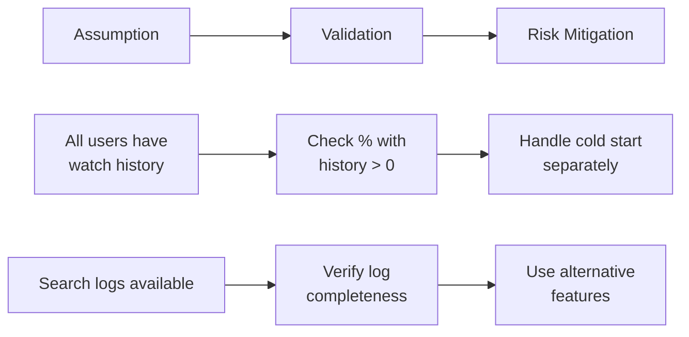

> Each assumption is validated through a specific check, and a concrete mitigation strategy is identified in case the assumption fails in production.

---

### Common Pitfalls Table

| Pitfall                | Description                  | Netflix Example                    | Mitigation                    |
|------------------------|------------------------------|------------------------------------|-------------------------------|
| **Data Leakage**       | Future info in training      | Using post-churn behavior          | Strict temporal split         |
| **Selection Bias**     | Non-random sample            | Only analyzing complainers         | Random stratified sampling    |
| **Label Noise**        | Incorrect labels             | Accidental cancellations           | Define churn window (e.g., 60 days) |
| **Feature Correlation**| Highly correlated features   | Watch time & session count         | Feature selection/PCA         |
| **Class Imbalance**    | Skewed class distribution    | 95% no-churn, 5% churn             | SMOTE, class weights          |

---

## 7. Pre-Development Checklist

**Pre-Development:**
- Business problem clearly defined?
- Success metrics agreed upon?
- Data availability confirmed?
- Baseline performance established?
- Stakeholders aligned?

**During Development:**
- Train/test split prevents leakage?
- Features available at inference time?
- Model interpretability acceptable?
- Edge cases handled?
- Performance on holdout set validated?

**Pre-Deployment:**
- A/B test designed?
- Rollback plan ready?
- Monitoring dashboards set up?
- Alert thresholds defined?
- Documentation complete?

---

## 8. Complete ML System Design

### End-to-End Architecture

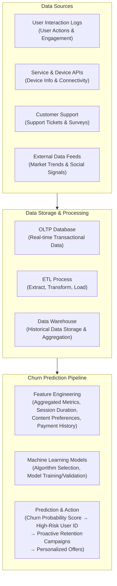

> The complete end-to-end architecture flows from four data source categories through ETL and storage layers (OLTP + Data Warehouse) into the Churn Prediction Pipeline, which outputs actionable churn scores and triggers retention campaigns.

---

### System Components

| Component          | Technology                    | Purpose             | Netflix Scale              |
|--------------------|-------------------------------|---------------------|----------------------------|
| **Data Lake**      | S3, HDFS                      | Raw data storage    | Petabytes                  |
| **Data Pipeline**  | Kafka, Spark                  | Data processing     | Real-time streaming        |
| **Feature Store**  | Feast, Tecton                 | Feature management  | 1000s of features          |
| **Training**       | MLflow, Kubeflow              | Model training      | Daily retraining           |
| **Serving**        | TensorFlow Serving, SageMaker | Model inference     | Millions of predictions/sec|
| **Monitoring**     | Prometheus, Grafana           | System health       | Real-time dashboards       |

---

## 9. Model Development Workflow

### Iterative Process

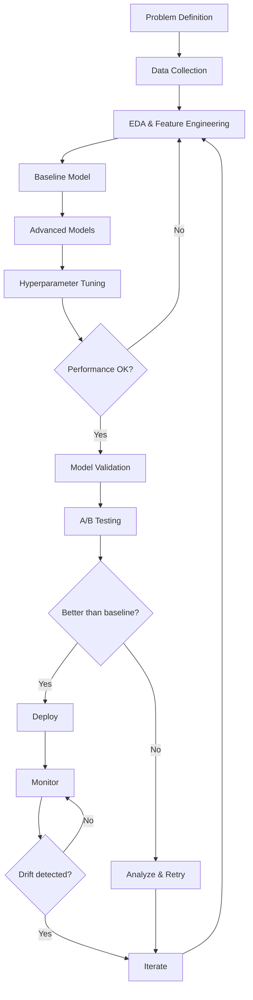

> This end-to-end workflow is iterative: poor performance at the hyperparameter tuning stage loops back to feature engineering; models that don't beat the baseline trigger analysis and retry; and post-deployment drift detection cycles back to the iterate stage.

---

### Model Selection for Churn

| Model                  | Pros                          | Cons                   | When to Use                  |
|------------------------|-------------------------------|------------------------|------------------------------|
| **Logistic Regression**| Interpretable, fast           | Linear assumptions     | Baseline, quick insights     |
| **Random Forest**      | Handles non-linearity, robust | Less interpretable     | Good balance                 |
| **XGBoost/LightGBM**   | High performance              | Black box              | Production (with SHAP)       |
| **Neural Networks**    | Captures complex patterns     | Requires lots of data  | Deep features available      |

---

## 10. Production Considerations

### MLOps Pipeline

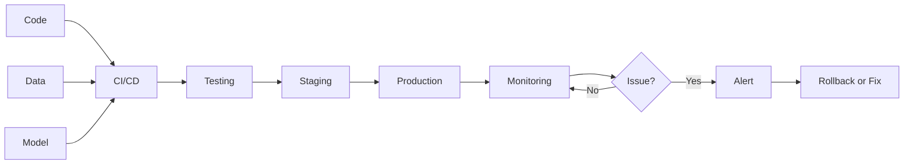

> The MLOps pipeline treats code, data, and model as equal first-class citizens, all flowing through CI/CD → Testing → Staging → Production, with continuous monitoring that triggers alerts and rollback on degradation.

---

### Monitoring Metrics

| Type                   | Metrics                       | Alert Threshold     |
|------------------------|-------------------------------|---------------------|
| **Model Performance**  | Precision, Recall, F1         | 10% degradation     |
| **Data Quality**       | Missing values, outliers      | >5% anomalies       |
| **System**             | Latency, throughput, errors   | p99 > 100ms         |
| **Business**           | Actual churn rate             | >1% increase        |

---

## Summary: 7-Step ML System Design

1. **Business → ML Problem**: Define clear objective and success criteria
2. **Problem Type**: Choose supervised/unsupervised, classification/regression
3. **Baseline**: Establish current performance benchmark
4. **Data**: Identify sources, features, and collection strategy
5. **Metrics**: Define both ML and business metrics
6. **Deployment**: Choose batch vs online vs hybrid
7. **Assumptions**: Validate all assumptions before and after deployment